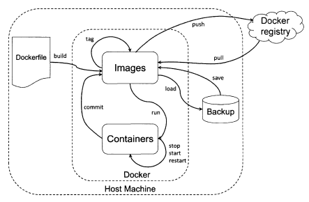

# docker command

* 环境
  * `docker info`
* 生命周期
  * `docker run`
  * `docker start/stop/restart`
* registry
  * `docker pull`
  * `docker push`
* image
  * `docker images`
  * `docker rmi`
  * `docker rm`
* op
  * `docker attach`
  * `docker inspect`
  * `docker ps`
* others
  * `docker commit`
  * `docker events`
  * `docker history`
  * `docker logs`

