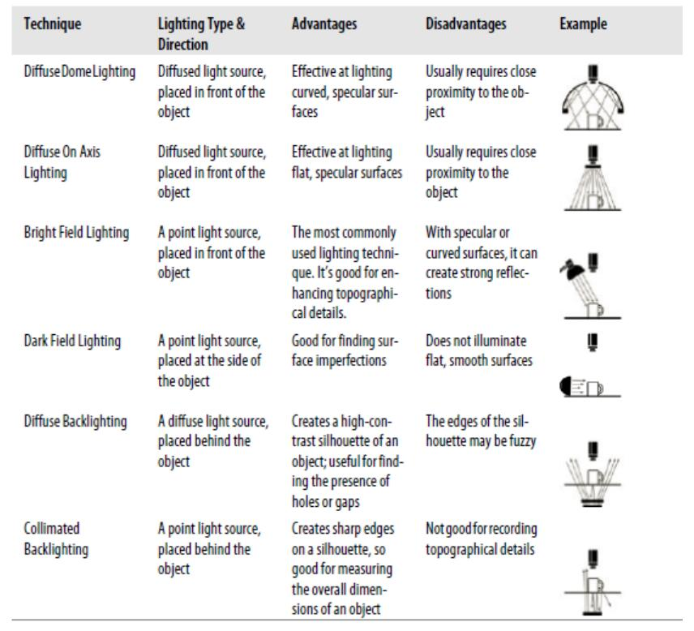
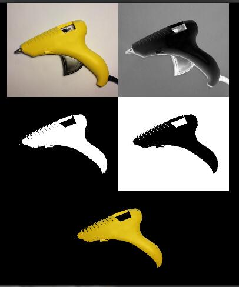

# 光与颜色

## 光源
* 荧光灯fluorescent
> 稳定
> 寿命短
* LED
> 稳定、寿命长、灵活
> 光强度较弱
* 石英卤素灯quartz halogen
> 光强
> 发热多，效率不高； 寿命不长
* 疝气灯xenon
* 金属卤素灯metal halide
* 高压钠灯high pressure sodium

## 光的测量单位

### wattage瓦特（功率）
> 光源发出的辐射量（能量/单位时间（秒））
> 但电磁辐射，除了可见光还有不可见光，所以功率只有一部分真实反映为“光照”

### lumens/lm流明
> 光源释放出的可见光总量的单位

### 坎德拉candelas/cd（candlepower烛光度）
> 光源在某一个特定方向的亮度的单位
> 对于点光源尤其有意义。 降低LED光束的角度，汇聚性会提高因此亮度会提高。

## 光照技术


## 颜色

### RGB
**问题** R、G、B都是从主频的角度来描述的，该模型没有经常需要操作的亮度的通道，亮黄和暗黄的不同是蓝色成分的量不同这点很不直观。
**alternative** HSV，把颜色值从亮度值中剥离出来。色度（hue）、饱和度（saturation）、亮度（value）。  HSV和RGB一一对应，可以互相转换。
> 使用场景： 镜面反射（产生一个高亮度和低饱和度，色度因为亮度大小产生一些噪音但不会太大）
> 灰度编码： 显示了亮度但缺少颜色成分（py里取出来的pixel是一个三元素值一样的tuple）。 区别于二值化图形（只有黑白没有灰阶）（py里取出来的pixel是一个(255.0, 255.0, 255.0)或(0.0, 0.0, 0.0)，也即灰阶的特殊情况）

## ColorCurve进行颜色调整
> 一条曲线对（某通道）颜色做映射重新赋值，X轴为原颜色，Y轴为新颜色
> 不可能描述所有的点，所以是采取“几个点”定义然后对其余点做插值的方式
> 如  [(0, 0), (128, 128), (255, 128)] 会使得小于128的都不变而大于128的都被“压制”为128

**使用**
```python
"""
rCurve这里用在R通道的remap； rgCurve用在G和B通道的remap
"""
from SimpleCV import Camera, Display, ColorCurve, Image
screenSize = (640, 480)
rCurve = ColorCurve([[0,0],[64,64],[128,128],[256,128]])
gbCurve = ColorCurve([[0,16],[64,72],[128,148],[256,256]])
cam = Camera(-1, {’width’: screenSize[0], ’height’: screenSize[1]} )
disp = Display(screenSize)
while not disp.isDone():
  img = cam.getImage()
  coloredImg = img.applyRGBCurve(rCurve, gbCurve, gbCurve)
  erodedImg = coloredImg.erode(1)
  erodedImg.save(disp)
```

## 颜色分割

### RGB的像素点减法
P(r1, g1, b2) - P(r2, g2, b2) = P(r1-r2, g1-g2, b1-b2)
Image.colorDistance(rgb) 可以把图的每个像素减去指定像素（距离）。
> #yonka# 可能是算每个像素的rgb到指定rgb的“距离”最后得到**灰阶**
> #yonka# 可能减去得到的负值取为0，这样才能理解原北京减去白色得到黑色
>> (178.0, 169.0, 164.0) - (223,191,29) -> (124.0, 124.0, 124.0)
Image.binarize(threshold) 可以指定阈值，低于该值的为0.0，该域该值的为255.0。

> 先colorDistance得到灰阶再指定阈值二值化（配合invert、crop）是常见的分割方式
> 下面以此是 原图、colorDistance、binarize、invert、原图minus最后invert的图

