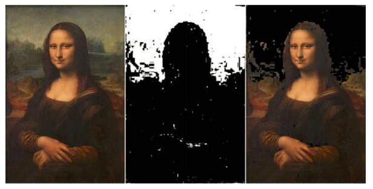

# 基础运算

## 加法
> 每个通道值相加，超过255则截断为255
> 任何两个像素相加都会使其**变得更亮更接近白色**，原来就接近白色的会不明显（截断），而原来很暗的也不明显（加倍之后值还是不大，#yonka# 也是因为亮度提升不是线性的吧）

```python
added_img = img1 + img2
```

## 减法
> 同加法，截断于0
> 自身相减： 得到全黑。 常用于“找不同”

```python
diff = img2 - img1
flat = diff.getNumpy().flatten()  # 矩阵平坦化，降维
diff_num = np.count_nonzero(flat)  # 计算差异点数量
diff_per = float(diff_num) / float(len(flat))
```

## 乘法
> 每个像素的各通道都乘以指定值，同样截断在255
> 变化更“柔和”一些，相比加法不容易出现“过亮”的情况
> 也有自己的问题，会升高噪音，导出出现颗粒

```python
mul_img = img1 * 2
```

## 除法
> 类似乘法，不过（除数>1的话）不需要截断，因为不会小于0

**注意** 因为截断的存在，所以乘以一个比例再除以它得到的不一定是原来的... （只会更模糊了，因为只可能丢失信息，原来一样的还是一样，原来不一样的也可能一样）

**可以根据diff的程度判断是否需要刷新图像显示**
> diff.getNumpy().mean()  # 然后与指定threshold比较，这个阈值是变化颜色平均值而不是变化像素比例


# 直方图

## Image.histogram
> 根据亮度把图片转为直方图数据： 一个记录中每阶像素数量的数组，默认为50阶，可以参数指定阶数。
> 可以用plot函数划出直方图数据对应的曲线图（SimpleCV.Shell.plot）
> 可以用 Image.splitChannels(False)来切分通道得到RGB三通道再分别得到（该通道亮度对应的）直方图数据

* 直方图可用于对摄像头进行校正（判断是否曝光过度）- 均衡的直方图应该像驼峰，波谱左右边都不应该有尖峰


# 色度峰值

## 计算色度峰值
1. RGB -> HSV
2. 得到色度波谱
3. 得到色度峰值

## 代码获得色度峰值
* Image.hueHistogram
> 得到色度直方图数据
> 返回数组...
* Image.huePeaks
> 直接得到色素直方图峰值
> 返回 list[(value, ratio)]（#yonka# 按照ratio大小排列，先大后小，第一个为最多的？）
* Image.hurDistance
> 类似colorDistance，返回色度距离图像，每一个像素的值表示了该点与所给色度值的距离（差值），越小表示越接近 （返回应该也是灰阶图像）（类似的深度图像也是灰阶图像）

## 色度掩模hue mask
> 按照前面的思路，得到色度距离图像后，做二值化+翻转，就可以得到色度掩膜
> 原图减去色度掩膜可以得到**去除背景**的图像
> 噪音需要处理...




# 二值化掩膜

## Image.createBinaryMask
> 给出两个rgb作为min和mx，之间的会被二值化为255（白），其余的为0（黑）

## Image.morphClose
> 清理图像上的噪音

## 创建二值化掩模
1. createBinaryMask
2. morphClose
3. invert

> 然后 img - mask 来使用掩膜


# 示例

## 模糊化
> 按照比例把前一张图和当前图相加
> lastImage * (1 - frameWeight) + newImage * frameWeight
> 采样率越高效果越好

## 色键抠像

1. 要放到背景中的图（img）得到去背景掩膜mask（背景色彩距离 - 二值化）
2. img - mask 得到前景图foreground
3. background - mask.invert() 得到背景图background1
4. foreground + background1 即为...
