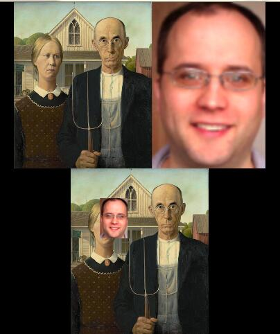

# 显示

## OpenCV的图像显示
```python
from SimpleCV import Display
disp = Display()
img = Image("test.png")
img.save(disp)  # 可能要调一次 disp.isDone/isNotDone 来触发刷新才能显示
# img.show()  # 也可以，自动创造窗口对象并显示

# disp = Display(resolution=img.size()
```
> SimpleCV只支持同时显示一个窗口，窗口中只能显示一张图像（通过sideBySide来拼接图像以显示多张...）
> 多数场景下SimpleCV会根据要显示的图像大小来自动创建相应的Display图像
> 如果自行初始化了Display对象的话，则会根据窗口大小来对图像进行缩放以适应窗口


# 图层
```python
class DrawingLayer(Surface)

dl = img.dl()

dl.blit(img1, (175, 110))  # blit -> BLock Image Transfer

img.blit(img1)  # alternative
```

```python
print img.layers()  # []

layer1 = DrawingLayer(img.size())
img.addDrawingLayer(layer1)
print img.layers()  # [<SimpleCV.DrawingLayer Object size (696, 551)>]

layer2 = DrawingLayer(img.size())
img.addDrawingLayer(layer2)
print img.layers()  # [<SimpleCV.DrawingLayer Object size (696, 551)>, <SimpleCV.DrawingLayer Object size (696, 551)>]

# 越“后”的层index越大
# 默认取 max_index 层，也即最上/后层
print layer1 is img.getDrawingLayer(0)  # True
print img.getDrawingLayer() is img.getDrawingLayer(1)  # True  
print img.getDrawingLayer() is img.getDrawingLayer(0)  # False
```

```python
img1 = Image()
img1.layers()  # []
img1.dl()  # <SimpleCV.DrawingLayer Object size (0, 0)>
img1_dl1 == img1.dl()
img2 = Image(os.path.join(base_dir, "Chapter 7", "amgothic.png"))
img2.layers()  # []
img2.dl()  # <SimpleCV.DrawingLayer Object size (468, 562)>

layer1 = DrawingLayer(img1.size())
layer2 = DrawingLayer(img2.size())
img1.addDrawingLayer(layer1)
img2.addDrawingLayer(layer2)

img1.layers()  # [<SimpleCV.DrawingLayer Object size (0, 0)>, <SimpleCV.DrawingLayer Object size (0, 0)>]
img1.dl()  # <SimpleCV.DrawingLayer Object size (0, 0)>
img1.dl() is layer1  # True
img1_dl1 is img1.getDrawingLayer(0)  # True
img1.dl() is img1.getDrawingLayer(1)  # True
img2.layers()  # [<SimpleCV.DrawingLayer Object size (468, 562)>, <SimpleCV.DrawingLayer Object size (468, 562)>]
img2.dl()  # <SimpleCV.DrawingLayer Object size (468, 562)>
img2.dl() is layer2  # True
```
**概要**
* 越“后”的层index越大（append）
* 默认取 max_index 层，也即最上/后层（dl/getDrawingLayer/getDrawingLayer(len(img.layers()-1)) 这几个方法看起来是等效的）
* 任何一张图（包括空图）的dl方法都可以得到一个DrawingLayer，即使此时layers()返回[]。 此DL是该图的基础DL，当添加其他DL以后layers()返回的[]里会多出该DL，位于index 0
> 好像调了 img.dl() 之后 layers() 返回的[]就会多出基础DL。无论是否空（具体img，(100, 100)，(0, 0)）

## 图层的创建
```python
layer = DrawingLayer(img.size())  # 也可以不带，则为 (0, 0)
```

## 图层的获取
```python
img.dl()  # max_index
img.getDrawingLayer()  # == dl
img.layers()  # 获取DL列表（可能包括基础DL，也可能不包括）
img._mLayers
```

## 图层删除
```python
img.clearLayers()  # 清空DL，不包括基础DL（如果存在于layers()的话）
img.removeDrawLayer(1)  # 删除（必须）指定index的DL，包括可能存在的index0的基础DL（不会真正删除，dl()一下又会出现在layers()）
```

## 图层叠加
```python
img1.dl().blit(img2, (100, 100))
```

## 图层添加
```python
img.addDrawingLayer(layer)
```

## 几种图层叠加方式

* Image.blit Image
> 会得到新的图片
> 保持原图大小，与blit的图重叠出被新图代替

  ```python
  img1.blit(img2, (100, 100))
  ```

* DrawingLayer.blit Image
> 会改变这个dl而不是生成新的。 如果是img.dl().blit方式的话，会改变这个图片的...

  ```python
  img1.dl().blit(img2, (175,110))

  # or

  layer = img1.getDrawingLayer()
  layer.blit(img2, (75, 220))
  ```
* Image.addDrawingLayer
> #yonka# sideBySide好像只会取各图片的index0这一层做拼接
> 并没有新的DL生成，如果修改该DL，会影响DL原属的图和DL新加到的图

  ```python
  layer1 = DrawingLayer(img.size())
  img.addDrawingLayer(layer1)

  # or

  img1.dl().blit(img2, (100, 100))
  img3.addDrawingLayer(img1.getDrawingLayer())

  # 奇怪的是：
  img1 = None
  img2 = None
  img3 = None
  # do init, load 3 pics from disk
  img3.addDrawingLayer(img1.dl().blit(img2, (10, 10)))  # 可见 img2（的与img1重叠的部分）而不可见img1。 神奇！！！
  ```


# 绘画

## 画圆
```python
img.dl().circle((100, 100), 50, Color.RED, filled=True)
img.dl().circle((150, 150), 50, Color.RED, width=3)
```

## 画线
直线
```python
line(start=(x1, y1), end=(x2, y2))
```
在（参数）提供的亮点之间绘制直线
```python
img.dl().line((200, 200), (250, 250), Color.GREEN, width=2)
```

## 椭圆
椭圆
```python
ellipse(center=(x, y), dimensions = (width, height))
```
绘制“被压扁的”圆

## 矩形

### 中心矩形
```python
centeredRectangle(center=(x, y), dimensions=(x,y))
```
与rectangle()类似，但是这个函数的第一个参数是矩形中心点的坐标而不是左上角，有时使用这个函数会更方便。

## 多边形
多边形
```python
polygon(points = [ (x1, y1), (x2, y2), (x3, y3) …])
```
提供一系列点的坐标作为参数，在这些点之间绘制一条直线将它们连在一起。

## 贝塞尔曲线
贝塞尔曲线
```python
`bezier(points = (p1, p1, p3, p4, …), steps=s)
```
根据参数中设置的控制点和线段的数目绘制曲线。

## 绘画+图片
> 可以绘制好一个图层后，addDrawingLayer到img中。 避免重复绘制。 常见于给摄像头等视频加不变的图案 以及 兴趣区域标记 等


# 文字和字体

## 绘制文字
```python
textLayer.text("3 ft", (500, 300), color=Color.RED)

textLayer.listFonts()  # 返回字体名列表
textLayer.selectFont("arial")
textLayer.setFontSize(24)
textLayer.setFontBold()  # 设置粗体
textLayer.setFontItalic()  # 设置斜体
textLayer.setFontUnderline()  # 设置下划线
```

## 设置透明度
```python
layer.setLayerAlpha(175)  # 默认好像是全透明
```

**注意： 其中一层的不透明度会影响整个图**

# 示例
