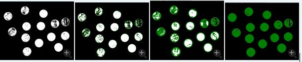

# 斑块blob
> 也称为： 物体或者是连接成分
> 图像中相似像素点构成的一块区域
> 在CV中非常有用，因为很多东西都可以描述成相对于背景的一块具有特殊颜色或形状的区域

## 斑块信息
* 多少像素
* 维度，宽高
* 通过中点或重心找到中心
* 计算斑块数量找到不同的对象
* 颜色
* 旋转角度
* 形状比较

## 斑块检测

### Image.findBlobs
> 查找图像中颜色比较亮的东西（对象）（深色背景中的浅色斑块）
> 如果不给参数的话，函数会自动检测（判断亮暗）。 返回一个包含图像中亮色区域的特征集（featureset）


### FeatureSet
```python
binImg = img.binarize()  # 二值化后更容易...
blobs = binImg.findBlobs()  # type: FeatureSet
# width会“放大”特征边缘...
blobs.show(width=5)  # 还支持color参数，默认为绿色

blobs.area()  # 返回每个斑块的面积（数组）（以像素为单位）
blobs.angle()  # 返回每个斑块的角度（数组）（角度表示该斑块...）
blobs.coordinates()  # 返回每个版块的中心点（数组）
```
**注意** FeatureSet.show方法会在原图进行绘制出每一个特征并显示出来，也即会改变...



### 深色斑块的检测
> 如果要找浅色背景中的深色斑块的话，可以先invert再...

```python
inv_img = img.invert()
blobs = inv_img.findBlobs()
blobs.show(width=2)
img.addDrawingLayer(inv_img.dl())
img.show()
```

原图和反转


反转+findBlobs


原图 addDrawingLayer 反转+findBlobs


### 特定颜色斑点的检测
> 思路和前面的接近，先做colorDistance再...

> 因为RGB是同时包含色度和亮度的，所以当色度差别大但整体亮度都很低（比如光照很弱）的时候，会导致colorDistance都很微弱，这时候推荐使用hueDistance。 如下图。


# 直线和圆

## 直线
> 寻找存在的直线 - 任意点都可以相连，要根据“特征”来判断 - 霍夫变换hough transform： 检测所有可能的直线出现的概率，越高的越可能是一个真实的特征

### 边缘检测
> 通过 **亮度（明暗）改变** 来检测的

**假阳性**
> 阈值过低，检测出“假”/不符合预期的对象 - 噪音
> 降噪方式
* 二值化
* 除燥点morphClose
* 适当的检测参数
```python
from SimpleCV import Image
img = Image(’block.png’)
dist = img.colorDistance((150, 90, 50))
bin = dist.binarize(70).morphClose()
lines = bin.findLines(threshold=10, minlinelength=15)
lines.draw(width=3)
#将绘制在二值化图像上的直线绘制到原始图像上。
img.addDrawingLayer(bin.dl())
img.show()
```

**假阴性**
> 阈值过高，“真”/符合预期的（部分）对象没有被检测出

#### 相关参数
* cannyth1
> 设定了被检测为边缘的最小亮度变化。 值越小，检测出直线越“容易”
* cannyth2
> 控制将多个边缘连在一起的阈值。 同样值越小，检测出直线越“容易”

### Image.findLines
> 使用霍夫变换，返回一个包含所有查找到的直线的特征集、
> Signature
```python
img.findLines(threshold=80, minlinelength=30, maxlinegap=10, cannyth1=50, cannyth2=100)
```

####参数
* threshold
> which determines the minimum "strength" of the line.
> 边缘多强才看成是直线。值较小会导致检测到的直线增多，升高则检测到直线减小。 默认80。
> **#yonka#** 可能是指“明显程度”吧，直线像素和周围像素的区别...

* minlinelength
> how many pixels long the line must be to be returned.
> （认定为直线的）最短长度。默认为30像素
* maxlinegap
> how much gap is allowed between line segments to consider them the same line .
> <del>直线中出现gap的最多次数（超过了也许认为是虚线吧）</del> **#yonka# 这里用how much好像是指gap的大小（小于等于才视为gap，大于则视为直线/线段终点了）**
* cannyth1
> thresholds used in the edge detection step, refer to :py:meth:`_getEdgeMap` for details.
> 用于边缘检测，设定最小的“边缘强度”
* cannyth2
> thresholds used in the edge detection step, refer to :py:meth:`_getEdgeMap` for details.
> 用于边缘检测，设定“edge persistance”（恒定、持久...）

#### 使用例子
```python
img = Image("lenna")
lines = img.findLines()
lines.draw()
img.show()
```

### FeatureSet对处理直线有用的函数
* coordinates
* width
* height
* length

## 圆

### Image.findCircles
> signature
```python
img.findCircle(canny=100, thresh=350, distance=-1)
```

#### 参数
* canny
> 同样，用于边缘检测（的阈值参数），设置越小越容易检测出圆。
* *thresh*
> the threshold at which to count a circle. Small parts of a circle get added to the accumulator array used internally to the array. This value is the minimum threshold. Lower thresholds give more circles, higher thresholds give fewer circles.
**Warning**:
If this threshold is too high, and no circles are found the underlying OpenCV routine fails and causes a segfault.
> 等同于findLines的与值参数，设置可以被检测为圆的最小边界强度

* *distance*
> the minimum distance between each successive circle in pixels. 10 is a goodstarting value.
> 和findLines的maxlinegap类似，设定圆之间有多近才会被视为同一个圆，不设置的话系统会根据被分析的图像尝试找到最佳值

### FeatureSet的适合处理圆的函数
* radius 半径
* diameter 直径
* perimeter 特征周长（对于圆就是圆周）

### 示例
```python
from SimpleCV import Image
img = Image("pong.png")
circles = img.findCircle(canny=200,thresh=250,distance=15)
circles = circles.sortArea()
circles.draw(width=4)
circles[0].draw(color=Color.RED, width=4)
img_with_circles = img.applyLayers()
edges_in_image = img.edges(t2=200)
final = img.sideBySide(edges_in_image.sideBySide(img_with_circles)).scale(0.5)
 final.show()
```


# 角点
> 直线相交处，用于定位。 好比矩形的四个角都是不同的（相交方式）
> 不限于直角，可以是任意（180*n是不可能了）角度

## Image.findCorner
> 同样返回包含所有检测出的角点的特征集
> FeatureSet的一些函数对于角点无意义（虽然可以调，但返回的是无意义默认值）
> signature
```python
img.findCorners(maxnum=50, minquality=0.04, mindistance=1.0)
```


### 参数
* *maxnum* - The maximum number of corners to return.
> 返回最“明显”的指定数量个角点

* *minquality* - The minimum quality metric. This shoudl be a number between zero and one.
> 角点的最低质量（阈值）

* *mindistance* - The minimum distance, in pixels, between successive corners.
> 顾名思义，相邻角点的最短距离（短于此距离就要做选择了，择优...）
