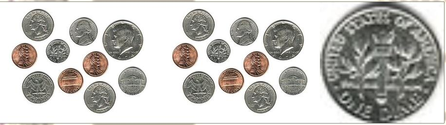
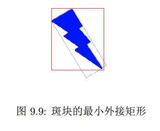
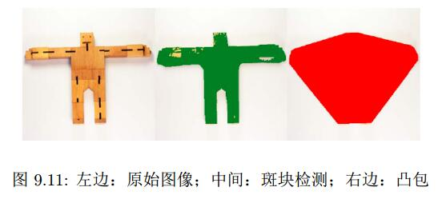
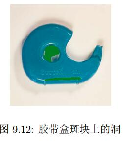

# FeatureSet
> extends list，list的函数都可以用于FeatureSet
> FeatureSet（自己的）函数可以分为三大类
* 对集合中的所有特征执行特性函数的函数
  * draw
  >> 对其中每个特征调draw方法，在原始图像（如果特征集的img被重新赋值的话就不是了吧）上绘制特征
  * show
  >> 也会对其中每个特征调用draw，*然后* 会显示图像
  * crop
  >> 为每个特征返回一张图像，沿着相应特征的边界**剪切（#yonka# 实际应该是copy）**得到
  下面从左到右分别是： 原图、被blobs.crop()的图、blobs.crop()[0]
  
  * image
  >> 为每个特征设置图像，用于首先需要对图像进行处理才能提取特征的场景。
  >> 这是一个特征集的属性，而不是方法
  >> 赋值后，特征集的draw等会绘制到指定图像（而不是获得特征集的那个）
>
  ```python
  from SimpleCV import Image
  img = Image("nuts-bolts.png")
  nutsBolts = img.binarize().findBlobs()
  nutsBolts.image = img
  nutsBolts.show()
  ```
* 返回每个特征性质的函数
  * area
  >> 返回每个特征的面积（单位是像素点） - array(float)
  * width
  >> 返回每个特征的宽（单位是像素点） - array(int)
  * height
  >> 同上，高
  * angle
  >> 返回每个特征的角度，特征向远离x轴的方向旋转的夹角，没有的角度的返回值为0 - array(float)
  * coordinates
  >> 返回每个特征的（中点的）坐标 - array([int, int])
  * x
  >> 返回每个特征的（中点的）x轴坐标 - array(int)
  * y
  >> 返回每个特征的（中点的）y轴坐标 - array(int)
  * distanceFrom
  >> 返回每个特征（的中点）与某给定坐标的距离（单位是像素） - array(float)
  * meanColor
  >> 返回每个特征的*颜色平均值*的RGB三元组 - array([float, float, float])
  * colorDistance
  >> 返回每个特征的*颜色平均值*与给定颜色的颜色距离（默认与黑色比较） - array(float)
>
  ```python
  from SimpleCV import Color, Image
  import numpy as np
  img = Image(’nuts-bolts.png’)
  blobs = img.binarize().findBlobs()
  medSize = np.median(blobs.length())
  blobs.image = img
  for b in blobs:
    if (b.length() > medSize):
    b.draw(width=3, color=Color.GREEN)
  ```
* 对特征进行分类或排序的函数
  * sortarea
  >> 按照面积从小到大排序
  * sortDistance
  >> 按照到某点的距离从小到大排序
  * sortColorDistance
  >> 按照到某色的距离从小到大排序（默认为黑色，从暗到亮）
  * sortLength
  >> 按特征长度从小到大排序
  * sortAngle
  >> 按与某给定角度的距离从小到大排序（默认为0度）
  * filter
  >> 返回符合某特定标准的新特征集
  >> 参数
    * *filterarray*
    >>> A numpy array, matching  the size of the feature set, made of Boolean values, we return the true values and reject the False value.
    >>> **注意** 这里参数不是“function”，而是一个长度和特征集相同的dtype为bool的num array，用于确定哪些特征被选择，如：
    ```python
    array([False, False, False, False,  True,  True,  True,  True,  True,  True], dtype=bool)
    ```
    >>> **此外** num array重载了比较操作符，支持比较操作得到一个 bool num array，如：
    ```python
    print blobs.area()
    # array([ 1819. ,  2061. ,  2080. ,  2081. ,  2588. ,  2589. ,  3306.5,
    #    3306.5,  3321. ,  5345.5])
    print lobs.area() >= 2500
    # array([False, False, False, False,  True,  True,  True,  True,  Tr
    # ue,  True], dtype=bool)
    ```
  * inside
  >> 返回在图像中某特定区域检测到的所有特征
  * outside
  >> 返回在图像后某特定区域之外检测到的所有特征
  * overlaps
  >> 返回与某特定区域重合的特征（部分？完全？ 完全的话inside？）
  * above
  >> 返回在某特定区域之上的所有特征
  * below
  >> 返回在某特定区域之下的所有特征
  * left
  >> 返回在某特定区域左侧的所有特征
  * right
  >> 返回在某特定区域右侧的所有特征
>
  ```python
  from SimpleCV import Image
  img = Image("colortiles.png")
  tiles = img.binarize().findBlobs()
  tiles.image = img
  color_sorted_tiles = tiles.sortColorDistance(Color.BLUE)
  count = 1
  for tile in color_sorted_tiles:
    img.dl().text(str(count), tile.coordinates(), color = Color.RED)
    count += 1
    img.show()
  ```
  ```python
  from SimpleCV import Image
  img = Image("coins.png")
  coins = img.binarize().findBlobs()
  coins.image = img
  perimeter_sorted = sorted(coins, key = lambda b: len(b.contour()))
  perimeter_sorted[-1].draw(width=3)
  img.show()
  ```
  ```python
  from SimpleCV import Image
  img = Image("coins.png")
  blobs = img.binarize().findBlobs()
  wide_blobs_binary_array = blobs.area() >= 2500
  ```

# 特征集剪切
> 查找特征 - 剪切 - 再次查找特征 是常用的处理方式
```python
from SimpleCV import Image
pill_image = Image("pills.png")
packs = pill_image.findBlobs()
pack_images = packs.crop()
pill_color = (149, 189, 198)
for individual_pack in pack_images:
  hue_distance = individual_pack.hueDistance(pill_color, 50, 80)
  pill_count = len(hue_distance.invert().findBlobs(minsize = 100))
  print "This pack has %d pills." % pill_count
```

# 特征测量
> 斑块和其他特征通常没有规则的形状，提供了一些测量方法

## 外接矩形和最小外接矩形

> 可以看到，外接矩形比较好求， maxX-minX-maxY--minY 围成的矩形就是了
> 最小外接矩形则麻烦一些

## 特征的一些外接矩形相关方法
* topLeftCorner

* topRightCorner

* bottomRightCorner

* bottomLeftCorner

* minX

* maxX

* minY

* maxY

* center

* width

* height

## 特征的一些最小外接矩形的相关方法
* getMinRectPoints

* angle

* minRectX

* minRectY

* minRectWigth

* minRectHeight

## 可以与外接矩形信息结合使用的特征方法
* area
* centroid
* centour
* radius
* isCircle
* isRectangle
* isSquare

# 斑块和凸包

## 凸包
> 定义： 能够包围斑块的最小凸多边形（重点是没有任何的凹陷部分）
> 直观认识是： 包围斑块的“一圈胶带”
> 通过 Blob.drawHull 方法可以在对应图上绘制出斑块的凸包，允许color参数

> Blob.mConvexHull 属性，类型为 list[(int, int)]，记录了这个斑块的凸包的所有点。

# 斑块之内
有些时候需要的对象在斑块内容，前面提到有一个思路是 find - crop - find，还一种方式是 Blob.drawHoles方法。



# 斑块旋转
有时希望斑块在“合适”的角度以便于分析处理。


## Blob.rectifyMajorAxis
1. 找到斑块的最小外接矩形
2. 对斑块进行旋转使得最小外接矩形的长边与x轴平行（默认，允许传入non-zero的axis将该行为改为与y轴平行）

```python
from SimpleCV import Image
img = Image(’lightbolt.png’)
blobs = img.binarize().findBlobs()
blobs[-1].rectifyMajorAxis()
corrected = blobs[-1].getBlobImage()
corrected.show()
```

# 示例 - 圆形（球）追踪

## Image.dilate
> 做形态学膨胀，可以起到消除噪点使得斑块平滑的效果
> SimpleCV的该方法实现是使用默认的openCV 3X3 square kernel

### 参数
* *iterations*
> 做膨胀操作的次数

## Blob.isCircle

### 参数
* *tolerance*
> the percentage difference between our blob and an ideal circle.

## 处理思路
1. 对目标颜色做colorDistance
2. 做膨胀除燥
3. 查找斑块
4. 在斑块中找圆（指定容忍度）
5. 如果有前一张图里的圆（的信息）的话，滤掉尺寸差别太多的（50%）圆然后取离的最近的； 如果没有的话取最后一个（最大的？）
