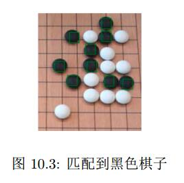
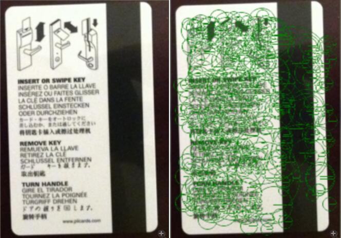

# 位图的模板匹配

## 模板匹配的工作方式
**通过在输入图像上滑动图像块对实际的图像块和输入图像进行匹配**

from [模板匹配(Match Template)](http://www.cnblogs.com/xrwang/archive/2010/02/05/MatchTemplate.html)
```
模板匹配的工作方式跟直方图的反向投影基本一样，大致过程是这样的：通过在输入图像上滑动图像块对实际的图像块和输入图像进行匹配。
假设我们有一张100x100的输入图像，有一张10x10的模板图像，查找的过程是这样的：
  （1）从输入图像的左上角(0,0)开始，切割一块(0,0)至(10,10)的临时图像；
  （2）用临时图像和模板图像进行对比，对比结果记为c；
  （3）对比结果c，就是结果图像(0,0)处的像素值；
  （4）切割输入图像从(0,1)至(10,11)的临时图像，对比，并记录到结果图像；
  （5）重复（1）～（4）步直到输入图像的右下角。
大家可以看到，直方图反向投影对比的是直方图，而模板匹配对比的是图像的像素值；模板匹配比直方图反向投影速度要快一些，但是我个人认为直方图反向投影的鲁棒性会更好。
```

## 模板匹配的匹配方式

from [模板匹配(Match Template)](http://www.cnblogs.com/xrwang/archive/2010/02/05/MatchTemplate.html)
```
在OpenCv和EmguCv中支持以下6种对比方式：
  CV_TM_SQDIFF 平方差匹配法：该方法采用平方差来进行匹配；最好的匹配值为0；匹配越差，匹配值越大。
  CV_TM_CCORR 相关匹配法：该方法采用乘法操作；数值越大表明匹配程度越好。
  CV_TM_CCOEFF 相关系数匹配法：1表示完美的匹配；-1表示最差的匹配。
  CV_TM_SQDIFF_NORMED 归一化平方差匹配法
  CV_TM_CCORR_NORMED 归一化相关匹配法
  CV_TM_CCOEFF_NORMED 归一化相关系数匹配法
  根据我的测试结果来看，上述几种匹配方式需要的计算时间比较接近（跟《学习OpenCv》书上说的不同），我们可以选择一个能适应场景的匹配方式。
```

## Image.findTemplate
> 简而言之就是在大图中查找小图（类似），是一种基本的模式查找。
> 使用标准的openCV模板（模式）匹配，不能处理缩放和旋转的情况
> 模板匹配不够稳健，限制较多。

```
This function searches an image for a template image.  The template
image is a smaller image that is searched for in the bigger image.
This is a basic pattern finder in an image.  This uses the standard
OpenCV template (pattern) matching and cannot handle scaling or rotation

Template matching returns a match score for every pixel in the image.
Often pixels that are near to each other and a close match to the template
are returned as a match. If the threshold is set too low expect to get
a huge number of values. The threshold parameter is in terms of the
number of standard deviations from the mean match value you are looking

For example, matches that are above three standard deviations will return
0.1% of the pixels. In a 800x600 image this means there will be
800*600*0.001 = 480 matches.

This method returns the locations of wherever it finds a match above a
threshold. Because of how template matching works, very often multiple
instances of the template overlap significantly. The best approach is to
find the centroid of all of these values. We suggest using an iterative
k-means approach to find the centroids.
```

### 参数
* *template_image* - The template image.
* *threshold* - Int，调整匹配的质量（阈值），同样，阈值越低越容易匹配（假阳性增多）
* *method* - 设定匹配使用的方法
  * SQR_DIFF_NORM - Normalized square difference
  * SQR_DIFF      - Square difference
  * CCOEFF        -
  * CCOEFF_NORM   -
  * CCORR         - Cross correlation
  * CCORR_NORM    - Normalize cross correlation

### 样例
```python
from SimpleCV import Image
# 加载图像和模板
goBoard = Image(’go.png’)
black = Image(’go-black.png’)
# 找到匹配的对象并标记出来
matches = goBoard.findTemplate(black)
matches.draw()
# 在棋盘上显示结果并打印出匹配的数目
goBoard.show()
 print str(len(matches)) + " matches found."
 # 结果应该是：找到9个匹配对象
```


# 关键点模板匹配
> 定义： 图片中在光照角度/强度变化时保持不变的独特区域，有助于计算不同视角、旋转角度、视角重叠的单应homographics。
> 一个关键点可以描述一个不受位置、旋转和照明影响的对象
> 很多环境中，检测到的角点是非常好的关键点（夹角）
> simpleCV中支持四种关键点检测器和一种形式的关键点descriptor。**Only the surf flavor** of keypoint returns feature and descriptors at this time.

## Image.findKeypoint

### 参数

* *min_quality* - The minimum quality metric for SURF descriptors. Good values
  range between about 300.00 and 600.00

* *flavor* - a string indicating the method to use to extract features.
  A good primer on how feature/keypoint extractiors can be found in
  `feature detection on wikipedia <http://en.wikipedia.org/wiki/Feature_detectio
n_(computer_vision)>`_
  and
  `this tutorial. <http://www.cg.tu-berlin.de/fileadmin/fg144/Courses/07WS/compP
hoto/Feature_Detection.pdf>`_

  * "SURF" - extract the SURF features and descriptors. If you don't know
    what to use, use this.

    See: http://en.wikipedia.org/wiki/SURF

  * "STAR" - The STAR feature extraction algorithm

    See: http://pr.willowgarage.com/wiki/Star_Detector

  * "FAST" - The FAST keypoint extraction algorithm

    See: http://en.wikipedia.org/wiki/Corner_detection#AST_based_feature_detecto
rs

  `All the flavour specified below are for OpenCV versions >= 2.4.0` :

  * "MSER" - Maximally Stable Extremal Regions algorithm

    See: http://en.wikipedia.org/wiki/Maximally_stable_extremal_regions

  * "Dense" -

  * "ORB" - The Oriented FAST and Rotated BRIEF

    See: http://www.willowgarage.com/sites/default/files/orb_final.pdf

  * "SIFT" - Scale-invariant feature transform

    See: http://en.wikipedia.org/wiki/Scale-invariant_feature_transform

* *highQuality* - The SURF descriptor comes in two forms, a vector of 64 descrip
tor
values and a vector of 128 descriptor values. The latter are "high"
quality descriptors.

### 示例
```python
from SimpleCV import Image
card = Image(’keycard.png’)
keys = card.findKeypoints()
keys.draw()
card.show()
```


## Image.findKeypointMatch

### 参数
* *template* - A template image.
* *quality* - The feature quality metric. This can be any value between about 300 and 500. Higher values should return fewer, but higher quality features.
* *minDist* - The value below which the feature correspondence is considered a match. This is the distance between two feature vectors. Good values are between 0.05 and 0.3
* *minMatch* - The percentage of features which must have matches to proceed with homography calculation.
  A value of 0.4 means 40% of features must match. Higher values mean better matches are used. Good values are between about 0.3 and 0.7

### 示例

```python
template = Image("template.png")
img = camera.getImage()
fs = img.findKeypointMatch(template)
if fs is not None:
  fs[0].draw()
  img.show()
```

# 光流
> 和模板匹配很相似，以一幅图像上很小的区域为模板，在另一幅图像上扫描，尝试找到一个匹配，如果能，则根据它的坐计算出运动的方向
> 只限2D的移动（垂直摄像头的方向的移动不能 ...）

## Image.findMotion
> current.findMotion(previous)
> 返回motion的特征集

### 参数
* *previous_frame* - The last frame as an Image.
* *window* - The block size for the algorithm. For the the HS and LK methods
  this is the regular sample grid at which we return motion samples.
  For the block matching method this is the matching window size.
* *method* - The algorithm to use as a string.
  Your choices are:

  * 'BM' - default block matching robust but slow - if you are unsure use this.

  * 'LK' - `Lucas-Kanade method <http://en.wikipedia.org/wiki/Lucas%E2%80%93Kana
de_method>`_

  * 'HS' - `Horn-Schunck method <http://en.wikipedia.org/wiki/Horn%E2%80%93Schun
ck_method>`_

* *aggregate* - If aggregate is true, each of our motion features is the average
 of motion around the sample grid defined by window. If aggregate is false we just return the the value as sampled at the window grid interval. For block matching this flag is ignored.

### 示例
```python
from SimpleCV import Camera, Color, Display
cam = Camera()
previous = cam.getImage()
disp = Display(previous.size())
while not disp.isDone():
  current = cam.getImage()
  motion = current.findMotion(previous)
  for m in motion:
    m.draw(color=Color.RED,normalize=False)
    current.save(disp)
    previous = current
```

# haar样特征
> 用来对更一般的对象进行分类。
> 常用语面部识别，判断目标对象是否属于（人）脸
> harr样特征是通过将图像切割来识别的关键参数，这个模板信息一般存储在harr分类器中，通常是XML文件（训练产生、下载已有的...）
> SimpleCV内置的分类器包括：
* 脸的正面
* 脸的轮廓
* 眼镜
* 耳朵

---

> A Haar like feature cascase is a really robust way of finding the location of a known object.
This technique works really well for a few specific applications like face, pedestrian, and vehicle detection. It is worth noting that this approach **IS NOT A MAGIC BULLET** .
Creating a cascade file requires a large number of images that have been sorted by a human.
If you want to find Haar Features (useful for face detection among other purposes) this will return Haar feature objects in a FeatureSet.
For more information, consult the cv.HaarDetectObjects documentation.
To see what features are available run img.listHaarFeatures() or you can
provide your own haarcascade file if you have one available.
Note that the cascade parameter can be either a filename, or a HaarCascade
loaded with cv.Load(), or a SimpleCV HaarCascade object.

---

> harr分类器在严格控制的环境中表现最好

## Image.findHarrFeatures
> Signature
```python
card1.findHaarFeatures(cascade, scale_factor=1.2, min_neighbors=2, use_canny=1, min_size=(20, 20))
```

### 参数
* *cascade*
> The Haar Cascade file, this can be either the path to a cascade file or a HaarCascased SimpleCV object that has already been loaded.
> harr分类器的XML文件
* *scale_factor*
>  scaling factor for subsequent rounds of the Haar cascade (d fault 1.2) in terms of a percentage (i.e. 1.2 = 20% increase in size)
> harr分类器对图像尺度很敏感，为了模仿（实现）尺度不变性，算法会运行很多次，每次运行前会把模板放大一定比例。 该参数控制该比例

* *min_neighbors*
> The minimum number of rectangles that makes up an object. Ususally detected faces are clustered around the face, this is the number of detections in a cluster that we need for detection. Higher values here should reduce false positives and decrease false negatives.

* *use-canny*
> Whether or not to use Canny pruning to reject areas with too many edges (default yes, set to 0 to disable)

* *min_size* - Minimum window size. By default, it is set to the size
  of samples the classifier has been trained on ((20,20) for face detection)

### 示例
```python
from SimpleCV import Camera, Display
cam = Camera()
disp = Display(cam.getImage().size())
while disp.isNotDone():
  img = cam.getImage()
  #查找脸部
  faces = img.findHaarFeatures(’face’)
  if faces is not None:
    # 找到最大的
    faces = faces.sortArea()
    bigFace = faces[-1]
    #在其周围绘制绿色方框
    bigFace.draw()
  img.save(disp)
```

# 条形码

```python
from SimpleCV import Color, Camera, Display
cam = Camera()
display = Display()
message = "Last item scanned: "
result = "None"
while( display.isNotDone() ):
  img = cam.getImage()
  barcode = img.findBarcode()
  if( barcode is not None ):
    result = str(barcode.data)
  img.drawText(message + result, color=Color.GREEN, fontsize=40)
  img.save(display)
```
