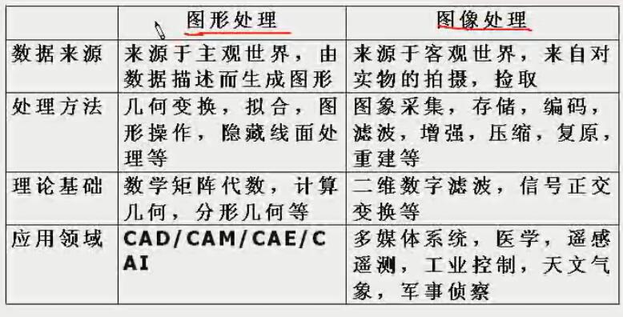
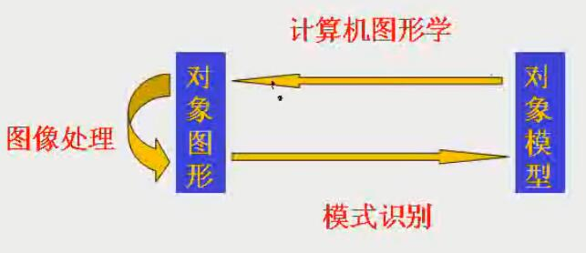

<!-- TOC depthFrom:1 depthTo:6 withLinks:1 updateOnSave:1 orderedList:0 -->

- [计算机图形学定义](#计算机图形学定义)
- [图片处理](#图片处理)
- [图形数据来源](#图形数据来源)
- [图形构成](#图形构成)
- [图形的表示方法](#图形的表示方法)
- [图像image vs 图像graph](#图像image-vs-图像graph)
- [图形计算机处理相关学科](#图形计算机处理相关学科)
- [图形标准](#图形标准)
- [图形基础知识](#图形基础知识)
	- [图形信息存储](#图形信息存储)
	- [像素和分辨率](#像素和分辨率)
		- [像素pixel](#像素pixel)
		- [硬件分辨率和显示分辨率](#硬件分辨率和显示分辨率)
		- [分辨率度量](#分辨率度量)
	- [色深](#色深)
	- [帧缓冲区容量](#帧缓冲区容量)

<!-- /TOC -->

<!-- 大约对应视频第 1，2 集 -->

#计算机图形学定义
> 研究利用**计算机来处理图形**的原理、方法和技术的学科

#图片处理
* 图形描述
* 图形生成
* 图形变换
* 图形存储
* 图形输出

#图形数据来源
* 描述图形
> 函数、代数方程、表达式锁描述的图形
* 自然图形
> 来自各种输入媒体（相机等）的图案、图像、图景等

#图形构成
* 几何要素
> 描述对象的轮廓、形状的几何信息

	* 点
	* 线
	* 面
	* 弧
	* 体

* 非几何要素
> 描述对象的颜色、纹理等非几何信息

#图形的表示方法
* 点阵式
> 枚举出所有的点
* 参数式
> 由图形的形状参数+属性参数来表示
	* 形状参数
		> 方程或分析表达式的参数，线段的端点坐标等
	* 属性参数
		> 颜色、线型等

	***yonka*** 特征概括+参数特化

#图像image vs 图像graph
* 图像image
> 位图bitmap（点阵式）形式存在的灰度信息（早期是没有色彩的）
* 图形graph
> 含有几何属性，更强调场景的几何表示，由场景的几何模型和景物的物理属性共同组成

#图形计算机处理相关学科
* 图像处理
> 侧重对图像的分析、处理、再现
* 模式识别
> 测试对图形的识别、分析，从图形到模型描述
* 计算机图形学
> 侧重从模型到图形（由非图形信息和成对应的图形）

#图形标准
* ISO
	* CGI
	* CGM
	* GKS
	* PHIGS

#图形基础知识

##图形信息存储

荧光屏上所有点的度值存储在被称为 帧缓冲区frame buffer 的内存区域，一一对应。
帧缓冲区 --- 显示控制器 --- 显示器

##像素和分辨率

###像素pixel
> pixel ---> picture element 像素点
> 图形显示在屏幕时按当前显示分辨率所能提供的最小元素点 -> 软件规定的最小像素点

###硬件分辨率和显示分辨率
* 硬件分辨率
> 计算机显示控制器所能提供的分辨率
* 显示分辨率
> 软件控制的当前使用的分辨率，小于或等于硬件分辨率。 小于硬件分辨率时，一个显示像素可能会大于“物理像素”区域

###分辨率度量
* 字符
> 西文字符，如 80x25
* 像素
> 如 1280x720

##色深
> 像素点信息的长度，以bit为单位

* 黑白光栅
> 只需要1bit，1表示亮，0表示暗
* 彩色光栅
> 16色需要4bits； 256色需要8bits； true color需要24bits

##帧缓冲区容量
> 显示分辨率 x 色深
> 如 1024x768分辨率的true color，则需要 1024 x 768 x 24  bits
