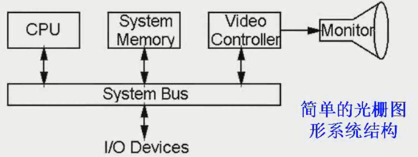
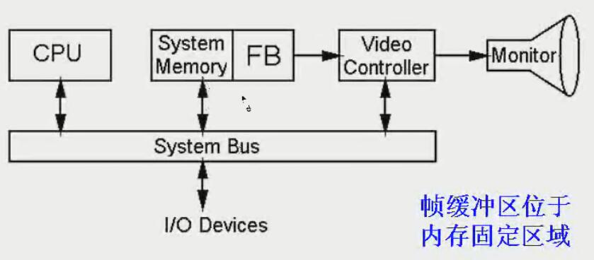
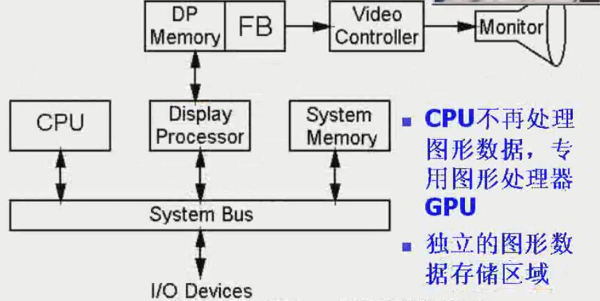
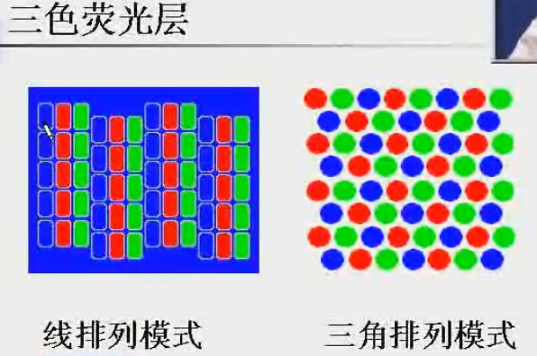
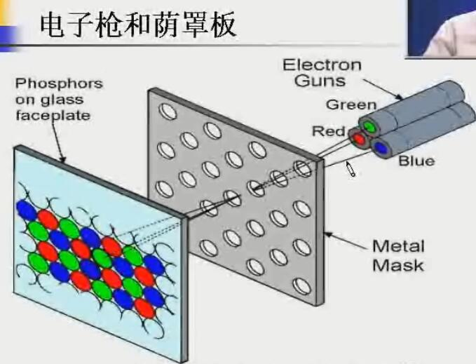
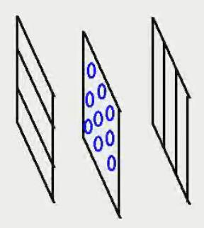
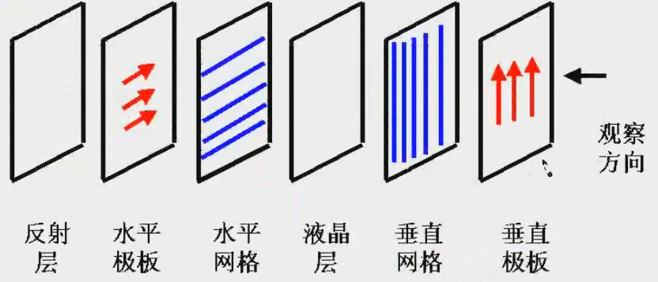
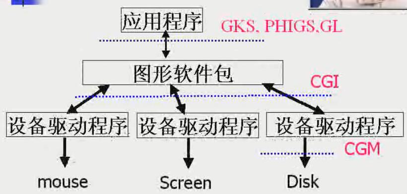

<!-- TOC depthFrom:1 depthTo:6 withLinks:1 updateOnSave:1 orderedList:0 -->

- [图形系统的基本功能和组成](#图形系统的基本功能和组成)
	- [基本功能](#基本功能)
- [图形系统硬件](#图形系统硬件)
	- [硬件设备分类](#硬件设备分类)
	- [视频显示设备](#视频显示设备)
		- [光栅系统结构](#光栅系统结构)
		- [彩色CRT](#彩色crt)
			- [产生彩色的机制](#产生彩色的机制)
		- [直视存储管](#直视存储管)
		- [平板显示器](#平板显示器)
			- [等离子板（气体放电显示器）](#等离子板气体放电显示器)
			- [液晶显示器LCD](#液晶显示器lcd)
				- [LCD基本结构](#lcd基本结构)
	- [输入设备](#输入设备)
	- [硬拷贝设备](#硬拷贝设备)
- [图形系统](#图形系统)
	- [图形软件类型](#图形软件类型)
	- [图形系统坐标表示](#图形系统坐标表示)
- [图形软件标准](#图形软件标准)
	- [ISO&ANSI](#isoansi)
	- [流行于工业界的软件包](#流行于工业界的软件包)

<!-- /TOC -->

#图形系统的基本功能和组成

##基本功能
* 图形输入
* 图形计算
* 图形交互
* 图形输出
* 图形存储

#图形系统硬件

##硬件设备分类
* 输入设备
* 输出设备
* 存储设备
* 通信设备

##视频显示设备
* 刷新式CRT
> CRT 阴极射线管，基本部件如下：
  * 电子枪（加热阴极+控制栅极）
  * 聚焦系统
  * 加速阳极
  * 偏转系统
  * 荧光屏
* 光栅与随机扫描显示器
* 彩色CRT
* 直视存储管DVST
* 平板显示器

###光栅系统结构
* 简单光栅系统结构

* 二代光栅系统结构

> FB在内存的特定区域，可以不走系统总线，提高效率

* 新结构

> 独立的图形存储内存（GPU内存）
> 独立的图形处理器（GPU）

###彩色CRT

####产生彩色的机制
* 电子渗透法
> 不同的电子（动能）穿透不同，而不同深度不同的荧光物质，那么显示的色彩取决于电子束穿入荧光层的深度
>
> 技术特点：
  * 主要用于随机扫描显示器产生彩色（廉价）
  * 只能获得四种颜色
  * 图片质量差
* 荫罩法
> 主要结构：
  * 三色荧光屏
  
  * 三电子枪
  * 荫罩板
  

###直视存储管
> 将图片信息以电荷分布存储在荧光屏后
>
> 特点：
  * 无需刷新，能在高分辨率下无闪烁的显示复杂图形
  * 不能显示彩色
  * 图形的擦除和重画过程耗时
  * 基于以上，已经被光栅系统取代

###平板显示器
> 定义： 代表一类比CRT体积小、重量轻、低功耗的视频设备
> 分类：
* 发射型显示器： 转换电能为光
  * 如LED
  * 等离子
  * 薄膜光电显示器
* 非发射型显示器： 利用光学效应把太阳光或其他光源转换为图形模式
  * LCD

####等离子板（气体放电显示器）

* 两块带有水平和垂直导电带的玻璃板
* 中间是氖气泡
* 在成对的水平和垂直导电带上施加点火电压，使导电带交叉点处的氖气进入辉光放点的等离子区

####液晶显示器LCD
**液晶** 介于固体和液体之间，具有规则性分子排列的有机化合物
**技术背景**
* 光的极性可改变
* 液晶能传输和改变光的极性
* 电场能改变液晶的分子排列结构
* 存在导电的透明物质（铟-锡氧化物）

**显示原理** 通过阻塞或传递来自周围的或内部光源的偏振光形成图案

**类型**
* 无源矩阵（被动式）
> 在亮度和可视角方面有较大限制，反应速度也比较慢。 不适合作为桌面显示器。
* 有源矩阵（主动式）
> TFT薄膜晶体管

#####LCD基本结构

##输入设备
* 键盘、鼠标
* 跟踪球、空间球
* 操纵杆
* 数据手套
* 数字化仪
* 扫描仪
* 触摸屏
* 光笔
* 声频输入系统

##硬拷贝设备
> 能永久保存屏幕图像的设备

* 打印机
* 绘图仪

#图形系统

##图形软件类型
* 通用编程软件包
> 编程语言的api/sdk，主要面向程序猿
* 专用应用软件包
> 为非程序猿设计，可以生成图形而无需考虑原理，如 CAD

##图形系统坐标表示
* 建模坐标
> 以模型（为原点）看世界
* 世界坐标
> 从世界看模型
* 规范化坐标
> 逻辑坐标，多在 [0, 1]

> 不同设备可能有不同的坐标系

#图形软件标准
> 标准的最初目的： 可移植性
* 硬件系统之间
* OS之间
* 开发工具之间
* 编程语言之间

##ISO&ANSI
* GKS/GKS3D
> Graphical Kernel System，定义了一个独立于语言的图形核心系统，包括全部的图形处理功能，分为十类。
* PHIGS/PHIGS+
> Programmer's Hierarchical Interactive Graphics Standards，程序猿分层交互图形标准。 是GKS的扩展，增加了对象建模、彩色设定、图形管理等功能。
* CGI
> Computer Graphics Interface 计算机图形接口，提供了控制图形硬件的一种与设备无关的方法
* CGM
> Computer Graphics Metafile，计算机图形元文件。 一套与设备无关的语法词法定义的图形文件格式。

##流行于工业界的软件包
* SGI's GL
* OpenGL

**标准作用范围**

