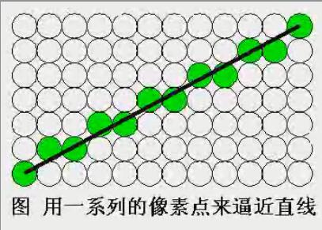
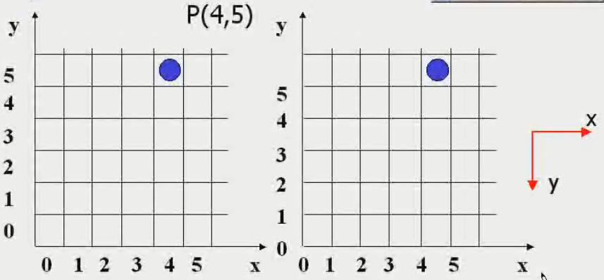
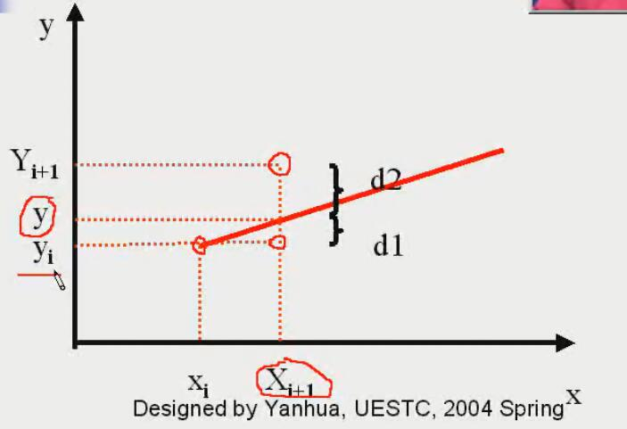
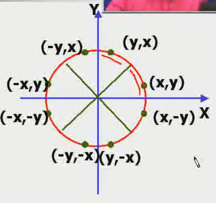
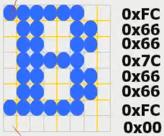
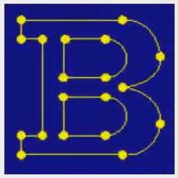

<!-- TOC depthFrom:1 depthTo:6 withLinks:1 updateOnSave:1 orderedList:0 -->

- [图元](#图元)
	- [概念](#概念)
	- [类型](#类型)
- [一些其他概念](#一些其他概念)
	- [图形的扫描转换](#图形的扫描转换)
	- [屏幕网格坐标](#屏幕网格坐标)
- [点绘制](#点绘制)
- [画线算法](#画线算法)
	- [Bresenham直线算法](#bresenham直线算法)
- [圆生成算法](#圆生成算法)
	- [圆的属性](#圆的属性)
		- [公式](#公式)
		- [symmetry对称性](#symmetry对称性)
	- [中点画圆算法](#中点画圆算法)
- [字符生成](#字符生成)
	- [字体typeface](#字体typeface)
	- [字模font](#字模font)
		- [TrueType](#truetype)
	- [字库](#字库)
- [区域填充](#区域填充)
	- [扫描线填充算法](#扫描线填充算法)
	- [递归填充算法](#递归填充算法)

<!-- /TOC -->

<!-- 主要对应视频的第 6~12 节 -->

#图元

##概念
> 包含坐标和其他属性信息的基本几何结构，即 **最基本的图形元素**

##类型
* 一级元素
  * 点
  * 线
* 二级元素
  * 多边形
  * 曲线
  * 字符串
* ...

#一些其他概念

##图形的扫描转换
> 光栅扫描器 可以看做 一个像素的矩阵
> 在光栅显示器上显示图形，确定最佳逼近图形的像素集合，并用指定属性写像素的过程 称为 **图形的扫描转换** 或 **光栅化**

##屏幕网格坐标
* 坐标在格子（线段）上
* 坐标在格子顶点处

#点绘制
>

#画线算法
> y = m * x + b
> 四舍五入/浮点运算，选择最接近的整数点 --- 运算较多

##Bresenham直线算法
> 只用整数计算寻找最接近实际直线的整数坐标
* 斜率<1则每次x以1步长变化而y则有（1步长）变化和不变两种情况； 斜率>1则x y互换...

**算法推导**
假定： `0<m<1`，已知 (xi, yj)， 求下一点是 (xi+1, yj) 还是 (xi, yj+1)？
推导：
* d1 = y - yj = m * xi+1 + b - yj = m * (xi + 1) + b - yj
* d2 = yj+1 - y = yj + 1 - m * (xi + 1) - b
* d2 - d1 = 2m * (xi + 1) - 2 * yj + 2b - 1
* ...

**算法结论**
1. 端点坐标 (x0, y0), (xn, yn)
2. 计算常数 P0, C1, C2，如果 P0 < 0，下一点的y坐标不变，否则加1
> P0 = 2△y - △x
>> △y = yn - y0
>> △x = xn - x0
>
> Pi+1 = Pi + 2△y if Pi < 0 else Pi + 2△y - 2△x

3. 画起始点 (x0, y0)
4. 以单位步长增加x，计算 Pi+1，确定下一点
5. 重复4，直至 xi = xn

> 其他象限则利用对称性，先翻转到positive的象限确定坐标后再加上负号
> \>45°的情况则x、y互换

#圆生成算法

##圆的属性

###公式
* 直角坐标系
> (x - xc)2 + (y-yc) = r2
>> 计算量大（开根号）
>> 产生不等间距

* 极坐标
> x = xc + r * cosΘ
> y = yc + r * sinΘ
>> 计算量大（sin、cos）

###symmetry对称性
> 只需要花八分之一圆弧（假设采样了n个点），然后根据对称性可以得到其他7n个点的坐标

##中点画圆算法
> 跟Breseham算法思路类似： 不直接用公式，而是先推一个判断公式，计算出决策参数，然后决定圆弧上的像素点的选取

* 选取90°~45°这八分之一圆弧（之所以是递减，是要使得x递增），在这八分之一圆弧里，x递增的速度比y递减的速度快，所以每次x递增1，然后决策y是否减1

**算法推导**

**算法描述**
1. 圆心 (xc, yc) 和 半径 r，那么 (x0, y0) = (0, r)
2. 计算 P0 = 1 - r
3. 根据公式计算 Pi+1，确定下一个点（<0则选择y不变，否则选择y减一）
> Pi+1 = Pi + 2xx+1 + 1 if Pi < 0 else Pi + 2(xi+1 - yi+1) + 1
4. 确定对称点
5. 重复3直至x>=y

#字符生成

##字体typeface
> 一组字符的完整设计风格

##字模font
> 一组按照特定尺寸和风格设计的字符模板图案
> 构成方式：
* 点阵式、位图字体bitmap font

>> 采用逐位映射的方式得到（有色为1无色为0，如图里第一行为0xFC...）
>> 特点
  * 易于定义显示
  * 空间需求量大
* 矢量式、轮廓字体outline font

>> 把字符笔画分解为线段，以线段端点坐标为字符字模的编码（数据内容）
>> 特点：
  * 空间需求量小
  * 时间开销大
>>
>> 编码顺序： 连续笔画 & 自然笔画

###TrueType
> 定义了填充区域而的轮廓字体

##字库
> 存储每个字符的字模编码信息
> 类型：
* 矢量字库
* 点阵字库

#区域填充
> 如多边形区域的颜色填充： 可以用扫描线与边界交点确定填充区域
> 有一些复杂边界很难写出边界方程： 递归算法，从内部向外填充直到触发终止条件

##扫描线填充算法
> 扫描线的填充过程
1. 求交
>> 不算水平边和扫描线的交点
2. 排序
3. 配对
>> 两两配对可以确定内外区域
4. 填色

* 扫描线多边形填充算法
* 内外测试

##递归填充算法
* 边界填充算法
* 洪范填充算法
