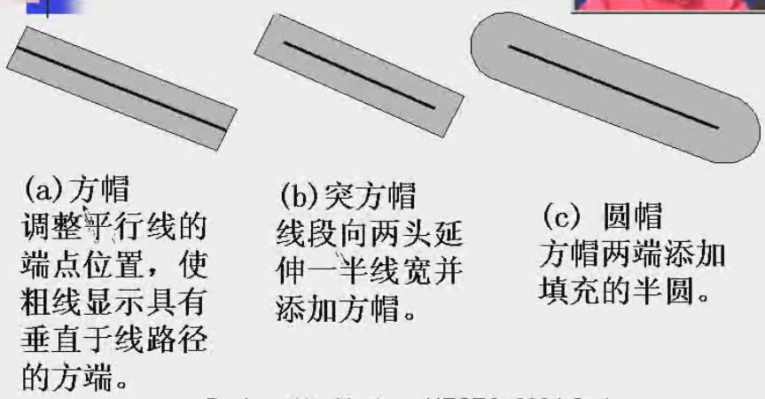
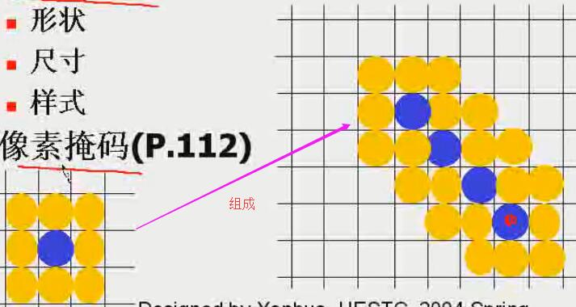
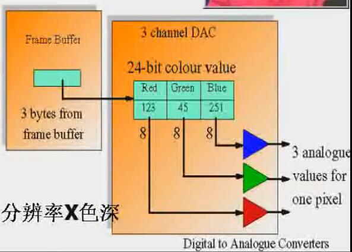
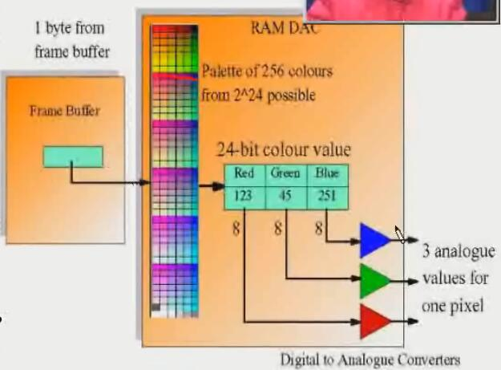

<!-- TOC depthFrom:1 depthTo:6 withLinks:1 updateOnSave:1 orderedList:0 -->

- [图元属性参数](#图元属性参数)
	- [属性选择设计](#属性选择设计)
- [线属性](#线属性)
	- [线型](#线型)
	- [线宽](#线宽)
	- [线色](#线色)
- [曲线属性](#曲线属性)
	- [曲线宽度](#曲线宽度)
- [颜色表和颜色查找表](#颜色表和颜色查找表)
	- [颜色信息存储方式](#颜色信息存储方式)
		- [颜色表（直接存储策略）](#颜色表直接存储策略)
		- [颜色查找表（间接存储策略）](#颜色查找表间接存储策略)
- [区域填充属性](#区域填充属性)
- [字符数形](#字符数形)
- [反走样antialiasing](#反走样antialiasing)

<!-- /TOC -->

<!-- 主要对应视频的 13-14 节 -->

# 图元属性参数
> 任何影响图元显示方法的参数
* 颜色
* 尺寸（宽度...）

## 属性选择设计
* 扩展输出图元的函数的参数列表
* 维护一张系统当前属性值表，并且软件包提供相应的函数设置当前值（fallback？current？）

# 线属性
## 线型
* 实线
* 虚线
* 点线

> **实现** 绘制实心或者空白的像素段，使用像素掩码指定像素段长度，如 11110000。简单粗暴，适应各种长度的像素段。
> **问题** 不同方向产生不等长的线段（非水平/垂直方向的同样像素点的空间长度大于水平/垂直方向）
> **解决办法** 根据斜率调整实心段和空白段的像素数目

## 线宽
* 形状
* 尺寸
* 样式

> **实现** 显示（像素上）相邻的平行线段
> **类型**
  * 水平或垂直方向扩展。 水平： |m| > 1； 垂直： |m| < 1
  >> **问题** 无论斜率大小，生成的直线的端点都是水平或垂直的，不够“真实”（除非线水平或垂直，否则端点不是垂直于线方向）
  >> **解决办法** 添加键帽： 方帽、突方帽、圆帽
  >> 
  * 矩形区域填充
  * 画笔或画刷
    >> 实现： 小图案组成直线
    >> 

## 线色

# 曲线属性
> 跟直线类似，用像素掩码来...
> **问题** 和直线一样（而且更突出），不同方向上的像素段不等长
> **解决办法** 根据斜率来确定实心段和空白段的像素数目

## 曲线宽度
* 水平垂直方向扩展
  > 根据曲线在该点上的斜率来选择扩展方式

  * |m| > 1： 水平方向
  * |m| < 1： 垂直方向
* 填充平行曲线路径之间的区域（外曲线、内曲线，之间）
* 画笔或画刷
> 参考直线...

# 颜色表和颜色查找表

## 颜色信息存储方式
### 颜色表（直接存储策略）

> 直接根据数据选择颜色，帧缓冲区里的像素值就是颜色信息
> 优点
  * 灵活，可以同时使用颜色范围的任一颜色
  * 硬件简单
> 缺点
  * 帧缓冲区存储容量需求大
  * 视频操作速度慢（如24bits色深，改变一个像素需要24bits/3bytes）
### 颜色查找表（间接存储策略）

> 颜色查找表 是 颜色表的一个子集，决定了“本次”能使用的颜色。 可以根据需要进行更新，使得每一次实际可以使用到全部颜色
> 帧缓冲区中的像素值是 颜色查找表索引值
> 根据索引查找到颜色（比如24bits）然后再给...
> 查找表项的长度大于帧缓冲区每像素的长度（可表示大小） - 这样才有意义，使得帧缓冲中像素值比较小
> **代价** 每次只能使用一部分颜色（比如帧缓冲区1byte/pixel的话，每次只能使用256种颜色） **#yonka# 也许比较适合颜色渐进/相对简单的图像**
> 优点
  * 提供合理的能够同时显示的颜色数量，而无需增加帧缓冲区容量（需求量小）
  * 视频操作快（改变每个像素所需要的数据量小）

> 缺点
  * 需要告诉RAM-DAC
  * 能同时使用的颜色数有限

# 区域填充属性
> 自学 = =

# 字符数形
> 自学 = =

# 反走样antialiasing
