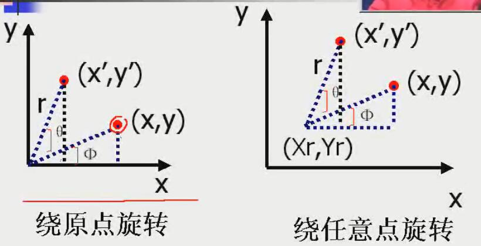
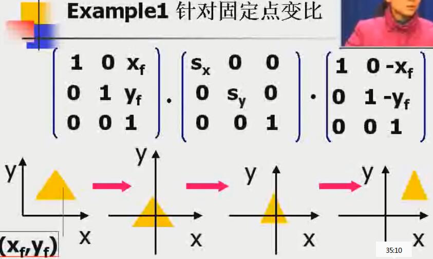
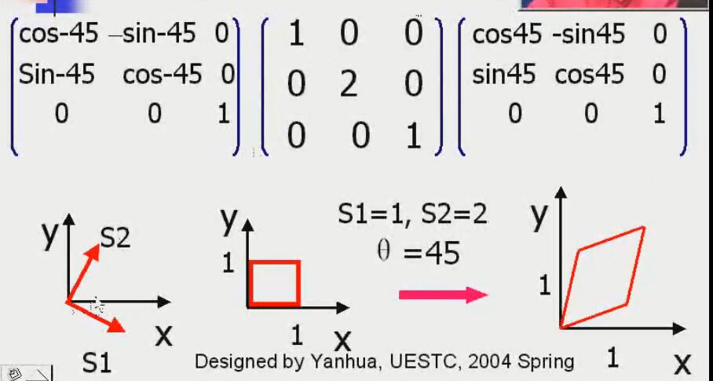

<!-- TOC depthFrom:1 depthTo:6 withLinks:1 updateOnSave:1 orderedList:0 -->

- [基本变换](#基本变换)
	- [矩阵运算](#矩阵运算)
	- [其次坐标表示](#其次坐标表示)
	- [平移变换translation](#平移变换translation)
	- [2D旋转rotation](#2d旋转rotation)
		- [旋转变换公式](#旋转变换公式)
	- [2D变比scaling](#2d变比scaling)
		- [变比公式](#变比公式)
- [复合变换](#复合变换)
	- [连续平移](#连续平移)
	- [连续旋转](#连续旋转)
	- [连续变比](#连续变比)
	- [通用基准点的变换](#通用基准点的变换)
		- [思路](#思路)
		- [例子](#例子)
	- [通用方向的变换](#通用方向的变换)
		- [思路](#思路)
		- [例子](#例子)
	- [通用复合变换矩阵](#通用复合变换矩阵)
	- [程序实现](#程序实现)
- [其他变换](#其他变换)
	- [反射](#反射)
		- [X轴反射](#x轴反射)
		- [Y轴反射](#y轴反射)
		- [原点反射](#原点反射)
		- [45度角反射](#45度角反射)
	- [错切](#错切)
		- [X方向错切](#x方向错切)
		- [Y方向错切](#y方向错切)
- [坐标系间的变换](#坐标系间的变换)
- [变换的光栅方法](#变换的光栅方法)

<!-- /TOC -->

<!-- 原视频15、16节 -->

#基本变换

## 矩阵运算
**矩阵运算满足结合率，不满足交换律**
> A \* B \* C = (A \* B) \* C = A \* (B \* C)
> A \* B != B \* A

## 其次坐标表示
> 矩阵变换的时候会用到
> 用 n+1 维向量表示一个 n 维向量

Point<x, y> ---> (xh, yh, h) ---> (x, y, 1)T 也即 [x // y // 1]
那么
* 2D graph可以表示为 []3xn （n个点，每个一列，每列3行（第三行为h））
* 基本变换参数 ---> []3x3
* 2D图形变换坐标运算： P'最终坐标 = M变换矩阵 * P原坐标

## 平移变换translation
> **缺了这部分，原视频14集**

**其次坐标矩阵表示**
> [x', y', 1] = [1 0 tx // 0 1 ty // 0 0 1] · [x // y // 1]
> P' = T(tx, ty) * P

## 2D旋转rotation

> 图形对象沿圆弧路径运动产生的变换
> 旋转也是一种不产生变形而移动对象的刚体物理变化呢
> **描述参数**
* 基准点
* 旋转角Θ
* 方向 （约定：`逆时针为正`，与坐标系角度一样）

### 旋转变换公式
* 针对原点
>  x' = x * cosΘ - y * sinΘ
>  y' = x * sinΘ + y * cosΘ
>
>  **矩阵表示**
>  P = [x // y], P' = [x' // y'], R = [cosΘ -sinΘ // sinΘ cosΘ]
>  P' = R · P
>
> **其次坐标矩阵表示**
> [x' // y' // 1] = [cosΘ -sinΘ 0 // sinΘ cosΘ 0 // 0 0 1] · [x // y // 1]
> P' = R(Θ) * P

* 针对任意点

## 2D变比scaling
> 改变图形对象大小的变换
> **参数**
* 变比因子(sx, sy)
* 基准点

### 变比公式
* 针对原点
>  x' = x * sx
>  y' = y * sy
>
> **矩阵表示**
>> P = [x // y], P' = [x' // y'], S = [sx 0 // 0 sy]
>> P' = S · P
>
> **其次坐标矩阵表示**
>> [x' // y' // 1] = [s<>x</> 0 0 // 0 s<>y</> 0 // 0 0 1] · [x // y // 1]
>> P' = S(sx, sy) * P

* 针对固定参考点(Xf, Yf)
>  x' = Xf + (x - Xf) * Sx
>  y' = Yf + (y - Yf) * Sy
>
> **其次坐标矩阵表示**
>> [x' // y' // 1] = [1 0 tx // 0 1 ty // 0 0 1] · [x // y // 1]
>> P' = T(tx, ty) * P

# 复合变换

## 连续平移
> (tx1, ty1), (tx2, ty2), ... (txn, tyn)
> P' = T(txn, tyn) \* ... T(tx2, ty2) \* T(tx1, ty1) \* P
> T(tx2, ty2) \* T(tx1, ty1) = T(tx1 + tx2, ty1 + ty2)
>
> **连续平移是可加的**

## 连续旋转
> (Θ1), (Θ2), ... (Θn)
> P' = R(Θn) \* ... R(Θ2) \* R(Θ1) \* P
> R(Θ1) \* R(Θ2) = R(Θ1 + Θ2)
>
> **连续旋转是可加的**

## 连续变比
> (sx1, sy1), (sx2, sy2), ..., (sxn, syn)
> P' = S(sxn, syn) \* ... \* S(sx2, sy2) \* S(sx1, sy1) \* P
> S(sx1, sy1) \* S(sx2, sy2) = S(sx1 \* sxx, sy1 \* sy2)
>
> **连续是可加的**

## 通用基准点的变换
### 思路
1. 做平移，基准点移到原点
2. 针对基准点做指定变换
3. 反向平移使基准点回到原始位置

### 例子

## 通用方向的变换
### 思路
1. 做旋转，使得任意方向与坐标轴方向重合
2. 针对坐标轴方向做指定变换
3. 反向旋转，使得任意方向回到院士方向

### 例子

## 通用复合变换矩阵
[x' // y' // 1] = [rsxx rsxy trsx // rsyx // rsyy trsy // 0 0 1] · [x // y // 1]

## 程序实现

# 其他变换

## 反射

### X轴反射
> x不变； y -> -y

### Y轴反射
> y不变； x -> -x

### 原点反射
> x -> -x； y -> -y

### 45度角反射
> x -> y； y -> x

## 错切

### X方向错切
**x方向的拉伸变换**
> [1 SHx 0 // 0 1 0 // 0 0 1]

### Y方向错切
**y方向的拉伸变换**
> [1 0 0 // SHy 1 0 // 0 0 1]

# 坐标系间的变换
(x', y') ---> (x, y)
1. 平移(x0, y0)到(0, 0)
2. 旋转x'轴使得和x轴重合

> M = R(-Θ) * T(-x0, -y0)
> y'方向的单位矢量 v = V/|V| = (vx, vy)
> V顺时针旋转90度得到x'的单位矢量 u = (vy, vx) = (uy, uy)
> R = [ux uy 0 // vx vy 0 // 0 0 1]

# 变换的光栅方法
