<!-- 视频 17~21 节 -->

# 2D观察流程
> 图形“被观察到”/“显示”的部分/样子
> 坐标系的变化，如从世界坐标系 ---> ...

## 几个概念

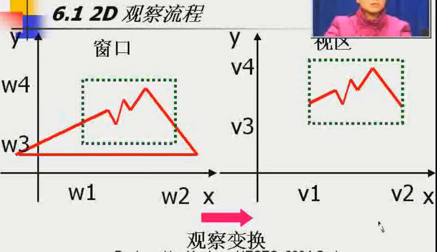

### 观察变化

### 窗口window
> 世界坐标系中指定的用于显示的坐标区域

### 视区/视口viewport
> 显示设备上用于窗口映射的坐标区域（windows ---> ...）

### 观察
> 世界坐标系中的部分场景（window）映射到设备坐标系的过程

## 观察流程

MC建模坐标 - WC世界坐标 - VC观察坐标 - (W-V) - NVC - (W-V) - DC设备坐标

**工作站变换**
> NVC - DC
> 可以打开任意数目的输出设备，使图形场景的各部分定位到不同的输出设备商

# 2D剪裁流程

## 剪裁clipping
> 识别图形在指定区域内/外的过程

### 剪裁时机
> 哪个坐标系...

* 针对窗口边界剪裁
* 针对视区边界剪裁
> 先映射再... 运算量更大，所以一般以前者居多

## 剪裁类型

### 点剪裁
> 点是否在窗口内

### 直线剪裁

#### Cohen-Sutherland算法（CS）
> 思路
* 直线由端点标识
* 先由端点和窗口边界的关系确定是否需要计算交点
  * 一个在外一个在里 - 需要
  * 两个都在里 - 不需要
  * 两个都在外 - 有可能需要
  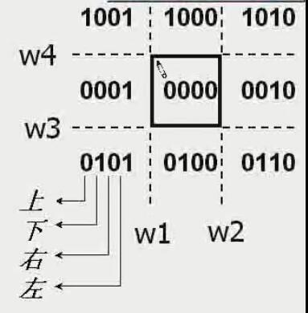
  >> 1. 把两个端点按上表分别计算值c1、c2：
  >> 2. 如果都为0000，保留直线
  >> 3. c1 & c2 !=0 ，则同在某一边界外，删除
  >> 4. c1 & c2 != 0，需要进一步求解交点，把交点和另一端点(跳至1)重复本过程，直至...

#### Liang-Barshy算法（LB）
> 思路： 基于直线段参数方程分析的快速直线剪裁算法
> 参数方程：
>> 直线两端点 (x1, y1), (x2, y2)
>> x = x1 + (x2-x1) * u
>> y = y1 + (y2-y1) * u
>> 0 <= u <= 1
>> ...

##### LB vs CS
> LB效率高于CS，因为减少了交点计算次数。 参数u1和u2的更新需要四次除法，交点坐标计算至多四次乘法。

#### Nicholl-Lee-Nicholl算法（NLN）
> 思路： 通过在剪裁窗口周围创立多个区域，丙再求交运算之前进行更多的区域测试，从而避免对直线线段进行多次剪裁
> 对CS的改进
> 适用范围： 仅2D
> 算法步骤
>> 从P1点向窗口的四个角点发出四条射线来吧窗口分成更多的区域
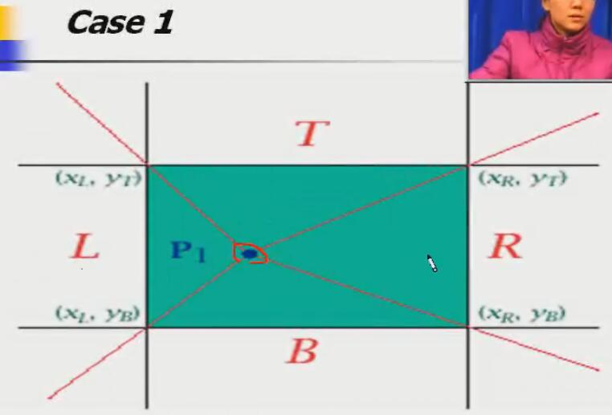
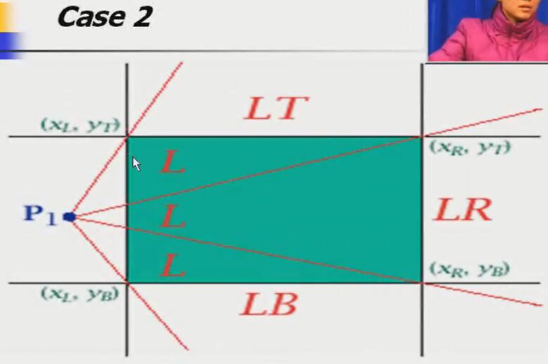
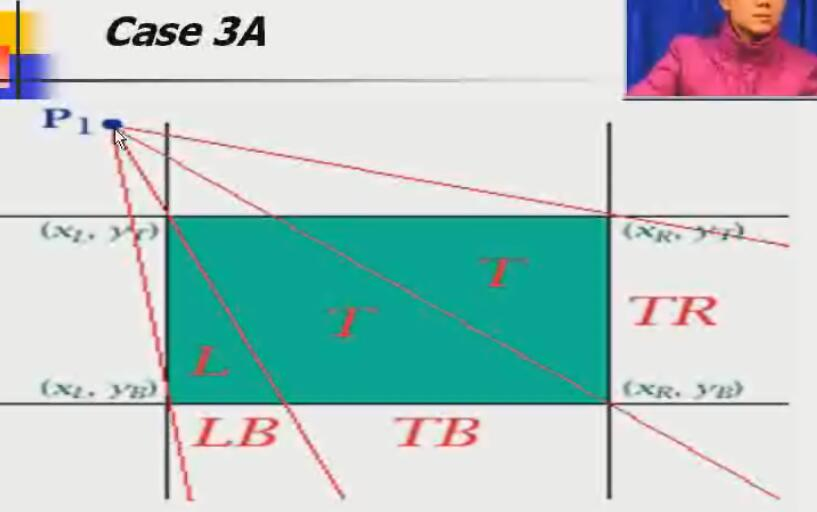
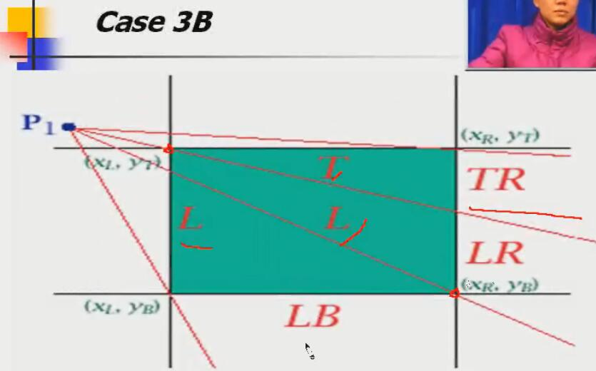

**#yonka# 这一部分暂时略过**

#### 非矩形剪裁窗口

### 多边形剪裁

#### 直接采取直线段剪裁算法
> 每条线进行...
> **问题** 填充问题

#### Sutherland-Hodgman算法
> 思路
>> 1. 以多边形顶点为初始集合（边界还是要的，不能任意两两连线去和边界求交，代价太大。 多维持一份顶点集合）
>> 2. 用窗口左边界裁剪多边形，产生新的顶点序列
>> 3. 对其他边界（右、下、上）repeat 2 得到最终顶点序列

> 算法改进: 只有当窗口的四条边界都确定一个点再窗口中时才加入到输出顶点表中
> 问题： **只适用于凸多边形**
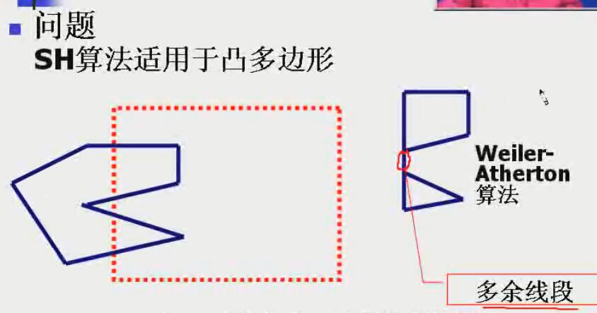

#### Weriler-Atherton算法
> 思路
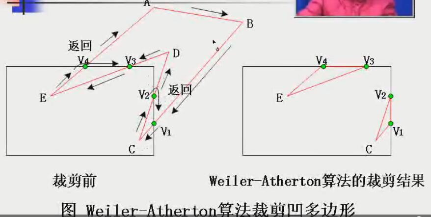
>> 通过修改多边形顶点处理顺序（考虑顶点处理方向），从而正确显示凹多边形。
>> 若顺时针处理，采用下列规则：
* 对由外到内的顶点对，沿着多边形边界的方向
* 对由内到外的顶点对，按顺时针沿窗口边界的方向

> **适用于任意多边形**

### 曲线剪裁

### 文本剪裁

#### 全有或全无字符串剪裁
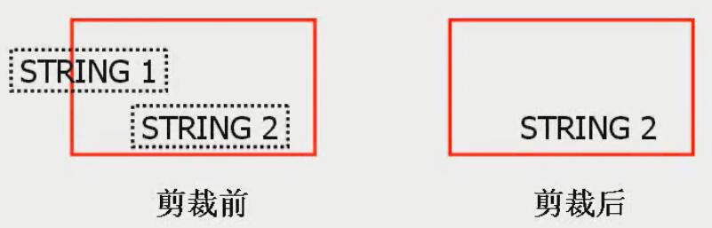
> 以字符串为单位，速度最快

#### 全有或全无字符剪裁
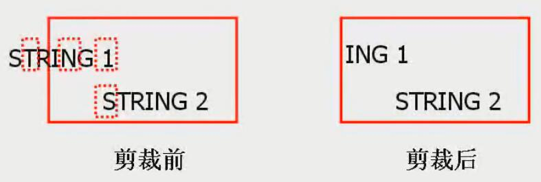
> 以字符为单位

#### 单字符剪裁
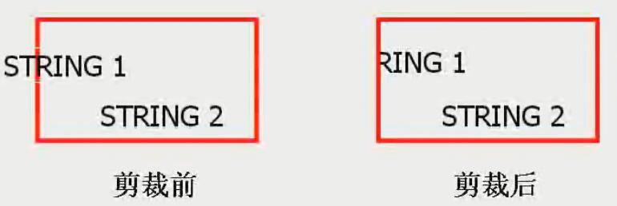
> 以点（点阵字符）或线段（矢量字符）为单位，速度最慢

### 空白剪裁/外部剪裁
> 保留位于剪裁区域外的图形部分的剪裁过程，如 多窗口系统
