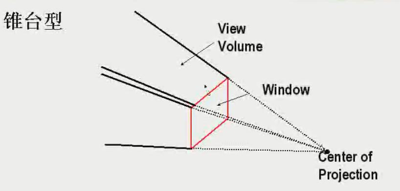
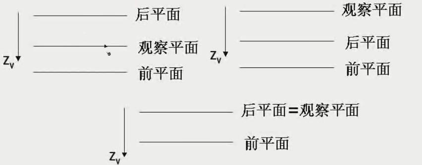

<!-- TOC depthFrom:1 depthTo:6 withLinks:1 updateOnSave:1 orderedList:0 -->

- [3D 概念](#3d-概念)
	- [3D显示方法](#3d显示方法)
		- [平行投影](#平行投影)
		- [透视投影](#透视投影)
		- [深度提示](#深度提示)
		- [可见线面的标识](#可见线面的标识)
		- [表面绘制](#表面绘制)
- [3D物体的表示](#3d物体的表示)
	- [实体表示方法](#实体表示方法)
		- [边界表示](#边界表示)
		- [空间分区表示](#空间分区表示)
	- [多边形表面](#多边形表面)
		- [多边形表](#多边形表)
			- [几何表](#几何表)
			- [属性表](#属性表)
			- [平面方程](#平面方程)
			- [二次曲面](#二次曲面)
			- [样条表示spline representation](#样条表示spline-representation)
				- [样条曲线生成](#样条曲线生成)
			- [样条类型](#样条类型)
			- [连续性条件](#连续性条件)
				- [参数连续性C0 ~ Cn](#参数连续性csup0sup-csupnsup)
				- [几何连续性G0 ~ Gn](#几何连续性gsup0sup-gsupnsup)
			- [Bezier Curves贝塞尔曲线](#bezier-curves贝塞尔曲线)
				- [Bezier构造公式](#bezier构造公式)
				- [样例](#样例)
				- [特点](#特点)
				- [设计技术](#设计技术)
			- [立体构造solid-modeling](#立体构造solid-modeling)
				- [扫描表示](#扫描表示)
				- [构造立体几何法 - CSG](#构造立体几何法-csg)
			- [八叉树octrees](#八叉树octrees)
				- [数据结构](#数据结构)
				- [表示特点](#表示特点)
			- [四叉树](#四叉树)
				- [思路](#思路)
				- [数据结构](#数据结构)
				- [同质象限](#同质象限)
				- [样例](#样例)
			- [分型fractal](#分型fractal)
				- [欧式几何法 vs 分形几何法](#欧式几何法-vs-分形几何法)
				- [基本特征](#基本特征)
				- [生成过程](#生成过程)
				- [分类](#分类)
				- [维数概念](#维数概念)
				- [示例](#示例)
- [3D几何变换](#3d几何变换)
	- [3D平移](#3d平移)
	- [3D变比](#3d变比)
	- [3D旋转](#3d旋转)
		- [通用/一般3D旋转](#通用一般3d旋转)
	- [3D反射和错切](#3d反射和错切)
		- [变换矩阵](#变换矩阵)
	- [3D复合变换](#3d复合变换)
- [3D观察](#3d观察)
	- [3D观察流程](#3d观察流程)
	- [世界坐标 -> 观察坐标变换](#世界坐标-观察坐标变换)
	- [投影变换](#投影变换)
		- [平行投影](#平行投影)
		- [正投影](#正投影)
			- [三视图](#三视图)
				- [主视图](#主视图)
				- [侧视图](#侧视图)
				- [俯视图](#俯视图)
			- [正轴测](#正轴测)
		- [斜投影](#斜投影)
			- [斜等测](#斜等测)
			- [斜二测](#斜二测)
		- [透视投影](#透视投影)
		- [平行投影](#平行投影)
		- [透视投影](#透视投影)
	- [视像矿和通用投影变换](#视像矿和通用投影变换)
	- [3D剪裁](#3d剪裁)
- [可见面判别算法](#可见面判别算法)
- [光照模型与面绘制算法](#光照模型与面绘制算法)

<!-- /TOC -->

<!-- 21 ~ 25 -->

# 3D 概念

## 3D显示方法

### 平行投影

> 平行线...
> 立体感不强

### 透视投影

> 有投影点
> 近大远小效果

### 深度提示
> 思路
>> 近亮远暗
>> 近大远小

> 问题
>> **二义性** 三维和二维的混乱...

### 可见线面的标识

### 表面绘制
> 思路
>> 根据场景中的光线条件以及指定表面的特性（透明、粗糙、平滑程度）来建立物体表面的亮度、纹理细节，增强显示的真实性

# 3D物体的表示

## 实体表示方法

### 边界表示
> 使用一组平面或曲面逼近表示3D对象

* 多边形表面polygon surfaces
* 二次曲面quadric surfaces
* 样条表示spline representation

### 空间分区表示
> 用于描述内部性质，将包含3D对象的空间分区划分为一组较小的、非重叠的连续立体（立方体）

* 立体构造solid-modeling
* 八叉树octrees
* 分型fractal

## 多边形表面
> 多面体的多边形表示精确的定义了物体的表面特征
> 其他物体，则使用多边形网格逼近表示

### 多边形表

#### 几何表
> 包含顶点坐标和用来标识多边形表面控件方向的参数

* 点表
* 边表
* 面表

#### 属性表
> 包含物体透明度以及表面反射度的参数和纹理特征

#### 平面方程
> 公式： Ax + By + Cz + D = 0
> 用途： 点和面的关系（是否在面上）， < 0 在面内； > 0 在面外 （**#yonka# 是不是搞错了？**）

#### 二次曲面
> 可以为简单的3D对象提供精确描述，如球体

* 球面
* 椭球面
* 环面
* 超二次曲面

#### 样条表示spline representation
> 定义： 样条曲线由多项式曲线段连接而成，并且在每段的边界处满足特定的连续性条件
> 样条曲面使用两组正交样条曲线进行描述
> 参数方程
>> P(u) = (x(u), y(u), z(u))
>> P(u, v) = (x(u, v), y(u, v), z(u, v))

##### 样条曲线生成
1. 给定一组控制点，指明曲线的大致形状
2. 根据控制点以及选择的多项式构造公式生成参数方程（多项式函数）
3. 根据参数方程显示曲线

#### 样条类型
* 控制点的插值样条曲线
* 控制点的逼近样条曲线

#### 连续性条件
##### 参数连续性C0 ~ Cn
> 相邻曲线段在交点处参数导数相等
* 零阶参数连续C0
* 一阶参数连续C1
* 二阶参数连续C2

> 

##### 几何连续性G0 ~ Gn
> 相邻曲线段在交点处参数导数成比例

#### Bezier Curves贝塞尔曲线
* Pierre Bezier
* Renault

##### Bezier构造公式
>> 假定给出n+1个控制点： pk = (xk, yk, zk)，k取值范围为0到n。
>> 用于和成向量 P(u)。
>> P(u) = Σ0,nPk \* Bk,n(u)

> 合成函数
>> Bk,n(u) = C(n,k) \* uk \* (1-u)n-k
>> C(n,k) = n! / (k! \* (n-k)!)

##### 样例
* 二次bezier曲线
* 立方bezier曲线

##### 特点

* 总是通过第一个和最后一个控制点（P(0) = p， P(1) = pn）
* 在起始点处的切线在头两个控制点的连线上； 在终点处的切点在最后两个控制点的连线上 P'(0) = -npp + np1； P'(1) = -npn-1 + npn

> #yonka# 前面两点总结为： 从起始点沿着头两个点连线方向出发； 沿着最后两个点连线方向回到终点

* 任何bezier曲线总是落在控制点的凸壳内 Σk=[0,n]Bk,n(u) = 1
> 参见图，也即凸的方向不会和控制点直线连线相反。 --- 稳定性，不会任意摆动

##### 设计技术
* 起始点和终点重合 得到 封闭bezier曲线
* 多个控制点位于同一位置会对该位置加以更多的权
* 零阶参数连续bezier曲线的构造 pn = p'0
* 一阶参数连续bezier曲线的构造 2pn - pn-1

  

#### 立体构造solid-modeling

##### 扫描表示
> 通过指定一个2D形状以及在空间区域内移动该形状的扫描来描述该3D对象

##### 构造立体几何法 - CSG
> 通过对两个指定3D对象进行并、交货差操作产生一个新的3D对象

#### 八叉树octrees
> 把三维空间连续划分成八个卦限得到八叉树

##### 数据结构

##### 表示特点
* 空间分区表示方法，存储3D物体内部信息
* 利用空间相关性减少存储空间需求量
* 二维平面四叉树编码方法的扩展

#### 四叉树

##### 思路
>> 通过连续将二维平面化分成四等份得到四叉树

##### 数据结构

##### 同质象限

##### 样例

#### 分型fractal

##### 欧式几何法 vs 分形几何法
* 欧式几何法
> 用**方程**描述具有平滑表面和规则形状的3D对象
* 分形几何法
> 用**过程**建立具有不规则或细碎特征的自然对象的模型

##### 基本特征
* 每点具有无限细节
  * 动态变化
  * 任意两点的距离不确定
* 对象整体和局部之间的自相似性

##### 生成过程
> 思路
>> 重复使用指定的变换函数作用于空间区域中的点的过程
>> 起始点 P0，变换函数 F
>> P1 = F(P0), P2 = F(P1), P3 = F(P2) ......

##### 分类
* 自相似分形
> 组成部分是整个物体的收缩形式。 从初始形状开始，对整个物体应用缩放参数s来构造物体的子部件
> 类型
  * 确定自相似分形
  * 统计自相似分形

> 用于模拟数目、灌木和其他植物

* 自仿射分形
> 组成部分由不同坐标方向上的不同缩放参数sx、sy、sz形成
> 类型
  * 确定自仿射分形
  * 统计自仿射分形

> 用于模拟岩层、水和云等自然景物

* 不变分形集
> 由非线性变化形成
> 类型
  * 自平方分形
  * 自逆分形

##### 维数概念
> 描述分型对象细节的变化量，是对象粗糙性或细碎性的度量
> 分形维数 vs 欧式维数
* 欧式维数 是指定物体参数的最小维数，是整数维
* 分形维数 可以是非整数

> 分形维数计算
>> 确定性自相似分形维数计算 D = Ln N / Ln(1/s)
>>> 科勒雪花 D = Ln 4 / Ln(1/1/3) = 1.2619

##### 示例

# 3D几何变换
> 基本思路方法和2D接近，不过多了一维，难度更大

## 3D平移
> 平移矢量： tx，ty，tz
> 矩阵表达： [x' // y' // z' // 1] = [1 0 0 tx // 0 1 0 ty // 0 0 1 tz // 0 0 0 1] · [x // y // z // 1]

## 3D变比
> 变比因子： sx，sy，sz
> 矩阵表达： [x' // y' // z' // 1] = [sx 0 0 0 // 0 sy 0 0 // 0 0 sz 0 // 0 0 0 1] · [x // y // z // 1]
> 针对固定点：
>> 参数： sx，sy，sz，(xf, yf, zf)
>> 变换矩阵： M = T(xf, yf, zf) S(sx, sy, sz) T(-xf, -yf, -zf)

## 3D旋转
* 旋转参数
  * 指定旋转轴
  * 旋转角度以及方向
* 基本旋转变换类型
  * Z-轴旋转
  * X-轴旋转
  * Y-轴旋转
* 代数方程
  * 绕X轴旋转
  > y' = ycosΘ - zsinΘ
  > z' = ysinΘ + zcosΘ
  > x' = x
  * 绕Y轴旋转
  > z' = zcosΘ - xsinΘ
  > x' = zsinΘ + xcosΘ
  > y' = y
  * 绕Z轴旋转
  > x' = xcosΘ - ysinΘ
  > y' = xsinΘ + ycosΘ
  > z' = z
* 矩阵表达
  * 绕X轴: P' = Rx(Θ) \* P
  > [x' // y' // z' // 1] = [1 0 0 0 // 0 cosΘ -sinΘ 0 // 0 sinΘ cosΘ 0 // 0 0 0 1] · [x // y // z // 1]
  * 绕Y轴: P' = Ry(Θ) \* P
  > [x' // y' // z' // 1] = [cosΘ 0 sinΘ 0 // 0 1 0 0 // -sinΘ 0 cosΘ // 0 0 0 1] · [x // y // z // 1]
  * 绕Z轴: P' = Rz(Θ) \* P
  > [x' // y' // z' // 1] = [cosΘ -sinΘ 0 0 // sinΘ cosΘ 0 0 // 0 0 1 0 // 0 0 0 1] · [x // y // z // 1]

  

### 通用/一般3D旋转
* 任意轴平行于坐标轴之一
  1. 平移任意轴到与平行的坐标轴重合
  2. 完成指定旋转
  3. 反向平移使回到原来位置

  > 任意平行于X轴的变换矩阵 M = T-1Rx(Θ)T

* 任意轴不平行于任何坐标轴
  1. 平移使任意轴过原点
  2. 旋转使任意轴与坐标轴之一重合（可能需要两次基本旋转）
  3. 完成指定旋转
  4. 反向旋转（同样可能需要两次基本旋转）
  5. 反向平移

  > M = T-1Rx(-a)Ry(-b)Rz(Θ)Ry(b)Rx(a)T

  > 已知任意轴L上两点(x1, y1, z1)，(x2, y2, z2)，3D对象绕该轴逆时针旋转Θ，求复合变换矩阵
  1. 求L的单位向量u
    >> 向量 v = p2 - p1 = (x2-x1, y2-y1, z2-z1)
    >> 单位向量u = v / |v| = (a, b, c)
  2. 平移P1（任选的）到原点 T(-x1, -y1, -z1) = [1 0 0 -x1 // 0 1 0 -y1 // 0 0 1 -z1 // 0 0 0 1]
  3. 指定轴L旋转至与Z轴重合
    1. L绕X轴旋转α，使L与XOZ平面平行（都过原点了，这时应该是落在XOZ平面）
    
      >> Rx(α) = [1 0 0 0 // 0 cosα -sinα 0 // 0 sinα cosα 0 // 0 0 0 1]
      >> ~~求点和面的夹角问题了...~~ α不是L与L到XOZ的投影的夹角，而是旋转角度... **注意** 旋转角不等于旋转前后的夹角，而是 ***绕轴分别和旋转前后的向量组成的平面的夹角***
      >> 这里阿尔法等同于u到YOZ的投影(u')和OZ的夹角
      >> 求得 Rx(α) = [1 0 0 0 // 0 c/d -b/d 0 // 0 b/d c/d 0 // 0 0 0 1]， d 为 b,c 的平方根，下同
    2. L绕Y轴旋转β，使L与Z重合
      >> Ry(β) = [cosβ 0 sinβ 0 // 0 1 0 0 // -sinβ 0 cosβ 0 // 0 0 0 1]
      >> u'' = (a, 0, d)
      >> 求得 Ry() = [d 0 -a 0 // 0 1 0 0 // a 0 d 0 // 0 0 0 1]
  4. 绕此时的L（Z轴）旋转Θ
    >> Rz(Θ) = [cosΘ -sinΘ 0 0 // sinΘ cosΘ 0 0 // 0 0 1 0 // 0 0 0 1]
  5. 反向旋转，使L回到原方向Rx(-α)Ry(-β)
    >> Ry(-β) = [d 0 a 0 // 0 1 0 0 // -a 0 d 0 // 0 0 0 1]
    >> Rx(-α) = [1 0 0 0 // 0 c/d b/d 0 // 0 -b/d c/d 0 // 0 0 0 1]
  6. 反向平移，使L回到原位置 T-1(x1, y1, z1) = [1 0 0 x1 // 0 1 0 y1 // 0 0 1 z1 // 0 0 0 1]

## 3D反射和错切

### 变换矩阵
* XOY平面反射
* XOZ平面反射
* XOZ平面反射
> RFz - [1 0 0 0 // 0 1 0 0 // 0 0 -1 0 // 0 0 0 1]

* X-axis错切
* Y-axis错切
* Z-axis错切
> SHz = [1 0 a 0 // 0 1 b 0 // 0 0 1 0 // 0 0 0 1]

## 3D复合变换

# 3D观察

## 3D观察流程

MC -[模型变换]- WC -[观察变化]- VC -[投影变化]- PC -[工作站变化]- DC

## 世界坐标 -> 观察坐标变换

## 投影变换
> 将3D图形的坐标定义从3D变换为2D
> 类型

### 平行投影
> 坐标位置沿平行线变换到观察平面
> 特点
>> 保持物理相关比例不变，图形真实感不强
>> 用于工程、建筑绘图

#### 正投影

**投影变换矩阵**
> 其实是 斜投影的 α == 0 也即 tanα == +∞ 的特殊情况
> 如Z轴方向（投影平面XOY）
>> xp = x
>> yp = y
>> zp = 0
>> M = [1 0 0 0 // 0 1 0 0 // 0 0 0 0 // 0 0 0 1]

##### 三视图

###### 主视图

###### 侧视图

###### 俯视图

##### 正轴测/轴侧正投影

##### 等轴侧投影

#### 斜投影

**投影变换矩阵**
> Z轴方向（投影平面XOY）（既然是斜，说明不是正Z轴方向）
>> xp = x + LcosΦ  // L 是投影到XOY的线段长度； Φ是 该线段和X轴的夹角
>> yp = y + LsinΦ
>> zp = 0
>> L = z / tanα = zL1 // 阿尔法为原...与XOY的夹角
>> 那么
>> xp = x + zL1cosΦ  // L 是投影到XOY的线段长度； Φ是 该线段和X轴的夹角
>> yp = y + zL1sinΦ
>> M = [1 0 L1cosΦ 0 // 0 1 L1sinΦ 0 // 0 0 0 0 // 0 0 0 1]

##### 斜等测
> 其实就是上面 α为45度，也即tanα == 1 的特殊情况

##### 斜二测
> 其实就是上面 tanα == 2 的特殊情况

### 透视投影
> 坐标位置沿收敛于某一点的直线变换到观察平面上，该点称为投影参考点
> 特点
>> 生成真实感图形，但不包吃相关比例，近大远小或近小远大的投影效果

> 类型

**概念**
* 灭点
> 3D物体的一组平行线投影后收敛于一点，称为...
* 主灭点
> 3D物体平行于坐标轴的平行线收敛产生的灭点
> 投影产生一个、两个、三个主灭点的投影分别称为 一点透视、二点透视、三点透视

**如何控制主灭点个数**
> 投影平面和坐标轴相交点的数目

#### 投影坐标计算
* 写出直线参数方程
* 利用投影平面方程，求出参数u
* 求出投影点坐标

#### 一点透视

#### 二点透视

#### 三点透视

## 视像框和通用投影变换

**投影窗口**
投影（观察）平面上的矩形选景窗口

### 视像框/观察体（view volume）
> 定义： 通过投影窗口所能观察到的空间区域
> 形状：
* 无穷平行六面体（平行投影）

* 锥台型（透视投影）

#### 有界视像框
> 在Zv方向上增加一到两个边界平面
> 控制图景的深度

**观察平面和前后平面的位置关系**

* 正平行投影
> 不受观察平面位置的影响
* 斜平行投影
> 是否受影响取决于如何指定投影向量Vp。 如果定义为投影参考点与窗口中心点的连线，则移动观察平面会改变视框两侧的倾斜度

**投影参考点与观察平面的位置对透视投影效果的影响**
* 如果投影参考点靠近参考平面
> ...
* 如果参考点和物体在参考平面同一侧
> ...

### 通用投影变换矩阵

#### 通用平行投影变换
> 已知 Vp(px, py, pz)
> 做Z轴错切就可以了

### 通用透视投影变换

## 3D剪裁
> 用视像框...

### 视像框调整

### 3D剪裁算法

# 可见面判别算法

## 物空间算法
> 降场景中的各形体和形体的各个组成部分相互比较，从而判断出哪些表面作为一个整体可见

## 像空间算法
> 在投影平面上逐点判断个像素所对应的可见面

## 具体算法

### 后向面检测
> 思路：
>> 平面

### 深度缓冲算法

### A-缓冲算法
> 两种的结合...

### 扫描线算法

### 深度-排序算法

### 二叉空间分区树算法

# 颜色模型

## 光的特性
> 电磁波
> 频谱图

## 色彩三要素

### Hue（dominant frequency，color）颜色、主频、色调（相）
> 颜色的基本特征，反映颜色的基本面貌

### brightness（lightness）亮度、明度
> 单位时间单位角度以及单位投射面上光源辐射能量

### purity（saturation）纯度（饱和度）

**色度/品**
> 主频+纯度

## 其他概念

### 互补色
> 两种彩色光源混合成白色光，则成为互补色

### 颜色模型
> 3D颜色坐标系

#### RGB颜色模型
> C = rR + gG + bB
> CIE 国际亮度委员会
**CIE-RGB模型问题**
> 如下图，有一部分区域需要“减去”红色光，这在目前实现里做不到

#### XYZ颜色模型
> C = xX + yY + zZ （x,y,z - 主频、纯度、亮度）

#### 颜色模型

### 原色
> 在颜色模型中使用的两到三种用于形成其他颜色的颜色
> 实际的基本颜色中，**没有一组原色能合成所有的可见颜色**

# 光照模型与面绘制算法
