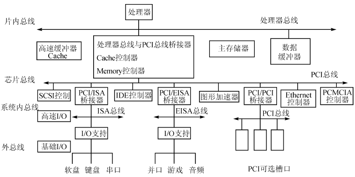
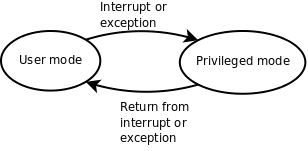

linux C一站式学习读书笔记_yonka

#INDEX

* [Introduction](#Introduction)
* [Types and interfaces](#Types and interfaces)
* [The representation of an interface](#The representation of an interface)
* [The laws of reflection](#The laws of reflection)
    * [The first law of reflection](#The first law of reflection)
    * [The second law of reflection](#The second law of reflection)
    * [The third law of reflection](#The third law of reflection)
* [Structs](#Structs)
* [Conclusion](#Conclusion)

#变量和作用域

C中变量有： `局部变量` 和 `全局变量`

**局部变量**
1. 一个函数中定义的变量不能被另一个函数使用。
2. 每次调用函数时局部变量都表示不同的存储空间。局部变量在每次函数调用时分配存储空间，在每次函数返回时释放存储空间。

**全局变量**

定义在所有的函数体之外，它们在程序开始运行时分配存储空间，在程序结束时释放存储空间，在任何函数中都可以访问全局变量
> 正因为全局变量在任何函数中都可以访问，所以在程序运行过程中全局变量被读写的顺序从源代码中是看不出来的，源代码的书写顺序并不能反映函数的调用顺序。程序出现了Bug往往就是因为在某个不起眼的地方对全局变量的读写顺序不正确。因此，**虽然全局变量用起来很方便，但一定要慎用，能用函数传参代替的就不要用全局变量**。

##变量的初始化

**局部变量可以用类型相符的任意表达式来初始化，而全局变量只能用常量表达式（Constant Expression）初始化**
例如，全局变量pi这样初始化是合法的：
```C
double pi = 3.14 + 0.0016;
```
但这样初始化是不合法的：
```C
double pi = acos(-1.0);
```
然而局部变量这样初始化却是可以的。
因为：
> 程序开始运行时要用适当的值来初始化全局变量，所以初始值必须保存在编译生成的可执行文件中，因此初始值在编译时就要计算出来，然而上面第二种Initializer的值必须在程序运行时调用acos函数才能得到，所以不能用来初始化全局变量。

*为了简化编译器的实现，C语言从语法上规定全局变量只能用常量表达式来初始化*，因此下面这种全局变量初始化是不合法的：
```C
int minute = 360;
int hour = minute / 60;
```
虽然在编译时计算出hour的初始值是可能的，但是minute / 60不是常量表达式，不符合语法规定，所以编译器不必想办法去算这个初始值。

##变量的初始值

**如果全局变量在定义时不初始化则初始值是0，如果局部变量在定义时不初始化则初始值是不确定的**。所以，***局部变量在使用之前一定要先赋值***，如果基于一个不确定的值做后续计算肯定会引入Bug。


#函数

##函数声明

如void threeline(void)这一行，声明了一个函数的名字、参数类型和个数、返回值类型，这称为函数原型。在代码中可以单独写一个函数原型，后面加;号结束，而不写函数体，例如：
```C
void threeline(void);

// 或者
int absolute_value(int x);
// 或者
int absolute_value(int);
// 形参参数名可以省，但分号不能省
```
这种写法只能叫函数声明而不能叫函数定义，只有带函数体的声明才叫定义。
只有分配存储空间的变量声明才叫变量定义，其实函数也是一样，编译器只有见到函数定义才会生成指令，而指令在程序运行时当然也要占存储空间。
那么没有函数体的函数声明有什么用呢？它为编译器提供了有用的信息，编译器在翻译代码的过程中，只有见到函数原型（不管带不带函数体）之后才知道这个函数的名字、参数类型和返回值，这样碰到函数调用时才知道怎么生成相应的指令，所以**函数原型必须出现在函数调用之前，这也是遵循“先声明后使用”的原则**。

如：
```C
#include <stdio.h>

void newline(void);
void threeline(void);

int main(void)
{
	...
}

void newline(void)
{
	...
}

void threeline(void)
{
	...
}
```

> **由于有Old Style C语法的存在，并非所有函数声明都包含完整的函数原型**，例如void threeline();这个声明并没有明确指出参数类型和个数，所以不算函数原型，这个声明提供给编译器的信息只有函数名和返回值类型。如果在这样的声明之后调用函数，编译器不知道参数的类型和个数，就不会做语法检查，所以很容易引入Bug。了解这个知识点以便维护别人用Old Style C风格写的代码，但绝不应该按这种风格写新的代码。

###隐式声明
C允许但不建议 *隐式声明*。如：
```C
#include <stdio.h>

int main(void)
{
	printf("Three lines:\n");
	threeline();  // 编译器认为此处隐式声明了int threeline(void)
	printf("Another three lines.\n");
	threeline();
	return 0;
}

void newline(void)
{
	printf("\n");
}

void threeline(void)  // 看到threeline函数的原型是void threeline(void)，和先前的隐式声明的返回值类型不符，所以报警告
{
	newline();
	newline();
	newline();
}
```
```shell
编译时会报警告：

$ gcc main.c
main.c:17: warning: conflicting types for ‘threeline’
main.c:6: warning: previous implicit declaration of ‘threeline’ was here
```


##main函数

###标准main函数

其实操作系统在调用main函数时是传参数的，main函数最标准的形式应该是**int main(int argc, char \*argv[])**。
C标准也允许**int main(void)**这种写法，如果不使用系统传进来的两个参数也可以写成这种形式。
但除了这两种形式之外，定义main函数的其它写法都是错误的或不可移植的。

##return
* return 1 或 return(1) 都支持。
* 函数的返回值不是左值，或者说函数调用表达式不能做左值，因此下面的赋值语句是非法的：`is_even(20) = 1;`
* 按值传递： 即便返回语句写成return x;，返回的也是变量x的值，而非变量x本身，因为变量x马上就要被释放了
* 对于return后的dead code编译器不会报错； 同时对于if中未涉及的条件也不会报错（此时返回不确定值）

```C
int absolute_value(int x);

/* main: generate some simple output */
int main(void)
{
    printf("absolute_value of (%d) is %d\n", -5, absolute_value(-5));  // 5
    printf("absolute_value of (%d) is %d\n", 0, absolute_value(0));  // 28  = =，估计与编译相关，如果还有其他语句的话可能不是28
    return 0;
}

int absolute_value(int x)
{
    if (x < 0) {
        return -x;
    } else if (x > 0) {
        return x;
    }
```

##形参和实参
* C语言的传参规则是Call by Value，按值传递


#控制语句

##分支语句

###if（else）
**dangling-else问题**
类似`if (A) if (B) C; else D;`形式的语句怎么理解呢？可以理解成
```C
if (A)
	if (B)
		C;
else
	D;
```
也可以理解成
```C
if (A)
	if (B)
		C;
	else
		D;
```
> C语言规定，else总是和它上面最近的一个if配对，因此应该理解成else和if (B)配对，也就是按第二种方式理解

###switch
格式：
```C
switch (控制表达式) {
case 常量表达式： 语句列表
case 常量表达式： 语句列表
...
default： 语句列表
}
```
* 默认fallthrough，如果不希望的话需要显式break

switch语句不是必不可缺的，显然可以用一组if ... else if ... else if ... else ...代替，但是一方面用switch语句会使代码更清晰，另一方面，有时候编译器会对switch语句进行整体优化，使它比等价的if/else语句所生成的指令效率更高。

##循环语句

###while（do/while）

###for

###break、continue


###goto、label
goto语句过于强大了，从程序中的任何地方都可以无条件跳转到任何其它地方，只要在那个地方定义一个标号就行，唯一的限制是goto只能跳转到同一个函数中的某个标号处，而不能跳到别的函数中。
滥用goto语句会使程序的控制流程非常复杂，可读性很差。著名的计算机科学家Edsger W. Dijkstra最早指出编程语言中goto语句的危害，提倡取消goto语句。goto语句不是必须存在的，显然可以用别的办法替代。
```C
for (...)
	for (...) {
		...
		if (出现错误条件)
			goto error;
	}
error:
	出错处理;

// 可以改写为

int cond = 0; /* bool variable indicating error condition */
for (...) {
	for (...) {
		...
		if (出现错误条件) {
			cond = 1;
			break;
		}
	}
	if (cond)
		break;
}
if (cond)
	出错处理;
```

switch-case结构中的case/default后面也有:，实际上也是特殊的标号。

与标号有关的语法规则：
* 语句 → 标识符: 语句
* 语句 → case 常量表达式: 语句
* 语句 → default: 语句

#数据类型

##数据类型标志

##枚举
如：
```C
enum coordinate_type { RECTANGULAR, POLAR };
struct complex_struct {
	enum coordinate_type t;
	double a, b;
};
```
成员为常量，值由编译器自动分配。 默认从0开始分配，如果想改变该行为的话，可以：
```C
enum coordinate_type { RECTANGULAR = 1, POLAR };  // 从1开始分配
```
**枚举成员并不在单独的命名空间中，所以不能和外部其他变量/常量重名**

```C
int main(void)
{
	enum coordinate_type { RECTANGULAR = 1, POLAR };
	int RECTANGULAR;  // 冲突
	printf("%d %d\n", RECTANGULAR, POLAR);
	return 0;
}
```

##结构体

###嵌套结构体
如：
```C
struct segment {
	struct complex_struct start;
	struct complex_struct end;
};
```

####嵌套结构体的初始化
初始化，可以嵌套初始化，如`struct segment s = {{ 1.0, 2.0 }, { 4.0, 6.0 }};`;
也可以平坦初始化，如`struct segment s = { 1.0, 2.0, 4.0, 6.0 };`;
甚至可以两者混用，如`struct segment s = {{ 1.0, 2.0 }, 4.0, 6.0 };`，但可读性很差，应尽量避免。

C99中引入新特性memberwise initialization，可以对部分成员做初始化，如 `struct segment s = { .start.x = 1.0, .end.x = 2.0 };`

##数组
C中声明数组类型变量的方式是 ${type} ${varname}[${length}]，type可以是基本类型，也可以是结构体类型，如：
```C
int count[4];  // 四个元素在空间上连续

struct complex_struct {
	double x, y;
} a[4];  // ...在空间上连续
```

也可以把数组嵌入到结构体：
```C
struct {
	double x, y;
	int count[4];
} s;
```

**数组越界问题**
C编译器并不检查（即使明显的）数组越界。

###数组初始化
```C
int count[4] = { 3, 2, };  // 剩余的用零值初始化，这里为0

int count[] = { 3, 2, 1, };  // 未指明长度的根据实际元素数量确定长度

int count[4] = { [2] = 3 };  // C99新特性： memberwise initialization
```

**数组不能像结构体那样相互赋值或初始化**
```C
int a[5] = { 4, 3, 2, 1 };
int b[5] = a;  // 不合法

a = b;  // 不合法
```
***因此不能用数组作为参数或者返回值***
**数组类型做右值使用时，自动转换成指向数组首元素的指针**
```C
void foo(int \*a)
{
	...
}

int array[5] = {0};
foo(array);  // 合法，但实际传入的的是 *int
```

###多维数组
C的多维数据是“真”多维数组。 而java等高级语言里是“伪”多维数组，比如java的 int\[3\]\[2\] 中 \[0\]\[1\] 中存的是指向 int[2]类型数组的引用。
```C
int a[3][2] = { 1, 2, 3, 4, 5 };  // [0][0],[0][1]: 1,2, [1][0],[1][1]: 3,4, [2][0],[2][1]: 5,0 ---> row-major，有些语言如fortran中式column-major
// 或者
int a[][2] = { { 1, 2 },
		{ 3, 4 },
		{ 5, } };
```

*对于char[][]，也可以用字符串字面量来做初始化*，如：
```C
char days[8][10] = { "", "Monday", "Tuesday",
			     "Wednesday", "Thursday", "Friday",
			     "Saturday", "Sunday" };

```

###变长数组
VLA： variable length array
在数组声明时使用变量，C99新特性，很多编译器不支持，不建议使用。

##字符串
* C字符串实际就是byte array
* C字符串用\0来表示字符串结束，而并没有长度“属性”，使得获取长度为O(n)操作
* 因为上一点，所以C字符串中无法包含\0
* 和很多语言一样，C中的字符串也不能修改。 允许按索引访问（只读）
* 和数组一样，作为右值使用时自动转为指向首元素（byte）的指针

###字符串初始化
```C
char str[10] = "Hello"
// 相当于
char str[10] = { 'H', 'e', 'l', 'l', 'o', '\0' };  // 后面四个元素初始化为0，也即\0
// str这个字符数组和字符串的区别是，str可以修改

// 如果初始化长度超过数组长度的话，编译器会给警告
char str[10] = "Hello, World.\n"  // 警告
char str[] = "Hello, world.\n"  // OK

// 如果字符串长度正好比数组长度大1（也即不包括最后的\0就正好相等）的话，是允许的，此时最后的\0将被截掉
// [C99 Rationale]说这样规定是为程序员方便，以前的很多编译器都是这样实现的，不管它有理没理，C标准既然这么规定了我们也没办法，只能自己小心了。
char str[14] = "Hello, world.\n";  // OK
```

###字符串的打印
```C
printf("string: %s\n", "hello")
//
printf("string: %s\n", str)  // str 为 char array
```
**注意如果此时str中没有最后的\0的话，会一直遍历下去，导致发生数组越界...，结合前面的“允许截断”的场景 = =**

##浮点数
（由于浮点数规范原因）浮点型的精度有限，不适合用==运算符做精确比较。
```C
double i = 20.0;
double j = i / 7.0;
if (j * 7.0 == i)
	printf("Equal.\n");
else
	printf("Unequal.\n");
// 输出： Unequal (也许会依赖平台）
```

##结构体


#运算符

##关系运算符

##逻辑运算符
AND &&
OR ||
NOT !

#C标准
C标准主要由两部分组成，一部分描述C的语法，另一部分描述C标准库。C标准库定义了一组标准头文件，每个头文件中包含一些相关的函数、变量、类型声明和宏定义。要在一个平台上支持C语言，不仅要实现C编译器，还要实现C标准库，这样的实现才算符合C标准。不符合C标准的实现也是存在的，例如很多单片机的C语言开发工具中只有C编译器而没有完整的C标准库。

#标准库
在Linux平台上最广泛使用的C函数库是glibc，其中包括C标准库的实现，也包括本书第三部分介绍的所有系统函数。几乎所有C程序都要调用glibc的库函数，所以glibc是Linux平台C程序运行的基础。glibc提供一组头文件和一组库文件，最基本、最常用的C标准库函数和系统函数在libc.so库文件中，几乎所有C程序的运行都依赖于libc.so，有些做数学计算的C程序依赖于libm.so，以后我们还会看到多线程的C程序依赖于libpthread.so。以后我说libc时专指libc.so这个库文件，而说glibc时指的是glibc提供的所有库文件。
```
gcc默认是使用libc.so，也即类似 -lc 选项。 如果还使用其他库的话，需要显式指出，类似： gcc main.c -lm 来指示使用libm.so库。
```
glibc并不是Linux平台唯一的基础C函数库，也有人在开发别的C函数库，比如适用于嵌入式系统的uClibc。

#C风格

##缩进和空白
* 关键字if、while、for与其后的控制表达式的(括号之间插入一个空格分隔，但括号内的表达式应紧贴括号
* 双目运算符的两侧各插入一个空格分隔，单目运算符和操作数之间不加空格，例如i␣=␣i␣+␣1、++i、!(i␣<␣1)、-x、&a[1]等。
* 后缀运算符和操作数之间也不加空格，例如取结构体成员s.a、函数调用foo(arg1)、取数组成员a[i]。
* ,号和;号之后要加空格，这是英文的书写习惯，例如for␣(i␣=␣1;␣i␣<␣10;␣i++)、foo(arg1,␣arg2)。
* 以上关于双目运算符和后缀运算符的规则并没有严格要求，有时候为了突出优先级也可以写得更紧凑一些，例如for␣(i=1;␣i<10;␣i++)、distance␣=␣sqrt(x*x␣+␣y*y)等。但是省略的空格一定不要误导了读代码的人，例如a||b␣&&␣c很容易让人理解成错误的优先级。
* 由于UNIX系统标准的字符终端是24行80列的，接近或大于80个字符的较长语句要折行写，折行后用空格和上面的表达式或参数对齐
```C
if␣(sqrt(x*x␣+␣y*y)␣>␣5.0
    &&␣x␣<␣0.0
    &&␣y␣>␣0.0)
// 再比如：
foo(sqrt(x*x␣+␣y*y),
    a[i-1]␣+␣b[i-1]␣+␣c[i-1])
```
* 较长的字符串可以断成多个字符串然后分行书写
```C
printf("This is such a long sentence that "
   "it cannot be held within a line\n");
```

内核代码风格关于缩进的规则有以下几条
* 要用缩进体现出语句块的层次关系，使用Tab字符缩进，不能用空格代替Tab
* if/else、while、do/while、for、switch这些可以带语句块的语句，语句块的{或}应该和关键字写在同一行，用空格隔开，而不是单独占一行
```C
// 例如应该这样写：
if␣(...)␣{
       // →语句列表
}␣else␣if␣(...)␣{
       // →语句列表
}
// 但很多人习惯这样写：
if␣(...)
{
       // →语句列表
}
else␣if␣(...)
{
       // →语句列表
}
// 内核的写法和[K&R]一致，好处是不必占太多行，使得一屏能显示更多代码。这两种写法用得都很广泛，只要在同一个项目中能保持统一就可以了。
```
* 函数定义的{和}单独占一行，这一点和语句块的规定不同
```C
// 如：
int␣foo(int␣a,␣int␣b)
{
       // →语句列表
}
```
* switch和语句块里的case、default对齐写，也就是说语句块里的case、default标号相对于switch不往里缩进，但标号下的语句要往里缩进。
```
// 如：
      →switch␣(c)␣{
      →case 'A':
      →       →语句列表
      →case 'B':
      →       →语句列表
      →default:
      →       →语句列表
      →}
```
* 用于goto语句的自定义标号应该顶头写不缩进，而不管标号下的语句缩进到第几层
* 代码中每个逻辑段落之间应该用一个空行分隔开。例如每个函数定义之间应该插入一个空行，头文件、全局变量定义和函数定义之间也应该插入空行
* 一个函数的语句列表如果很长，也可以根据相关性分成若干组，用空行分隔。这条规定不是严格要求，通常把变量定义组成一组，后面加空行，return语句之前加空行，
```
int main(void)
{
       →int    →a, b;
       →double →c;

       →语句组1

       →语句组2

       →return 0;
}
```

##注释

###单行注释
单行注释应采用`/*␣comment␣*/`的形式，用空格把界定符和文字分开。


###多行注释
多行注释最常见的是这种形式：
```
/*
␣*␣Multi-line
␣*␣comment
␣*/
```
也有更花哨的形式：
```
/*************\
* Multi-line  *
* comment     *
\*************/
```

###不同场合的注释
* 整个源文件的顶部注释。说明此模块的相关信息，例如文件名、作者和版本历史等，顶头写不缩进
```C
/*
 *  kernel/sched.c
 *
 *  Kernel scheduler and related syscalls
 *
 *  Copyright (C) 1991-2002  Linus Torvalds
 *
 *  1996-12-23  Modified by Dave Grothe to fix bugs in semaphores and
 *              make semaphores SMP safe
 *  1998-11-19  Implemented schedule_timeout() and related stuff
 *              by Andrea Arcangeli
 *  2002-01-04  New ultra-scalable O(1) scheduler by Ingo Molnar:
 *              hybrid priority-list and round-robin design with
 *              an array-switch method of distributing timeslices
 *              and per-CPU runqueues.  Cleanups and useful suggestions
 *              by Davide Libenzi, preemptible kernel bits by Robert Love.
 *  2003-09-03  Interactivity tuning by Con Kolivas.
 *  2004-04-02  Scheduler domains code by Nick Piggin
 */
```
* 函数注释。说明此函数的功能、参数、返回值、错误码等，写在函数定义上侧，和此函数定义之间不留空行，顶头写不缩进。
* 相对独立的语句组注释。对这一组语句做特别说明，写在语句组上侧，和此语句组之间不留空行，与当前语句组的缩进一致。
* 代码行右侧的简短注释。对当前代码行做特别说明，一般为单行注释，和代码之间至少用一个空格隔开，一个源文件中所有的右侧注释最好能上下对齐。
```C
/**
 *      radix_tree_insert    -    insert into a radix tree
 *      @root:          radix tree root
 *      @index:         index key
 *      @item:          item to insert
 *
 *      Insert an item into the radix tree at position @index.
 */
int radix_tree_insert(struct radix_tree_root *root,
                        unsigned long index, void *item)
{
        struct radix_tree_node *node = NULL, *slot;
        unsigned int height, shift;
        int offset;
        int error;

        /* Make sure the tree is high enough.  */
        if ((!index && !root->rnode) ||
                        index > radix_tree_maxindex(root->height)) {
                error = radix_tree_extend(root, index);
                if (error)
                        return error;
        }

        slot = root->rnode;
        height = root->height;
        shift = (height-1) * RADIX_TREE_MAP_SHIFT;

        offset = 0;                     /* uninitialised var warning */
        do {
                if (slot == NULL) {
                        /* Have to add a child node.  */
                        if (!(slot = radix_tree_node_alloc(root)))
                                return -ENOMEM;
                        if (node) {
                                node->slots[offset] = slot;
                                node->count++;
                        } else
                                root->rnode = slot;
                }

                /* Go a level down */
                offset = (index >> shift) & RADIX_TREE_MAP_MASK;
                node = slot;
                slot = node->slots[offset];
                shift -= RADIX_TREE_MAP_SHIFT;
                height--;
        } while (height > 0);

        if (slot != NULL)
                return -EEXIST;

        BUG_ON(!node);
        node->count++;
        node->slots[offset] = item;
        BUG_ON(tag_get(node, 0, offset));
        BUG_ON(tag_get(node, 1, offset));

        return 0;
}
```
`函数内的注释要尽可能少用。写注释主要是为了说明你的代码“能做什么”（比如函数接口定义），而不是为了说明“怎样做”，只要代码写得足够清晰，“怎样做”是一目了然的，如果你需要用注释才能解释清楚，那就表示你的代码可读性很差，除非是特别需要提醒注意的地方才使用函数内注释。`
* 复杂的结构体定义比函数更需要注释。
```C
/*
 * This is the main, per-CPU runqueue data structure.
 *
 * Locking rule: those places that want to lock multiple runqueues
 * (such as the load balancing or the thread migration code), lock
 * acquire operations must be ordered by ascending &runqueue.
 */
struct runqueue {
        spinlock_t lock;

        /*
         * nr_running and cpu_load should be in the same cacheline because
         * remote CPUs use both these fields when doing load calculation.
         */
        unsigned long nr_running;
#ifdef CONFIG_SMP
        unsigned long cpu_load[3];
#endif
        unsigned long long nr_switches;

        /*
         * This is part of a global counter where only the total sum
         * over all CPUs matters. A task can increase this counter on
         * one CPU and if it got migrated afterwards it may decrease
         * it on another CPU. Always updated under the runqueue lock:
         */
        unsigned long nr_uninterruptible;

        unsigned long expired_timestamp;
        unsigned long long timestamp_last_tick;
        task_t *curr, *idle;
        struct mm_struct *prev_mm;
        prio_array_t *active, *expired, arrays[2];
        int best_expired_prio;
        atomic_t nr_iowait;
#ifdef CONFIG_SMP
        struct sched_domain *sd;

        /* For active balancing */
        int active_balance;
        int push_cpu;

        task_t *migration_thread;
        struct list_head migration_queue;
        int cpu;
#endif
#ifdef CONFIG_SCHEDSTATS
        /* latency stats */
        struct sched_info rq_sched_info;

        /* sys_sched_yield() stats */
        unsigned long yld_exp_empty;
        unsigned long yld_act_empty;
        unsigned long yld_both_empty;
        unsigned long yld_cnt;

        /* schedule() stats */
        unsigned long sched_switch;
        unsigned long sched_cnt;
        unsigned long sched_goidle;

        /* try_to_wake_up() stats */
        unsigned long ttwu_cnt;
        unsigned long ttwu_local;
#endif
};
```
* 复杂的宏定义和变量声明也需要注释
```C
/* TICK_USEC_TO_NSEC is the time between ticks in nsec assuming real ACTHZ and  */
/* a value TUSEC for TICK_USEC (can be set bij adjtimex)                */
#define TICK_USEC_TO_NSEC(TUSEC) (SH_DIV (TUSEC * USER_HZ * 1000, ACTHZ, 8))
/* some arch's have a small-data section that can be accessed register-relative
 * but that can only take up to, say, 4-byte variables. jiffies being part of
 * an 8-byte variable may not be correctly accessed unless we force the issue
 */
#define __jiffy_data  __attribute__((section(".data")))
/*
 * The 64-bit value is not volatile - you MUST NOT read it
 * without sampling the sequence number in xtime_lock.
 * get_jiffies_64() will do this for you as appropriate.
 */
extern u64 __jiffy_data jiffies_64;
extern unsigned long volatile __jiffy_data jiffies;
```

##标识符命名

* UNIX风格（K&R，或者说linux kernal风格），也即 a_b （大小写混合的命名方式是Modern C++风格所提倡的，在C++代码中很普遍，称为CamelCase），but not C）
* 标识符命名要清晰明了，可以使用**完整的单词和易于理解的缩写**。短的单词可以通过去元音形成缩写，较长的单词可以取单词的头几个字母形成缩写。看别人的代码看多了就可以总结出一些缩写惯例，例如count写成cnt，block写成blk，length写成len，window写成win，message写成msg，number写成nr，temporary可以写成temp，也可以进一步写成tmp
* 全局变量和全局函数的命名一定要详细，不惜多用几个单词多写几个下划线，例如函数名radix_tree_insert，因为它们在整个项目的许多源文件中都会用到，必须让使用者明确这个变量或函数是干什么用的。局部变量和只在一个源文件中调用的内部函数的命名可以简略一些，但不能太短。尽量不要使用单个字母做变量名，只有一个例外：用i、j、k做循环变量是可以的


##函数
每个函数都应该设计得尽可能简单，简单的函数才容易维护。应遵循以下原则：
* 实现一个函数**只是为了做好一件事情**，不要把函数设计成用途广泛、面面俱到的，这样的函数肯定会超长，而且往往不可重用，维护困难。
* 函数内部的**缩进层次不宜过多，一般以少于4层为宜**。如果缩进层次太多就说明设计得太复杂了，应考虑分割成更小的函数（Helper Function）来调用。
* 函数不要写得太长，建议**在24行的标准终端上不超过两屏**，太长会造成阅读困难，如果一个函数超过两屏就应该考虑分割函数了。`[CodingStyle]中特别说明，如果一个函数在概念上是简单的，只是长度很长，这倒没关系。例如函数由一个大的switch组成，其中有非常多的case，这是可以的，因为各case分支互不影响，整个函数的复杂度只等于其中一个case的复杂度，这种情况很常见，例如TCP协议的状态机实现。`
* 执行函数就是执行一个动作，函数名通常应包含**动词**，例如get_current、radix_tree_insert。
* 比较重要的函数定义上侧必须加注释，说明此函数的功能、参数、返回值、错误码等。
* 另一种度量函数复杂度的办法是看有多少个局部变量，**5到10个局部变量已经很多了**，再多就很难维护了，应该考虑分割成多个函数。


##ident工具
```
indent -kr -i8 main.c
// -kr means K&R style
// -i8 means usr 8-space ident, if -nut not specified, will use a tab to replace every 8 indent spaces
```
会直接修改文件（而不是通过类似-w参数来指示写入）

##Old Style C
> *main函数定义写成main(){...}的形式，不写返回值类型也不写参数列表*
>> **Old Style C规定不写返回值类型就表示返回int型，不写参数列表就表示参数类型和个数没有明确指出。**
>> 新标准仍然兼容，但不应该继续沿用。因为这样使得编译器无法检查程序中可能存在的bug，增加了调试难度。
>

#编译

**预处理**
CPP: C preprocessor
`cpp main.c` 可以看到预处理后的代码，`gcc -E main.c`也有同样的效果。
预处理做的事情有：
* 把头文件代码展开（到当前文件）
* 替换#define定义的标示符（预处理指示，preprocessing directive）

#调试

##gdb
**gdb基本命令**

|命令	|描述	|
| :----: | :----: |
|backtrace（或bt）|	查看各级函数调用及参数	|
|finish|	连续运行到当前函数返回为止，然后停下来等待命令	|
|frame（或f）| 帧编号	选择栈帧	|
|info（或i）| locals	查看当前栈帧局部变量的值	|
|list（或l）|	列出源代码，接着上次的位置往下列，每次列10行	|
|list 行号|	列出从第几行开始的源代码	|
|list 函数名|	列出某个函数的源代码	|
|next（或n）|	执行下一行语句	|
|print（或p）|	打印表达式的值，通过表达式可以修改变量的值或者调用函数	|
|quit（或q）|	退出gdb调试环境	|
|set var|	修改变量的值	|
|start|	开始执行程序，停在main函数第一行语句前面等待命令	|
|step（或s）|	执行下一行语句，如果有函数调用则进入到函数中	|
|break（或b） 行号|	在某一行设置断点
|break 函数名|	在某个函数开头设置断点
|break ... if ...|	设置条件断点
|continue（或c）|	从当前位置开始连续运行程序
|delete breakpoints 断点号|	删除断点
|display 变量名|	跟踪查看某个变量，每次停下来都显示它的值
|disable breakpoints 断点号|	禁用断点
|enable 断点号|	启用断点
|info（或i） breakpoints|	查看当前设置了哪些断点
|run（或r）|	从头开始连续运行程序
|undisplay 跟踪显示号|	取消跟踪显示	|

*gcc -o main -g main.c* 加了`-g参数`才能gdb，但不代表就不需要源代码了，main.c还是需要在当前目录下...
默认好像是输出为 a.out，用`-o`指定输出...
gdb main 开始调试

样例代码
```C
#include <stdio.h>

int add_range(int low, int high)
{
	int i, sum;
	for (i = low; i <= high; i++)
		sum = sum + i;
	return sum;
}

int main(void)
{
	int result[100];
	result[0] = add_range(1, 10);
	result[1] = add_range(1, 100);
	printf("result[0]=%d\nresult[1]=%d\n", result[0], result[1]);
	return 0;
}
```

* help/help ${cmd}
* list/l
* start --- 开始/重新开始（会停在main的第一行）
* next/n --- step over
* strep/s --- step into
* backstrace/bt --- print stack trace(backward, 也即最近的在最前，符合栈结构形象）
```
(gdb) bt
#0  test_add_range () at main.c:62
#1  0x00000000004015c2 in main () at main.c:20
```
* info/i --- 查看具体...，如 i locals 查看局部变量； i breakpoints 查看断点
```
// 查看局部变量
// 未初始化好时，输出如下：
(gdb) i locals
result = {5250384, 0, 5251120, 0, 2003343648, 0, 1, 0, 5242880, 0, 336003091,
  0, 5242880, 0, 2003343623, 0, 256, 0, 1342177377, 0, 0, 0, 1342177377, 0,
  5242881, 0, 256, 0, 5250400, 0, 1, 0, 5250408, 0, 2002959467, 0, 5242880,
  0, 1342177377, 0, 5242880, 0, 8, 0, 0, 0, 2293296, 0, 0, 0, 0, 0, 0, 0,
  2002729978, 0, 4199840, 0, 1135552923, 2046, 2, 0, 4205096, 0, 0, 0, 0, 0,
  5250408, 0, -38207308, 2046, 4200400, 0, 1135552923, 0, 5250704, 0, 1, 0,
  0, 0, 0, 0, 8, 0, 4200353, 0, 4200400, 0, 43, 0, 5250704, 0, 1, 0, -1, -1,
  4200501, 0}
// 另一种
(gdb) i locals
i = 11
sum = 5251175
// 查看断点
(gdb) i breakpoints 
Num     Type           Disp Enb Address    What
3       breakpoint     keep y   0x08048411 in main at main.c:12
```
* frame/f --- 跳到指定栈帧，用bt打出来的栈帧的编号，如 f 1
* print/p --- 查看变量，如 p sum。 也可以用来设置变量，如 p result[2]=33 （print后跟表达式...，所以赋值语句或调用函数都可以）
```
(gdb) p u
No symbol "u" in current context.
(gdb) p i
$1 = 6
(gdb) p sum
```
* set var --- 设置变量，如 set var sum=0
* finish --- 让代码一直执行到当前函数返回
```
(gdb) finish
Run till exit from #0  add_range (low=1, high=100) at main.c:55
0x00000000004016cf in test_add_range () at main.c:63
63          result[1] = add_range(1, 100);
Value returned is $3 = 5256225
```
* display ${varname} --- 跟踪显示，使得每次操作都是print一次该变量的值
```
(gdb) display sum
1: sum = -1208103488
(gdb) n
9			scanf("%s", input);
1: sum = 0
(gdb) 
123
10			for (i = 0; input[i] != '\0'; i++)
1: sum = 0
```
* undisplay ${seq} --- 取消跟踪显示，也即反display操作，用的是序号，如前面sum的序号1
* break/b ${line} --- 在指定行设置断点，可以指定条件
```
(gdb) l
5		int sum = 0, i;
6		char input[5];
7	
8		while (1) {
9			scanf("%s", input);
10			for (i = 0; input[i] != '\0'; i++)
11				sum = sum*10 + input[i] - '0';
12			printf("input=%d\n", sum);
13		}
14		return 0;
// 普通断点
(gdb) b 9
Breakpoint 2 at 0x80483bc: file main.c, line 9.
// 条件断点
(gdb) break 9 if sum != 0
Breakpoint 5 at 0x80483c3: file main.c, line 9.
// 查看断点
(gdb) i breakpoints 
Num     Type           Disp Enb Address    What
5       breakpoint     keep y   0x080483c3 in main at main.c:9
	stop only if sum != 0
```
* delete breakpoints ${seq} --- 删除指定断点，使用编号
* disable breakpoints ${seq} --- 禁用（而不是删除）断点...
* continue/c --- 连续运行（至下一个断点）
```
(gdb) c
Continuing.
input=123
Breakpoint 2, main () at main.c:9
9			scanf("%s", input);
1: sum = 123
```
* run/r --- 重新从程序开头连续运行（start则会停在第一条语句）
```
(gdb) r
The program being debugged has been started already.
Start it from the beginning? (y or n) y
Starting program: /home/akaedu/main 
123
input=123
Breakpoint 5, main () at main.c:9
9			scanf("%s", input);
1: sum = 123
```
* watch --- 设置观察点
```
(gdb) watch input[5]
Hardware watchpoint 2: input[5]
(gdb) i watchpoints 
Num     Type           Disp Enb Address    What
2       hw watchpoint  keep y              input[5]
(gdb) c
Continuing.
Hardware watchpoint 2: input[5]
Old value = 0 '\0'
New value = 1 '\001'
0x0804840c in main () at main.c:11
11			for (i = 0; input[i] != '\0'; i++)
(gdb) c
Continuing.
Hardware watchpoint 2: input[5]
Old value = 1 '\001'
New value = 2 '\002'
0x0804840c in main () at main.c:11
11			for (i = 0; input[i] != '\0'; i++)
(gdb) c
Continuing.
Hardware watchpoint 2: input[5]
Old value = 2 '\002'
New value = 3 '\003'
0x0804840c in main () at main.c:11
11			for (i = 0; input[i] != '\0'; i++)
```
* info/i watchpoints --- 查看观察点信息
* x --- 从某个位置开始打印存储单元的内容，全部当成字节来看， 不区分属于哪个变量。
```
// input为char[]，这里为打印该字符数组的前7个byte（即使也许没这么长）
(gdb) x/7b input
0xbfb8f0a7:	0x31	0x32	0x33	0x34	0x35	0x00	0x00
```

```
// 刚进入add_range时
(gdb) i locals
i = 0
sum = 3350576
(gdb) l
50          return 0;
51      }
52
53      int add_range(int low, int high) {
54          int i, sum;
55          for (i = low; i <= high; i++)
56              sum = sum + i;
57          return sum;
58      }
59
(gdb) bt
#0  add_range (low=1, high=10) at main.c:55
#1  0x00000000004016bd in test_add_range () at main.c:62
#2  0x00000000004015c2 in main () at main.c:20
(gdb) f 1
#1  0x00000000004016bd in test_add_range () at main.c:62
62          result[0] = add_range(1, 10);
(gdb) i locals
result = {3349840, 0, 3350576, 0, 2003343648, 0, 1, 0, 3342336, 0, 336003091,
  0, 3342336, 0, 2003343623, 0, 256, 0, 1342177377, 0, 0, 0, 1342177377, 0,
  3342337, 0, 256, 0, 3349856, 0, 1, 0, 3349864, 0, 2002959467, 0, 3342336,
  0, 1342177377, 0, 3342336, 0, 8, 0, 0, 0, 2293296, 0, 0, 0, 0, 0, 0, 0,
  2002729978, 0, 4199840, 0, 1263592041, 2046, 2, 0, 4205096, 0, 0, 0, 0, 0,
  3349864, 0, -38207308, 2046, 4200400, 0, 1263592041, 0, 3350160, 0, 1, 0,
  0, 0, 0, 0, 8, 0, 4200353, 0, 4200400, 0, 43, 0, 3350160, 0, 1, 0, -1, -1,
  4200501, 0}
(gdb) l
57          return sum;
58      }
59
60      int test_add_range(void) {
61          int result[100];
62          result[0] = add_range(1, 10);
63          result[1] = add_range(1, 100);
64          printf("result[0]=%d\nresult[1]=%d\n", result[0], result[1]);
65          return 0;
66      }
// 62 - 55 - ...
// 可以看到sum没有初始化，所以值为内存原“脏”内容
```

**单步执行**
见前一节相关命令

**观察点**
只在观察点数据发生变化时停下来并且输出变化前后的内容和当前语句...
```
(gdb) watch input[5]
Hardware watchpoint 2: input[5]
(gdb) i watchpoints 
Num     Type           Disp Enb Address    What
2       hw watchpoint  keep y              input[5]
(gdb) c
Continuing.
Hardware watchpoint 2: input[5]

Old value = 0 '\0'
New value = 1 '\001'
0x0804840c in main () at main.c:11
11			for (i = 0; input[i] != '\0'; i++)
(gdb) c
Continuing.
Hardware watchpoint 2: input[5]

Old value = 1 '\001'
New value = 2 '\002'
0x0804840c in main () at main.c:11
11			for (i = 0; input[i] != '\0'; i++)
```

**段错误**
在gdb中run，如果发生段错误会print出信息..。


#计算机体系结构基础

##内存和地址


##CPU
* **寄存器**R `CPU内部的高速存储器，像内存一样可以存取数据，但比访问内存快得多。`
* **（指令）译码器**ID  `CPU取上来的指令由若干个字节组成，这些字节中有些位表示内存地址，有些位表示寄存器编号，有些位表示这种指令做什么操作，是加减乘除还是读写内存，指令译码器负责解释这条指令的含义，然后调动相应的执行单元去执行它。`
* **算术逻辑单元**ALU `CPU取上来的指令由若干个字节组成，这些字节中有些位表示内存地址，有些位表示寄存器编号，有些位表示这种指令做什么操作，是加减乘除还是读写内存，指令译码器负责解释这条指令的含义，然后调动相应的执行单元去执行它。`
* **地址和数据总线**BUS  `CPU和内存之间用地址总线、数据总线和控制线连接起来，每条线上有1和0两种状态。如果在执行指令过程中需要访问内存，比如从内存读一个数到寄存器`

**CPU访问内存数据的过程**

`32位地址线 + 32位数据线，一般和CPU存储器位数一致`
1. CPU内部将寄存器对接到数据总线上，使寄存器的每一位对接到一条数据线，等待接收数据。
2. CPU通过控制线发一个读请求，并且将内存地址通过地址线发给内存。
3. 内存收到地址和读请求之后，将相应的内存单元对接到数据总线的另一端，这样，内存单元每一位的1或0状态通过一条数据线到达CPU寄存器中相应的位，就完成了数据传送。

*内总线和外总线*
> 内总线： 直接和CPU的执行单元相连
外总线： 内总线经过MMU和总线接口的转换之后引出动啊芯片引脚。 外地址/数据线的位数都有可能和内总线不同，如32位处理器的外地址总线可寻址空间可以大于4GB。

`具体区别？有图吗？`

> 内部总线是微机内部各外围芯片与处理器之间的总线，用于芯片一级的互连;
> 而系统总线是微机中各插件板与系统板之间的总线，用于插件板一级的互连；
> 外部总线则是微机和外部设备之间的总线，微机作为一种设备，通过该总线和其他设备进行信息与数据交换，它用于设备一级的互连。 

以及

> 总线分两种：
1、一种是CPU总线，是用来连接CPU和外围芯片的，分数据总线、控制总线和地址总线；
2、一种是系统总线，也称I/O通道总线，用来与扩展槽的各种扩展卡相连接的一种通信标准和工作协议。
按照功能划分，大体上可以分为地址总线和数据总线。有的系统中，数据总线和地址总线是复用的，即总线在某些时刻出现的信号表示数据而另一些时刻表示地址；而有的系统是分开的。51系列单片机的地址总线和数据总线是复用的，而一般PC中的总线则是分开的。
>>  系统总线包含有三种不同功能的总线，即数据总线DB（Data Bus）、地址总线AB（Address Bus）和控制总线CB（Control Bus）。
　　“数据总线DB”用于传送数据信息。数据总线是双向三态形式的总线，即他既可以把CPU的数据传送到存储器或I／O接口等其它部件，也可以将其它部件的数据传送到CPU。数据总线的位数是微型计算机的一个重要指标，通常与微处理的字长相一致。例如Intel 8086微处理器字长16位，其数据总线宽度也是16位。需要指出的是，数据的含义是广义的，它可以是真正的数据，也可以是指令代码或状态信息，有时甚至是一个控制信息，因此，在实际工作中，数据总线上传送的并不一定仅仅是真正意义上的数据。
　　“地址总线AB”是专门用来传送地址的，由于地址只能从CPU传向外部存储器或I／O端口，所以地址总线总是单向三态的，这与数据总线不同。地址总线的位数决定了CPU可直接寻址的内存空间大小，比如8位微机的地址总线为16位，则其最大可寻址空间为2^16＝64KB，16位微型机的地址总线为20位，其可寻址空间为2^20＝1MB。一般来说，若地址总线为n位，则可寻址空间为2^n字节。
　　“控制总线CB”用来传送控制信号和时序信号。控制信号中，有的是微处理器送往存储器和I／O接口电路的，如读／写信号，片选信号、中断响应信号等；也有是其它部件反馈给CPU的，比如：中断申请信号、复位信号、总线请求信号、设备就绪信号等。因此，控制总线的传送方向由具体控制信号而定，一般是双向的，控制总线的位数要根据系统的实际控制需要而定。实际上控制总线的具体情况主要取决于CPU。
　　按照传输数据的方式划分，可以分为串行总线和并行总线。串行总线中，二进制数据逐位通过一根数据线发送到目的器件；并行总线的数据线通常超过2根。常见的串行总线有SPI、I2C、USB及RS232等。
　　按照时钟信号是否独立，可以分为同步总线和异步总线。同步总线的时钟信号独立于数据，而异步总线的时钟信号是从数据中提取出来的。SPI、I2C是同步串行总线，RS232采用异步串行总线。

也即：

总线
* CPU总线
	* 数据总线DB
	* 地址总线AB
	* 控制总线CB 
* 系统总线
	* 数据总线DB
	* 地址总线AB
	* 控制总线CB

*可能不同的场景下内外总线的定义略有不同，可以参考以下图*



**CPU取指令执行的过程**

1. eip寄存器指向地址0x80483a2，CPU从这里开始取一条5个字节的指令，然后eip寄存器指向下一条指令的起始地址0x80483a7。
2. CPU对这5个字节译码，得知这条指令要求从地址0x804a01c开始取4个字节保存到eax寄存器。
3. 执行指令，读内存，取上来的数是3，保存到eax寄存器。注意，地址0x804a01c~0x804a01f里存储的四个字节不能按地址从低到高的顺序看成0x03000000，而要按地址从高到低的顺序看成0x00000003。也就是说，**对于多字节的整数类型，低地址保存的是整数的低位，这称为小端（Little Endian）字节序（Byte Order）。x86平台是小端字节序的，而另外一些平台规定低地址保存整数的高位，称为大端（Big Endian）字节序**。
4. CPU从eip寄存器指向的地址取一条3个字节的指令，然后eip寄存器指向下一条指令的起始地址0x80483aa。
5. CPU对这3个字节译码，得知这条指令要求把eax寄存器的值加1，结果仍保存到eax寄存器。
6. 执行指令，现在eax寄存器中的数是4。
7. CPU从eip寄存器指向的地址取一条5个字节的指令，然后eip寄存器指向下一条指令的起始地址0x80483af。
8. CPU对这5个字节译码，得知这条指令要求把eax寄存器的值保存到从地址0x804a018开始的4个字节。
9. 执行指令，把4这个值保存到从地址0x804a018开始的4个字节（按小端字节序保存）。

`指令长度是怎么确定的？由谁确定的？`

###寄存器
EAX. ESP, EIP

EIP用作PC - 特殊寄存器

**程序计数器**PC
> 从功能上来定义的。 一种特殊寄存器，`保存着CPU取下一条指令的地址`，CPU按程序计数器保存的地址去内存中取指令然后解释执行，这时程序计数器保存的地址会自动加上该指令的长度，指向内存中的下一条指令。

##设备

###CPU访问设备

**从CPU的角度来看，访问设备只有内存映射I/O和端口I/O两种**，要么像内存一样访问，要么用一种专用的指令访问。其实访问设备是相当复杂的，计算机的设备五花八门，各种设备的性能要求都不一样，有的要求带宽大，有的要求响应快，有的要求热插拔，于是出现了各种适应不同要求的设备总线，比如PCI、AGP、USB、1394、SATA等等，`这些设备总线并不直接和CPU相连，CPU通过内存映射I/O或端口I/O访问相应的总线控制器，通过总线控制器再去访问挂在总线上的设备。所以上图中标有“设备”的框可能是实际的设备，也可能是设备总线的控制器`。

**内存映射IO**
还有一些设备集成在处理器芯片中。在上图中，从CPU核引出的地址和数据总线有一端经总线接口引出到芯片引脚上了，还有一端没有引出，而是接到芯片内部集成的设备上，无论是在CPU外部接总线的设备还是在CPU内部接总线的设备都有各自的地址范围，都可以像访问内存一样访问，很多体系结构（比如ARM）采用这种方式操作设备，称为内存映射I/O（Memory-mapped I/O）。

**端口映射IO**
但是x86比较特殊，x86对于设备有独立的端口地址空间，CPU核需要引出额外的地址线来连接片内设备（和访问内存所用的地址线不同），访问设备寄存器时用特殊的in/out指令，而不是和访问内存用同样的指令，这种方式称为端口I/O（Port I/O）。
> \#by yonka# 也即区别在于使用的总线，内存映射的话，是通过内存总线访问设备（也即设备也连在内存总线上，使用内存地址空间的地址）； 而端口映射IO则是通过专门的设备总线来访问设备，此时访问地址就不是通用的内存地址了...

> \#by yonka# 似乎，CPU只和内存有数据交互，其他设备与CPU应该只有中断交互，数据IO则通过内存（so-called主存）来中转，比如CPU发指令从硬盘读取数据到内存地址...

###CPU与设备的交互
内存是主要（数据）存储，所以CPU与内存的交互基本都是数据读写。 而设备则不一定，有可能是发指令（而不关心执行情况/结果），也有可能是获取状态...。
设备中可供读写访问的单元通常称为`设备寄存器（注意和CPU寄存器不是一回事）`，操作设备的过程就是读写这些设备寄存器的过程，比如向串口发送寄存器里写数据，串口设备就会把数据发送出去，读串口接收寄存器的值，就可以读取串口设备接收到的数据。

###设备中断
访问设备还有一点和访问内存不同。内存只是保存数据而不会产生新的数据，如果CPU不去读它，它也不需要主动提供数据给CPU，所以**内存总是被动地等待被读或者被写。而设备往往会自己产生数据，并且需要主动通知CPU来读这些数据**，例如敲键盘产生一个输入字符，用户希望计算机马上响应自己的输入，这就要求键盘设备主动通知CPU来读这个字符并做相应处理，给用户响应。
这是由中断（Interrupt）机制实现的，`每个设备都有一条中断线，通过中断控制器连接到CPU，当设备需要主动通知CPU时就引发一个中断信号，CPU正在执行的指令将被打断，程序计数器会指向某个固定的地址（这个地址由体系结构定义），于是CPU从这个地址开始取指令（或者说跳转到这个地址），执行中断服务程序（ISR，Interrupt Service Routine），完成中断处理之后再返回先前被打断的地方执行后续指令`。比如某种体系结构规定发生中断时跳转到地址0x00000010执行，那么就要`事先把一段ISR程序加载到这个地址，ISR程序是内核代码的一部分，在这段代码中首先判断是哪个设备引发了中断，然后调用该设备的中断处理函数做进一步处理`。

**ISR**
...


##MMU
MMU: 封装对真实物理地址（的内存）的访问。 一般在CPU片内。

**MMU和PA/VA**
* 如果处理器没有MMU，或者有MMU但没有启用，CPU执行单元发出的内存地址将直接传到芯片引脚上，被内存芯片（以下称为物理内存，以便与虚拟内存区分）接收，这称为物理地址（Physical Address，以下简称PA），如下图所示。

* 如果处理器启用了MMU，CPU执行单元发出的内存地址将被MMU截获，从CPU到MMU的地址称为虚拟地址（Virtual Address，以下简称VA），而MMU将这个地址翻译成另一个地址发到CPU芯片的外部地址引脚上，也就是将VA映射成PA，如下图所示。

> 内总线和外总线： 这里定义为MMU“内/外”。 
> 对于32位处理器，一般内总线（与CPI直连）为32位，但经过MMU转换之后的外总线不一定是，可能更多也可能更少，意味着虚拟地址空间是4GB，而物理地址空间可能大于也可能小于4GB。

**MMU对内存的管理（翻译）**
* VA/PA映射是以页（page）为单位的，32位处理器的页尺寸通常是4KB。 
* 该映射通过页表（page table）来描述，页表保存在物理内存中，MMU查找页表来确定VA映射到什么PA
* 物理内存中的页成为物理页面或者页帧（page frame）
* MMU工作过程如下：
	1. 操作系统在初始化或分配、释放内存时会执行一些指令在物理内存中填写页表，然后用指令设置MMU，**告诉MMU页表在物理内存中的什么位置**。
	2. 设置好之后，CPU每次执行访问内存的指令都会*自动引发MMU做查表和地址转换操作*，地址转换操作由硬件自动完成，不需要用指令控制MMU去做。
* 除了地址转换，还提供内存保护： 检查CPU当前模式是否有权限访问对应内存页。
> 用户模式（user mode）和特权模式（privileged mode），OS可以在页表中设置每个页的访问权限，比如有些不允许访问、有些需要特权模式、有些都可以。 而权限又分RWX三种。
> CPU访问内存时，MMU做检查（当前模式、操作类型、页...），权限符合则允许访问（转为PA），不符合则产生异常，处理方式类似中断。 区别在于中断有外设产生而异常由CPU内部有关，并且异常与CPU执行的指令有关而中断与设备本身状况有关。
> 处理中断/异常时CPU会切换到特权模式执行内核程序，处理完后返回用户模式继续执行用户程序。


**段错误的处理流程**
1. 用户程序要访问的一个VA，经MMU检查无权访问。
2. MMU产生一个异常，CPU从用户模式切换到特权模式，跳转到内核代码中执行异常服务程序。
3. 内核把这个异常解释为段错误，把引发异常的进程终止掉。

##内存层级

|存储器类型|	位于哪里|	存储容量|	半导体工艺|	访问时间|	如何访问|
|:---:|:---:|:---:|:---:|:---:|:---:|
|CPU寄存器|	位于CPU执行单元中。|	CPU寄存器通常只有几个到几十个，每个寄存器的容量取决于CPU的字长，所以一共只有几十到几百字节。|	“寄存器”这个名字就是一种数字电路的名字，它由一组触发器（Flip-flop）组成，每个触发器保存一个Bit的数据，可以做存取和移位等操作。计算机掉电时寄存器中保存的数据会丢失。|	寄存器是访问速度最快的存储器，典型的访问时间是几纳秒。|	使用哪个寄存器，如何使用寄存器，这些都是由指令决定的。|
|Cache|	和MMU一样位于CPU核中。|	Cache通常分为几级，最典型的是如上图所示的两级Cache，一级Cache更靠近CPU执行单元，二级Cache更靠近物理内存，通常一级Cache有几十到几百KB，二级Cache有几百KB到几MB。|	Cache和内存都是由RAM（Random Access Memory）组成的，可以根据地址随机访问，计算机掉电时RAM中保存的数据会丢失。不同的是，Cache通常由SRAM（Static RAM，静态RAM）组成，而内存通常由DRAM（Dynamic RAM，动态RAM）组成。DRAM电路比SRAM简单，存储容量可以做得更大，但DRAM的访问速度比SRAM慢。|	典型的访问时间是几十纳秒。|	Cache缓存最近访问过的内存数据，由于Cache的访问速度是内存的几十倍，所以有效利用Cache可以大大提高计算机的整体性能。一级Cache是这样工作的：CPU执行单元要访问内存时首先发出VA，Cache利用VA查找相应的数据有没有被缓存，如果Cache中有就不需要访问物理内存了，如果是读操作就直接将Cache中的数据传给CPU寄存器，如果是写操作就直接改写到Cache中；如果Cache没有缓存该数据，就去物理内存中取数据，但并不是要哪个字节就取哪个字节，而是把相邻的几十个字节都取上来缓存着，以备下次用到，这称为一个Cache Line，典型的Cache Line大小是32~256字节。如果计算机还配置了二级缓存，则在访问物理内存之前先用PA去二级缓存中查找。一级缓存是用VA寻址的，二级缓存是用PA寻址的，这是它们的区别。Cache所做的工作是由硬件自动完成的，而不是像寄存器一样由指令决定先做什么后做什么。|
|内存|	位于CPU外的芯片，与CPU通过地址和数据总线相连。|	典型的存储容量是几百MB到几GB。|	由DRAM组成，详见上面关于Cache的说明。|	典型的访问时间是几百纳秒。|	内存是通过地址来访问的，在启用MMU的情况下，程序指令中的地址是VA，而访问内存用的是PA，它们之间的映射关系由操作系统维护。|
|硬盘|	位于设备总线上，并不直接和CPU相连，CPU通过设备总线的控制器访问硬盘。|	典型的存储容量是几百GB到几TB。|	硬盘由磁性介质和磁头组成，访问硬盘时存在机械运动，磁头要移动，磁性介质要旋转，机械运动的速度很难提高到电子的速度，所以访问速度很受限制。保存在硬盘上的数据掉电后不会丢失。|	典型的访问时间是几毫秒，是寄存器访问时间的106倍。|	由驱动程序操作设备总线控制器去访问。由于硬盘的访问速度较慢，操作系统通常一次从硬盘上读几个页面到内存中缓存起来，如果这几个页面后来都被程序访问到了，那么这一次读硬盘的时间就可以分摊（Amortize）给程序的多次访问了。|

小结：
* 寄存器、Cache和内存中的数据都是掉电丢失的，这称为易失性存储器（Volatile Memory），与之相对的，硬盘是一种非易失性存储器（Non-volatile Memory）。
* 除了访问寄存器由程序指令直接控制之外，访问其它存储器都不是由指令直接控制的，有些是硬件自动完成的，有些是操作系统配合硬件完成的。
* Cache从内存取数据时会预取一个Cache Line缓存起来，操作系统从硬盘读数据时会预读几个页面缓存起来，都是希望这些数据以后会被程序访问到。`大多数程序的行为都具有局部性（Locality）的特点：它们会花费大量的时间反复执行一小段代码（例如循环），或者反复访问一个很小的地址范围中的数据（例如访问一个数组）`。所以`预读缓存的办法是很有效的：CPU取一条指令，我把和它相邻的指令也都缓存起来，CPU很可能马上就会取到；CPU访问一个数据，我把和它相邻的数据也都缓存起来，CPU很可能马上就会访问到`。设想有两台计算机，一台有256KB的Cache，另一台没有Cache，两台计算机的内存都是512MB的，硬盘都是100GB的，虽然多出来256KB的Cache与内存、硬盘的容量相比微不足道，但访问Cache比访问内存、硬盘快几个数量级，由于局部性原理，CPU大部分时间是在和Cache打交道，有Cache的计算机明显会快很多。高速存储器的容量只能做得很小，却能显著提升计算机的性能，这就是Memory Hierarchy的意义所在。