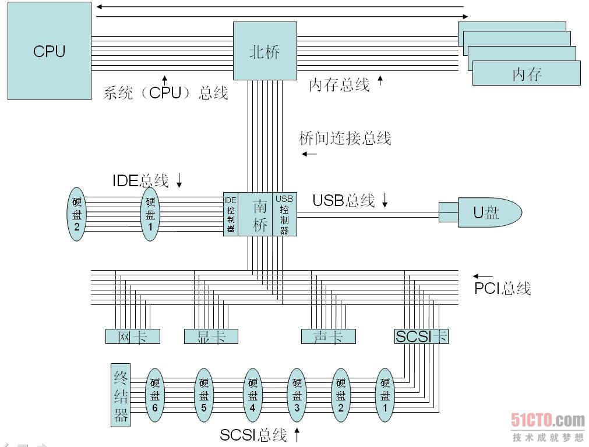
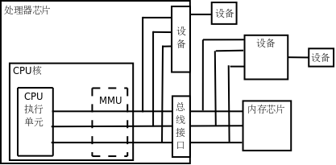

linux C一站式学习读书笔记_yonka

计算机体系结构部分

#INDEX

* [Introduction](#Introduction)
* [Types and interfaces](#Types and interfaces)
* [The representation of an interface](#The representation of an interface)
* [The laws of reflection](#The laws of reflection)
    * [The first law of reflection](#The first law of reflection)
    * [The second law of reflection](#The second law of reflection)
    * [The third law of reflection](#The third law of reflection)
* [Structs](#Structs)
* [Conclusion](#Conclusion)

#计算机体系结构基础

##内存和地址

##CPU
* **寄存器**R `CPU内部的高速存储器，像内存一样可以存取数据，但比访问内存快得多。`
* **（指令）译码器**ID  `CPU取上来的指令由若干个字节组成，这些字节中有些位表示内存地址，有些位表示寄存器编号，有些位表示这种指令做什么操作，是加减乘除还是读写内存，指令译码器负责解释这条指令的含义，然后调动相应的执行单元去执行它。`
* **算术逻辑单元**ALU `CPU取上来的指令由若干个字节组成，这些字节中有些位表示内存地址，有些位表示寄存器编号，有些位表示这种指令做什么操作，是加减乘除还是读写内存，指令译码器负责解释这条指令的含义，然后调动相应的执行单元去执行它。`
* **地址和数据总线**BUS  `CPU和内存之间用地址总线、数据总线和控制线连接起来，每条线上有1和0两种状态。如果在执行指令过程中需要访问内存，比如从内存读一个数到寄存器`

**CPU访问内存数据的过程**

`32位地址线 + 32位数据线，一般和CPU存储器位数一致`
1. CPU内部将寄存器对接到数据总线上，使寄存器的每一位对接到一条数据线，等待接收数据。
2. CPU通过控制线发一个读请求，并且将内存地址通过地址线发给内存。
3. 内存收到地址和读请求之后，将相应的内存单元对接到数据总线的另一端，这样，内存单元每一位的1或0状态通过一条数据线到达CPU寄存器中相应的位，就完成了数据传送。

*内总线和外总线*
> 内总线： 直接和CPU的执行单元相连
外总线： 内总线经过MMU和总线接口的转换之后引出动啊芯片引脚。 外地址/数据线的位数都有可能和内总线不同，如32位处理器的外地址总线可寻址空间可以大于4GB。

`具体区别？有图吗？`

> 内部总线是微机内部各外围芯片与处理器之间的总线，用于芯片一级的互连;
> 而系统总线是微机中各插件板与系统板之间的总线，用于插件板一级的互连；
> 外部总线则是微机和外部设备之间的总线，微机作为一种设备，通过该总线和其他设备进行信息与数据交换，它用于设备一级的互连。 

以及

> 总线分两种：
1、一种是CPU总线，是用来连接CPU和外围芯片的，分数据总线、控制总线和地址总线；
2、一种是系统总线，也称I/O通道总线，用来与扩展槽的各种扩展卡相连接的一种通信标准和工作协议。
按照功能划分，大体上可以分为地址总线和数据总线。有的系统中，数据总线和地址总线是复用的，即总线在某些时刻出现的信号表示数据而另一些时刻表示地址；而有的系统是分开的。51系列单片机的地址总线和数据总线是复用的，而一般PC中的总线则是分开的。
>>  系统总线包含有三种不同功能的总线，即数据总线DB（Data Bus）、地址总线AB（Address Bus）和控制总线CB（Control Bus）。
　　“数据总线DB”用于传送数据信息。数据总线是双向三态形式的总线，即他既可以把CPU的数据传送到存储器或I／O接口等其它部件，也可以将其它部件的数据传送到CPU。数据总线的位数是微型计算机的一个重要指标，通常与微处理的字长相一致。例如Intel 8086微处理器字长16位，其数据总线宽度也是16位。需要指出的是，数据的含义是广义的，它可以是真正的数据，也可以是指令代码或状态信息，有时甚至是一个控制信息，因此，在实际工作中，数据总线上传送的并不一定仅仅是真正意义上的数据。
　　“地址总线AB”是专门用来传送地址的，由于地址只能从CPU传向外部存储器或I／O端口，所以地址总线总是单向三态的，这与数据总线不同。地址总线的位数决定了CPU可直接寻址的内存空间大小，比如8位微机的地址总线为16位，则其最大可寻址空间为2^16＝64KB，16位微型机的地址总线为20位，其可寻址空间为2^20＝1MB。一般来说，若地址总线为n位，则可寻址空间为2^n字节。
　　“控制总线CB”用来传送控制信号和时序信号。控制信号中，有的是微处理器送往存储器和I／O接口电路的，如读／写信号，片选信号、中断响应信号等；也有是其它部件反馈给CPU的，比如：中断申请信号、复位信号、总线请求信号、设备就绪信号等。因此，控制总线的传送方向由具体控制信号而定，一般是双向的，控制总线的位数要根据系统的实际控制需要而定。实际上控制总线的具体情况主要取决于CPU。
　　按照传输数据的方式划分，可以分为串行总线和并行总线。串行总线中，二进制数据逐位通过一根数据线发送到目的器件；并行总线的数据线通常超过2根。常见的串行总线有SPI、I2C、USB及RS232等。
　　按照时钟信号是否独立，可以分为同步总线和异步总线。同步总线的时钟信号独立于数据，而异步总线的时钟信号是从数据中提取出来的。SPI、I2C是同步串行总线，RS232采用异步串行总线。

也即：

总线
* CPU总线
	* 数据总线DB
	* 地址总线AB
	* 控制总线CB 
* 系统总线
	* 数据总线DB
	* 地址总线AB
	* 控制总线CB

*可能不同的场景下内外总线的定义略有不同，可以参考以下图*

**CPU取指令执行的过程**

1. eip寄存器指向地址0x80483a2，CPU从这里开始取一条5个字节的指令，然后eip寄存器指向下一条指令的起始地址0x80483a7。
2. CPU对这5个字节译码，得知这条指令要求从地址0x804a01c开始取4个字节保存到eax寄存器。
3. 执行指令，读内存，取上来的数是3，保存到eax寄存器。注意，地址0x804a01c~0x804a01f里存储的四个字节不能按地址从低到高的顺序看成0x03000000，而要按地址从高到低的顺序看成0x00000003。也就是说，**对于多字节的整数类型，低地址保存的是整数的低位，这称为小端（Little Endian）字节序（Byte Order）。x86平台是小端字节序的，而另外一些平台规定低地址保存整数的高位，称为大端（Big Endian）字节序**。
4. CPU从eip寄存器指向的地址取一条3个字节的指令，然后eip寄存器指向下一条指令的起始地址0x80483aa。
5. CPU对这3个字节译码，得知这条指令要求把eax寄存器的值加1，结果仍保存到eax寄存器。
6. 执行指令，现在eax寄存器中的数是4。
7. CPU从eip寄存器指向的地址取一条5个字节的指令，然后eip寄存器指向下一条指令的起始地址0x80483af。
8. CPU对这5个字节译码，得知这条指令要求把eax寄存器的值保存到从地址0x804a018开始的4个字节。
9. 执行指令，把4这个值保存到从地址0x804a018开始的4个字节（按小端字节序保存）。

`指令长度是怎么确定的？由谁确定的？`

###寄存器
EAX, EBX, ECX, EDX
EDI, ESP, EIP

EIP用作PC - 特殊寄存器

寄存器在大多数指令中式可以任意选用的，但有一些指令会规定使用某些/个寄存器做特定用途，如 除法指令idivl要求被除数在eax而edx必须为0，除数则可以在任意寄存器，结果的商保存在eas（覆盖原来的被除数），余数保存在eda。  也即 **通用寄存器对于某些特殊指令来说也不是通用的**。

**程序计数器**PC
> 从功能上来定义的。 一种特殊寄存器，`保存着CPU取下一条指令的地址`，CPU按程序计数器保存的地址去内存中取指令然后解释执行，这时程序计数器保存的地址会自动加上该指令的长度，指向内存中的下一条指令。

##设备

###CPU访问设备

**从CPU的角度来看，访问设备只有内存映射I/O和端口I/O两种**，要么像内存一样访问，要么用一种专用的指令访问。其实访问设备是相当复杂的，计算机的设备五花八门，各种设备的性能要求都不一样，有的要求带宽大，有的要求响应快，有的要求热插拔，于是出现了各种适应不同要求的设备总线，比如PCI、AGP、USB、1394、SATA等等，`这些设备总线并不直接和CPU相连，CPU通过内存映射I/O或端口I/O访问相应的总线控制器，通过总线控制器再去访问挂在总线上的设备。所以上图中标有“设备”的框可能是实际的设备，也可能是设备总线的控制器`。

**内存映射IO**
还有一些设备集成在处理器芯片中。在上图中，从CPU核引出的地址和数据总线有一端经总线接口引出到芯片引脚上了，还有一端没有引出，而是接到芯片内部集成的设备上，无论是在CPU外部接总线的设备还是在CPU内部接总线的设备都有各自的地址范围，都可以像访问内存一样访问，很多体系结构（比如ARM）采用这种方式操作设备，称为内存映射I/O（Memory-mapped I/O）。

**端口映射IO**
但是x86比较特殊，x86对于设备有独立的端口地址空间，CPU核需要引出额外的地址线来连接片内设备（和访问内存所用的地址线不同），访问设备寄存器时用特殊的in/out指令，而不是和访问内存用同样的指令，这种方式称为端口I/O（Port I/O）。
> \#by yonka# 也即区别在于使用的总线，内存映射的话，是通过内存总线访问设备（也即设备也连在内存总线上，使用内存地址空间的地址）； 而端口映射IO则是通过专门的设备总线来访问设备，此时访问地址就不是通用的内存地址了...

> \#by yonka# 似乎，CPU只和内存有数据交互，其他设备与CPU应该只有中断交互，数据IO则通过内存（so-called主存）来中转，比如CPU发指令从硬盘读取数据到内存地址...

###CPU与设备的交互
内存是主要（数据）存储，所以CPU与内存的交互基本都是数据读写。 而设备则不一定，有可能是发指令（而不关心执行情况/结果），也有可能是获取状态...。
设备中可供读写访问的单元通常称为`设备寄存器（注意和CPU寄存器不是一回事）`，操作设备的过程就是读写这些设备寄存器的过程，比如向串口发送寄存器里写数据，串口设备就会把数据发送出去，读串口接收寄存器的值，就可以读取串口设备接收到的数据。

###设备中断
访问设备还有一点和访问内存不同。内存只是保存数据而不会产生新的数据，如果CPU不去读它，它也不需要主动提供数据给CPU，所以**内存总是被动地等待被读或者被写。而设备往往会自己产生数据，并且需要主动通知CPU来读这些数据**，例如敲键盘产生一个输入字符，用户希望计算机马上响应自己的输入，这就要求键盘设备主动通知CPU来读这个字符并做相应处理，给用户响应。
这是由中断（Interrupt）机制实现的，`每个设备都有一条中断线，通过中断控制器连接到CPU，当设备需要主动通知CPU时就引发一个中断信号，CPU正在执行的指令将被打断，程序计数器会指向某个固定的地址（这个地址由体系结构定义），于是CPU从这个地址开始取指令（或者说跳转到这个地址），执行中断服务程序（ISR，Interrupt Service Routine），完成中断处理之后再返回先前被打断的地方执行后续指令`。比如某种体系结构规定发生中断时跳转到地址0x00000010执行，那么就要`事先把一段ISR程序加载到这个地址，ISR程序是内核代码的一部分，在这段代码中首先判断是哪个设备引发了中断，然后调用该设备的中断处理函数做进一步处理`。

**ISR**
...

##MMU
MMU: 封装对真实物理地址（的内存）的访问。 一般在CPU片内。

**MMU和PA/VA**
* 如果处理器没有MMU，或者有MMU但没有启用，CPU执行单元发出的内存地址将直接传到芯片引脚上，被内存芯片（以下称为物理内存，以便与虚拟内存区分）接收，这称为物理地址（Physical Address，以下简称PA），如下图所示。

* 如果处理器启用了MMU，CPU执行单元发出的内存地址将被MMU截获，从CPU到MMU的地址称为虚拟地址（Virtual Address，以下简称VA），而MMU将这个地址翻译成另一个地址发到CPU芯片的外部地址引脚上，也就是将VA映射成PA，如下图所示。

> 内总线和外总线： 这里定义为MMU“内/外”。 
> 对于32位处理器，一般内总线（与CPI直连）为32位，但经过MMU转换之后的外总线不一定是，可能更多也可能更少，意味着虚拟地址空间是4GB，而物理地址空间可能大于也可能小于4GB。

**MMU对内存的管理（翻译）**
* VA/PA映射是以页（page）为单位的，32位处理器的页尺寸通常是4KB。 
* 该映射通过页表（page table）来描述，页表保存在物理内存中，MMU查找页表来确定VA映射到什么PA
* 物理内存中的页成为物理页面或者页帧（page frame）
* MMU工作过程如下：
	1. 操作系统在初始化或分配、释放内存时会执行一些指令在物理内存中填写页表，然后用指令设置MMU，**告诉MMU页表在物理内存中的什么位置**。
	2. 设置好之后，CPU每次执行访问内存的指令都会*自动引发MMU做查表和地址转换操作*，地址转换操作由硬件自动完成，不需要用指令控制MMU去做。
* 除了地址转换，还提供内存保护： 检查CPU当前模式是否有权限访问对应内存页。
> 用户模式（user mode）和特权模式（privileged mode），OS可以在页表中设置每个页的访问权限，比如有些不允许访问、有些需要特权模式、有些都可以。 而权限又分RWX三种。
> CPU访问内存时，MMU做检查（当前模式、操作类型、页...），权限符合则允许访问（转为PA），不符合则产生异常，处理方式类似中断。 区别在于中断有外设产生而异常由CPU内部有关，并且异常与CPU执行的指令有关而中断与设备本身状况有关。
> 处理中断/异常时CPU会切换到特权模式执行内核程序，处理完后返回用户模式继续执行用户程序。

**段错误的处理流程**
1. 用户程序要访问的一个VA，经MMU检查无权访问。
2. MMU产生一个异常，CPU从用户模式切换到特权模式，跳转到内核代码中执行异常服务程序。
3. 内核把这个异常解释为段错误，把引发异常的进程终止掉。

##内存层级

|存储器类型|	位于哪里|	存储容量|	半导体工艺|	访问时间|	如何访问|
|:---:|:---:|:---:|:---:|:---:|:---:|
|CPU寄存器|	位于CPU执行单元中。|	CPU寄存器通常只有几个到几十个，每个寄存器的容量取决于CPU的字长，所以一共只有几十到几百字节。|	“寄存器”这个名字就是一种数字电路的名字，它由一组触发器（Flip-flop）组成，每个触发器保存一个Bit的数据，可以做存取和移位等操作。计算机掉电时寄存器中保存的数据会丢失。|	寄存器是访问速度最快的存储器，典型的访问时间是几纳秒。|	使用哪个寄存器，如何使用寄存器，这些都是由指令决定的。|
|Cache|	和MMU一样位于CPU核中。|	Cache通常分为几级，最典型的是如上图所示的两级Cache，一级Cache更靠近CPU执行单元，二级Cache更靠近物理内存，通常一级Cache有几十到几百KB，二级Cache有几百KB到几MB。|	Cache和内存都是由RAM（Random Access Memory）组成的，可以根据地址随机访问，计算机掉电时RAM中保存的数据会丢失。不同的是，Cache通常由SRAM（Static RAM，静态RAM）组成，而内存通常由DRAM（Dynamic RAM，动态RAM）组成。DRAM电路比SRAM简单，存储容量可以做得更大，但DRAM的访问速度比SRAM慢。|	典型的访问时间是几十纳秒。|	Cache缓存最近访问过的内存数据，由于Cache的访问速度是内存的几十倍，所以有效利用Cache可以大大提高计算机的整体性能。一级Cache是这样工作的：CPU执行单元要访问内存时首先发出VA，Cache利用VA查找相应的数据有没有被缓存，如果Cache中有就不需要访问物理内存了，如果是读操作就直接将Cache中的数据传给CPU寄存器，如果是写操作就直接改写到Cache中；如果Cache没有缓存该数据，就去物理内存中取数据，但并不是要哪个字节就取哪个字节，而是把相邻的几十个字节都取上来缓存着，以备下次用到，这称为一个Cache Line，典型的Cache Line大小是32~256字节。如果计算机还配置了二级缓存，则在访问物理内存之前先用PA去二级缓存中查找。一级缓存是用VA寻址的，二级缓存是用PA寻址的，这是它们的区别。Cache所做的工作是由硬件自动完成的，而不是像寄存器一样由指令决定先做什么后做什么。|
|内存|	位于CPU外的芯片，与CPU通过地址和数据总线相连。|	典型的存储容量是几百MB到几GB。|	由DRAM组成，详见上面关于Cache的说明。|	典型的访问时间是几百纳秒。|	内存是通过地址来访问的，在启用MMU的情况下，程序指令中的地址是VA，而访问内存用的是PA，它们之间的映射关系由操作系统维护。|
|硬盘|	位于设备总线上，并不直接和CPU相连，CPU通过设备总线的控制器访问硬盘。|	典型的存储容量是几百GB到几TB。|	硬盘由磁性介质和磁头组成，访问硬盘时存在机械运动，磁头要移动，磁性介质要旋转，机械运动的速度很难提高到电子的速度，所以访问速度很受限制。保存在硬盘上的数据掉电后不会丢失。|	典型的访问时间是几毫秒，是寄存器访问时间的106倍。|	由驱动程序操作设备总线控制器去访问。由于硬盘的访问速度较慢，操作系统通常一次从硬盘上读几个页面到内存中缓存起来，如果这几个页面后来都被程序访问到了，那么这一次读硬盘的时间就可以分摊（Amortize）给程序的多次访问了。|

小结：
* 寄存器、Cache和内存中的数据都是掉电丢失的，这称为易失性存储器（Volatile Memory），与之相对的，硬盘是一种非易失性存储器（Non-volatile Memory）。
* 除了访问寄存器由程序指令直接控制之外，访问其它存储器都不是由指令直接控制的，有些是硬件自动完成的，有些是操作系统配合硬件完成的。
* Cache从内存取数据时会预取一个Cache Line缓存起来，操作系统从硬盘读数据时会预读几个页面缓存起来，都是希望这些数据以后会被程序访问到。`大多数程序的行为都具有局部性（Locality）的特点：它们会花费大量的时间反复执行一小段代码（例如循环），或者反复访问一个很小的地址范围中的数据（例如访问一个数组）`。所以`预读缓存的办法是很有效的：CPU取一条指令，我把和它相邻的指令也都缓存起来，CPU很可能马上就会取到；CPU访问一个数据，我把和它相邻的数据也都缓存起来，CPU很可能马上就会访问到`。设想有两台计算机，一台有256KB的Cache，另一台没有Cache，两台计算机的内存都是512MB的，硬盘都是100GB的，虽然多出来256KB的Cache与内存、硬盘的容量相比微不足道，但访问Cache比访问内存、硬盘快几个数量级，由于局部性原理，CPU大部分时间是在和Cache打交道，有Cache的计算机明显会快很多。高速存储器的容量只能做得很小，却能显著提升计算机的性能，这就是Memory Hierarchy的意义所在。

