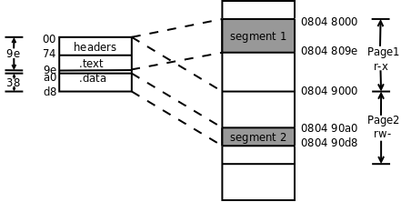

linux C一站式学习读书笔记_yonka

汇编部分

#INDEX

* [Introduction](#Introduction)
* [Types and interfaces](#Types and interfaces)
* [The representation of an interface](#The representation of an interface)
* [The laws of reflection](#The laws of reflection)
    * [The first law of reflection](#The first law of reflection)
    * [The second law of reflection](#The second law of reflection)
    * [The third law of reflection](#The third law of reflection)
* [Structs](#Structs)
* [Conclusion](#Conclusion)


#汇编

##X86寄存器

通用寄存器： EAX, EBX, ECX, EDX, EDI, ESI
> 通用寄存器对于某些特定的指令来说可能不通用。

特殊寄存器： EBP, ESP, EFLAGS
> EIP 用作PC
> EBP, ESP 用于维护函数调用的堆栈
> EFLAGS 保存计算过程中产生的标识位，如 进位CF、溢出OF、零标志ZF、负数SF 等

*EAX这些实际都是助记符，在机器码中用几个bit表示其编号。*


##寻址方式

内存寻址的通用指令格式： **ADDRESS_OR_OFFSET(%BASE_OR_OFFSET, %INDEX, MULTIPLIER)**

	FINAL ADDRESS = ADDRESS_OR_OFFSET + BASE_OR_OFFSET + MULTIPLIER * INDEX
其中 `ADDRESS_OR_OFFSET和MULTIPLIER必须是常数； BASE_OR_OFFSET和INDEX 必须是寄存器`

* **直接寻址DAM**  顾名思义，只用ADDRESS_OR_OFFSET，如 `movl 12345, %eax` 会把12345这个地址处的一个字长度的内容传送到eax寄存器
* **变址寻址IAM**  会使用%INDEX和MULTIPLIER，如 `movl data_items(,%edi, 4)`，用于访问数组元素比较方便，比如这里表示访问 data_items这个数组（地址）的第%edi个元素，每个元素的长度为4...
* **间接寻址IAM** 使用寄存器中内容作为地址，然后再（直接）寻址。 如 `movl (%eax), %ebx`，注意和 `movl %eax, %ebx`区分开
* **基址寻址BPAM** 以寄存器中内容作为基址寻址，然后使用直接地址作为偏移量，进行寻址。 如 `movl 4(%eax), %ebx`，表示以%eax中内容作为基址，偏移4后的地址作为地址，将其内容传送到%eba。 用于结构体成员访问比较方便。
* **立即数寻址IM** 指令中有一个操作数是立即数（也即数据本身），如 `movl $12, %eax`表示把数字12传送到%eax，需要$开头。
> 实际并不属于寻址的概念
* **寄存器寻址RAM** 指令中有一个操作数是寄存器，如 `movl $12, %eax`中的%eax（这么说，多数指令都是...） 
> 同上，实际也不属于寻址的概念

**汇编程序编译过程**
1. 得到汇编代码 .s文件
2. 转为目标文件 .o。 由多个section组成，对应汇编代码里的.section，此外汇编器可能会自动添加一些section（如符号表）
3. 链接器

**汇编器和编译器的区别**
编译器
> 编译器就是将“一种语言（通常为高级语言）”翻译为“另一种语言（通常为低级语言）”的程序。
> **【广义】**一个现代编译器的主要工作流程：源代码 (source code) → `预处理器 (preprocessor)` {**预处理**} → `编译器 (compiler)` {**编译**} → 目标代码 (object code) → `链接器(Linker)` {**链接**} → 可执行程序 (executables)
> **【狭义】** 就是上面的通过compiler转为目标代码的步骤
> **目标代码** 对于部分语言（c、c++等），目标代码是机器语言的目标代码（object code），也成为机器代码（machine code）； 对于C#、VB等，则是编译成中间语言的字节码（bytecode），然后在运行的时候通过通用语言运行库的转换得到机器码（nativecode）

汇编器
> 将汇编语言翻译为“机器语言”，一般来说也是目标代码（也即需要进行链接后才能运行） --- 可以看做是`特殊/特定的编译器`

**预处理器，编译器，汇编器和链接器**
1. 预处理(cpp)：预处理器不止一种，而C/C++的预处理器就是其中最低端的一种——词法预处理器，主要是进行文本替换、宏展开、删除注释这类简单工作。

    `gcc -E` 选项可以得到预处理后的结果，扩展名为`.i`；
    C/C++预处理不做任何语法检查，不仅是因为它不具备语法检查功能，也因为预处理命令不属于C/C++语句（这也是定义宏时不要加分号的原因），语法检查是编译器要做的事情；
    预处理之后，得到的仅仅是真正的源代码；
    GCC确实很强大，如果是用VC这种IDE，恐怕就不能看到预处理后的结果。

2. 编译器(ccl)：将文本文件.i翻译成文本文件.s，得到汇编语言程序(把高级语言翻译为机器语言)，该种语言程序中的每条语句都以一种标准的文本格式确切的描述了一条低级机器语言指令。

    `gcc -S` 选项可以得到编译后的汇编代码，扩展名为`.s`；
    汇编语言为不同高级语言的不同编译器提供了通用的输出语言，比如，C编译器和Fortran编译器产生的输出文件用的都是一样的汇编语言。

3. 汇编(as)：将.s翻译成机器语言指令，把这些指令打包成一种叫做可重定位目标程序的格式，并将结果保存在目标文件.o中(把汇编语言翻译成机器语言的过程)。

    `gcc -c` 选项可以得到汇编后的结果，扩展名为`.o`；
    .o是一个二进制文件，它的字节编码是机器语言指令而不是字符。如果在文本编辑器中打开.o文件，看到的将是一堆乱码。
    把一个源程序翻译成目标程序的工作过程分为五个阶段：词法分析；语法分析；语义检查和中间代码生成；代码优化；目标代码生成。主要是进行词法分析和语法分析，又称为源程序分析，分析过程中发现有语法错误，给出提示信息。

4. 链接(ld)：gcc会到系统默认的搜索路径”/usr/lib”下进行查找，也就是链接到libc.so.6库函数中去。 函数库一般分为静态库和动态库两种。静态库是指编译链接时，把库文件的代码全部加入到可执行文件中，因此生成的文件比较大，但在运行时也就不再需要库文件了。其后缀名一般为“`.a`”。动态库与之相反，在编译链接时并没有把库文件的代码加入到可执行文件中，而是在程序执行时由运行时链接文件加载库，这样可以节省系统的开销。动态库一般后缀名为”.so”，如前面所述的libc.so.6就是动态库。gcc在编译时默认使用动态库。

	`-lc`选项是gcc默认的，不用写，而对于ld则不是默认选项
	此外gcc好像会自动处理-dynamic-linker，而ld不能（至少windows上观察到是这样）

##ELF文件格式

开放标准，被各种*NIX使用。 有三种不同类型
* 可重定位的目标文件（relocatable，或者 object file）
* 可执行文件（executable）
* 共享库（shared object，或者 shared library）

###结构


`注意Section Header Table和Program Header Table并不是一定要位于文件的开头和结尾，其位置由ELF Header指出，上图这么画只是为了清晰。`

*左边从链接器角度来看ELF*
1. ELF Header
	
	描述了体系结构和操作系统等基本信息，并指出Section Header Table和Program Header Table在文件中的什么位置
2. Program Header Table

	在链接过程中用不到，所以是可有可无的
3. Section Header Table

	保存了所有Section的描述信息，通过Section Header Table可以找到每个Section在文件中的位置

*右边从加载器的角度来看ELF*
1. ELF Header

2. Program Header Table

	保存了所有Segment的描述信息
	`从上图可以看出，一个Segment由一个或多个Section组成，这些Section加载到内存时具有相同的访问权限。有些Section只对链接器有意义，在运行时用不到，也不需要加载到内存，那么就不属于任何Segment`
3. Section Header Table

	在加载过程中用不到，所以是可有可无的

**ELF文件格式示例**
用readelf命令
```
$ readelf -a max.o 
ELF Header:
  Magic:   7f 45 4c 46 01 01 01 00 00 00 00 00 00 00 00 00 
  Class:                             ELF32
  Data:                              2's complement, little endian
  Version:                           1 (current)
  OS/ABI:                            UNIX - System V
  ABI Version:                       0
  Type:                              REL (Relocatable file)
  Machine:                           Intel 80386
  Version:                           0x1
  Entry point address:               0x0
  Start of program headers:          0 (bytes into file)
  Start of section headers:          200 (bytes into file)
  Flags:                             0x0
  Size of this header:               52 (bytes)
  Size of program headers:           0 (bytes)
  Number of program headers:         0
  Size of section headers:           40 (bytes)
  Number of section headers:         8
  Section header string table index: 5
...
ELF Header中描述了操作系统是UNIX，体系结构是80386。Section Header Table中有8个Section Header，从文件地址200（0xc8）开始，每个Section Header占40字节，共320字节，到文件地址0x207结束。这个目标文件没有Program Header。文件地址是这样定义的：文件开头第一个字节的地址是0，然后每个字节占一个地址。

...
Section Headers:
  [Nr] Name              Type            Addr     Off    Size   ES Flg Lk Inf Al
  [ 0]                   NULL            00000000 000000 000000 00      0   0  0
  [ 1] .text             PROGBITS        00000000 000034 00002a 00  AX  0   0  4
  [ 2] .rel.text         REL             00000000 0002b0 000010 08      6   1  4
  [ 3] .data             PROGBITS        00000000 000060 000038 00  WA  0   0  4
  [ 4] .bss              NOBITS          00000000 000098 000000 00  WA  0   0  4
  [ 5] .shstrtab         STRTAB          00000000 000098 000030 00      0   0  1
  [ 6] .symtab           SYMTAB          00000000 000208 000080 10      7   7  4
  [ 7] .strtab           STRTAB          00000000 000288 000028 00      0   0  1
Key to Flags:
  W (write), A (alloc), X (execute), M (merge), S (strings)
  I (info), L (link order), G (group), x (unknown)
  O (extra OS processing required) o (OS specific), p (processor specific)

There are no section groups in this file.

There are no program headers in this file.
...
从Section Header中读出各Section的描述信息，其中.text和.data是我们在汇编程序中声明的Section，而其它Section是汇编器自动添加的。Addr是这些段加载到内存中的地址（我们讲过程序中的地址都是虚拟地址），加载地址要在链接时填写，现在空缺，所以是全0。Off和Size两列指出了各Section的文件地址，比如.data段从文件地址0x60开始，一共0x38个字节，回去翻一下程序，.data段定义了14个4字节的整数，一共是56个字节，也就是0x38。根据以上信息可以描绘出整个目标文件的布局。

...
Relocation section '.rel.text' at offset 0x2b0 contains 2 entries:
 Offset     Info    Type            Sym.Value  Sym. Name
00000008  00000201 R_386_32          00000000   .data
00000017  00000201 R_386_32          00000000   .data

There are no unwind sections in this file.

Symbol table '.symtab' contains 8 entries:
   Num:    Value  Size Type    Bind   Vis      Ndx Name
     0: 00000000     0 NOTYPE  LOCAL  DEFAULT  UND 
     1: 00000000     0 SECTION LOCAL  DEFAULT    1 
     2: 00000000     0 SECTION LOCAL  DEFAULT    3 
     3: 00000000     0 SECTION LOCAL  DEFAULT    4 
     4: 00000000     0 NOTYPE  LOCAL  DEFAULT    3 data_items
     5: 0000000e     0 NOTYPE  LOCAL  DEFAULT    1 start_loop
     6: 00000023     0 NOTYPE  LOCAL  DEFAULT    1 loop_exit
     7: 00000000     0 NOTYPE  GLOBAL DEFAULT    1 _start

No version information found in this file.

Ndx列是每个符号所在的Section编号，例如符号data_items在第3个Section里（也就是.data段），各Section的编号见Section Header Table。Value列是每个符号所代表的地址，在目标文件中，符号地址都是相对于该符号所在Section的相对地址，比如data_items位于.data段的开头，所以地址是0，_start位于.text段的开头，所以地址也是0，但是start_loop和loop_exit相对于.text段的地址就不是0了。从Bind这一列可以看出_start这个符号是GLOBAL的，而其它符号是LOCAL的，GLOBAL符号是在汇编程序中用.globl指示声明过的符号。
```

###目标文件（ELF）的布局

|起始文件地址|	Section或Header|解释	|
| :---: | :---: | :---: |
|0|	ELF Header|-	|
|0x34|	.text|把符号换成地址的指令（汇编语句 -> ...）	|
|0x60|	.data|-	|
|0x98|	.bss（此段为空）|-	|
|0x98|	.shstrtab|保存着各个section的名字	|
|0xc8|	Section Header Table|-	|
|0x208|	.symtab|符号表。Ndx列是每个符号所在的Section编号	|
|0x288|	.strtab|保存着程序中用到的符号的名字，每个都以'\0'结尾	|
|0x2b0|	.rel.text|告诉链接器指令中的哪些地方需要做重定位	|

> C语言的全局变量如果在代码中没有初始化，就会在程序加载时用0初始化。这种数据属于.bss段，在加载时它和.data段一样都是可读可写的数据，但是在ELF文件中.data段需要占用一部分空间保存初始值，而.bss段则不需要。也就是说，.bss段在文件中只占一个Section Header而没有对应的Section，程序加载时.bss段占多大内存空间在Section Header中描述

如：
```
$ hexdump -C max.o 
00000000  7f 45 4c 46 01 01 01 00  00 00 00 00 00 00 00 00  |.ELF............|
00000010  01 00 03 00 01 00 00 00  00 00 00 00 00 00 00 00  |................|
00000020  c8 00 00 00 00 00 00 00  34 00 00 00 00 00 28 00  |........4.....(.|
00000030  08 00 05 00 bf 00 00 00  00 8b 04 bd 00 00 00 00  |................|
00000040  89 c3 83 f8 00 74 10 47  8b 04 bd 00 00 00 00 39  |.....t.G.......9|
00000050  d8 7e ef 89 c3 eb eb b8  01 00 00 00 cd 80 00 00  |.~..............|
00000060  03 00 00 00 43 00 00 00  22 00 00 00 de 00 00 00  |....C...".......|
00000070  2d 00 00 00 4b 00 00 00  36 00 00 00 22 00 00 00  |-...K...6..."...|
00000080  2c 00 00 00 21 00 00 00  16 00 00 00 0b 00 00 00  |,...!...........|
00000090  42 00 00 00 00 00 00 00  00 2e 73 79 6d 74 61 62  |B.........symtab|
000000a0  00 2e 73 74 72 74 61 62  00 2e 73 68 73 74 72 74  |..strtab..shstrt|
000000b0  61 62 00 2e 72 65 6c 2e  74 65 78 74 00 2e 64 61  |ab..rel.text..da|
000000c0  74 61 00 2e 62 73 73 00  00 00 00 00 00 00 00 00  |ta..bss.........|
000000d0  00 00 00 00 00 00 00 00  00 00 00 00 00 00 00 00  |................|
*
000000f0  1f 00 00 00 01 00 00 00  06 00 00 00 00 00 00 00  |................|
00000100  34 00 00 00 2a 00 00 00  00 00 00 00 00 00 00 00  |4...*...........|
00000110  04 00 00 00 00 00 00 00  1b 00 00 00 09 00 00 00  |................|
00000120  00 00 00 00 00 00 00 00  b0 02 00 00 10 00 00 00  |................|
00000130  06 00 00 00 01 00 00 00  04 00 00 00 08 00 00 00  |................|
00000140  25 00 00 00 01 00 00 00  03 00 00 00 00 00 00 00  |%...............|
00000150  60 00 00 00 38 00 00 00  00 00 00 00 00 00 00 00  |`...8...........|
00000160  04 00 00 00 00 00 00 00  2b 00 00 00 08 00 00 00  |........+.......|
00000170  03 00 00 00 00 00 00 00  98 00 00 00 00 00 00 00  |................|
00000180  00 00 00 00 00 00 00 00  04 00 00 00 00 00 00 00  |................|
00000190  11 00 00 00 03 00 00 00  00 00 00 00 00 00 00 00  |................|
000001a0  98 00 00 00 30 00 00 00  00 00 00 00 00 00 00 00  |....0...........|
000001b0  01 00 00 00 00 00 00 00  01 00 00 00 02 00 00 00  |................|
000001c0  00 00 00 00 00 00 00 00  08 02 00 00 80 00 00 00  |................|
000001d0  07 00 00 00 07 00 00 00  04 00 00 00 10 00 00 00  |................|
000001e0  09 00 00 00 03 00 00 00  00 00 00 00 00 00 00 00  |................|
000001f0  88 02 00 00 28 00 00 00  00 00 00 00 00 00 00 00  |....(...........|
00000200  01 00 00 00 00 00 00 00  00 00 00 00 00 00 00 00  |................|
00000210  00 00 00 00 00 00 00 00  00 00 00 00 00 00 00 00  |................|
00000220  00 00 00 00 03 00 01 00  00 00 00 00 00 00 00 00  |................|
00000230  00 00 00 00 03 00 03 00  00 00 00 00 00 00 00 00  |................|
00000240  00 00 00 00 03 00 04 00  01 00 00 00 00 00 00 00  |................|
00000250  00 00 00 00 00 00 03 00  0c 00 00 00 0e 00 00 00  |................|
00000260  00 00 00 00 00 00 01 00  17 00 00 00 23 00 00 00  |............#...|
00000270  00 00 00 00 00 00 01 00  21 00 00 00 00 00 00 00  |........!.......|
00000280  00 00 00 00 10 00 01 00  00 64 61 74 61 5f 69 74  |.........data_it|
00000290  65 6d 73 00 73 74 61 72  74 5f 6c 6f 6f 70 00 6c  |ems.start_loop.l|
000002a0  6f 6f 70 5f 65 78 69 74  00 5f 73 74 61 72 74 00  |oop_exit._start.|
000002b0  08 00 00 00 01 02 00 00  17 00 00 00 01 02 00 00  |................|
000002c0
```

###可执行文件（ELF）的结构

```
$ readelf -a max
ELF Header:
  Magic:   7f 45 4c 46 01 01 01 00 00 00 00 00 00 00 00 00 
  Class:                             ELF32
  Data:                              2's complement, little endian
  Version:                           1 (current)
  OS/ABI:                            UNIX - System V
  ABI Version:                       0
  Type:                              EXEC (Executable file)
  Machine:                           Intel 80386
  Version:                           0x1
  Entry point address:               0x8048074
  Start of program headers:          52 (bytes into file)
  Start of section headers:          256 (bytes into file)
  Flags:                             0x0
  Size of this header:               52 (bytes)
  Size of program headers:           32 (bytes)
  Number of program headers:         2
  Size of section headers:           40 (bytes)
  Number of section headers:         6
  Section header string table index: 3

Section Headers:
  [Nr] Name              Type            Addr     Off    Size   ES Flg Lk Inf Al
  [ 0]                   NULL            00000000 000000 000000 00      0   0  0
  [ 1] .text             PROGBITS        08048074 000074 00002a 00  AX  0   0  4
  [ 2] .data             PROGBITS        080490a0 0000a0 000038 00  WA  0   0  4
  [ 3] .shstrtab         STRTAB          00000000 0000d8 000027 00      0   0  1
  [ 4] .symtab           SYMTAB          00000000 0001f0 0000a0 10      5   6  4
  [ 5] .strtab           STRTAB          00000000 000290 000040 00      0   0  1
Key to Flags:
  W (write), A (alloc), X (execute), M (merge), S (strings)
  I (info), L (link order), G (group), x (unknown)
  O (extra OS processing required) o (OS specific), p (processor specific)

There are no section groups in this file.

Program Headers:
  Type           Offset   VirtAddr   PhysAddr   FileSiz MemSiz  Flg Align
  LOAD           0x000000 0x08048000 0x08048000 0x0009e 0x0009e R E 0x1000
  LOAD           0x0000a0 0x080490a0 0x080490a0 0x00038 0x00038 RW  0x1000

 Section to Segment mapping:
  Segment Sections...
   00     .text 
   01     .data 

There is no dynamic section in this file.

There are no relocations in this file.

There are no unwind sections in this file.

Symbol table '.symtab' contains 10 entries:
   Num:    Value  Size Type    Bind   Vis      Ndx Name
     0: 00000000     0 NOTYPE  LOCAL  DEFAULT  UND 
     1: 08048074     0 SECTION LOCAL  DEFAULT    1 
     2: 080490a0     0 SECTION LOCAL  DEFAULT    2 
     3: 080490a0     0 NOTYPE  LOCAL  DEFAULT    2 data_items
     4: 08048082     0 NOTYPE  LOCAL  DEFAULT    1 start_loop
     5: 08048097     0 NOTYPE  LOCAL  DEFAULT    1 loop_exit
     6: 08048074     0 NOTYPE  GLOBAL DEFAULT    1 _start
     7: 080490d8     0 NOTYPE  GLOBAL DEFAULT  ABS __bss_start
     8: 080490d8     0 NOTYPE  GLOBAL DEFAULT  ABS _edata
     9: 080490d8     0 NOTYPE  GLOBAL DEFAULT  ABS _end

No version information found in this file.
```


**ELF目标文件和ELF可执行文件的差别**


* 在ELF Header中，Type改成了EXEC，由目标文件变成可执行文件了
* Entry point address改成了0x8048074（这是_start符号的地址） (原先用的是相对地址，entry point则为0）
* 多了两个Program Header（见图）
	* .text段和前面的ELF Header、Program Header Table一起组成一个Segment（FileSiz指出总长度是0x9e）
	* .data段组成另一个Segment（总长度是0x38）
> VirtAddr列指出第一个Segment加载到虚拟地址0x08048000（注意在x86平台上后面的PhysAddr列是没有意义的，并不代表实际的物理地址）
> Flg列指出第一个Segment的访问权限是可读可执行
> 最后一列Align的值0x1000（4K）是x86平台的内存页面大小。在加载时文件也要按内存页面大小分成若干页，文件中的一页对应内存中的一页，对应关系如下图所示。
> 
> `这个可执行文件很小，总共也不超过一页大小，但是两个Segment必须加载到内存中两个不同的页面，因为MMU的权限保护机制是以页为单位的，一个页面只能设置一种权限。`
> `此外还规定每个Segment在文件页面内偏移多少加载到内存页面仍然要偏移多少，比如第二个Segment在文件中的偏移是0xa0，在内存页面0x08049000中的偏移仍然是0xa0，所以从0x080490a0开始，这样规定是为了简化链接器和加载器的实现。从上图也可以看出.text段的加载地址应该是0x08048074，_start符号位于.text段的开头，所以_start符号的地址也是0x08048074，从符号表中可以验证这一点。`
* 少了两个Section Header （.rel.text（用于链接，链接完就没用了所以删掉）和.bss（没用到，被删掉））
* Section Header Table中，.text和.data段的加载地址分别改成了0x08048074和0x080490a0 （绝对地址）


***完整c - s - o - e代码***
*c代码*
```C
/* main.c */
#include <stdio.h>

void push(char);
char pop(void);
int is_empty(void);

int a, b = 1;

int main(void)
{
    push('a');
    push('b');
    push('c');

    while(!is_empty())
        putchar(pop());
    putchar('\n');

    return 0;
}


/* stack.c */


char stack[512];
int top = -1;

void push(char c)
{
    stack[++top] = c;
}

char pop(void)
{
    return stack[top--];
}

int is_empty(void)
{
    return top == -1;
}
```

*s代码*
```
// main.s
        .file   "main1.c"
        .comm   a,4,4
        .globl  b
        .data
        .align 4
        .type   b, @object
        .size   b, 4
b:
        .long   1
        .text
        .globl  main
        .type   main, @function
main:
.LFB0:
        .cfi_startproc
        pushq   %rbp
        .cfi_def_cfa_offset 16
        .cfi_offset 6, -16
        movq    %rsp, %rbp
        .cfi_def_cfa_register 6
        movl    $97, %edi
        call    push
        movl    $98, %edi
        call    push
        movl    $99, %edi
        call    push
        jmp     .L2
.L3:
        call    pop
        movsbl  %al, %eax
        movl    %eax, %edi
        call    putchar
.L2:
        call    is_empty
        testl   %eax, %eax
        je      .L3
        movl    $10, %edi
        call    putchar
        movl    $0, %eax
        popq    %rbp
        .cfi_def_cfa 7, 8
        ret
        .cfi_endproc
.LFE0:
        .size   main, .-main
        .ident  "GCC: (GNU) 4.8.5 20150623 (Red Hat 4.8.5-4)"
        .section        .note.GNU-stack,"",@progbits

// stack.s
        .file   "stack.c"
        .comm   stack,512,32
        .globl  top
        .data
        .align 4
        .type   top, @object
        .size   top, 4
top:
        .long   -1
        .text
        .globl  push
        .type   push, @function
push:
.LFB0:
        .cfi_startproc
        pushq   %rbp
        .cfi_def_cfa_offset 16
        .cfi_offset 6, -16
        movq    %rsp, %rbp
        .cfi_def_cfa_register 6
        movl    %edi, %eax
        movb    %al, -4(%rbp)
        movl    top(%rip), %eax
        addl    $1, %eax
        movl    %eax, top(%rip)
        movl    top(%rip), %eax
        cltq
        movzbl  -4(%rbp), %edx
        movb    %dl, stack(%rax)
        popq    %rbp
        .cfi_def_cfa 7, 8
        ret
        .cfi_endproc
.LFE0:
        .size   push, .-push
        .globl  pop
        .type   pop, @function
pop:
.LFB1:
        .cfi_startproc
        pushq   %rbp
        .cfi_def_cfa_offset 16
        .cfi_offset 6, -16
        movq    %rsp, %rbp
        .cfi_def_cfa_register 6
        movl    top(%rip), %eax
        leal    -1(%rax), %edx
        movl    %edx, top(%rip)
        cltq
        movzbl  stack(%rax), %eax
        popq    %rbp
        .cfi_def_cfa 7, 8
        ret
        .cfi_endproc
.LFE1:
        .size   pop, .-pop
        .globl  is_empty
        .type   is_empty, @function
is_empty:
.LFB2:
        .cfi_startproc
        pushq   %rbp
        .cfi_def_cfa_offset 16
        .cfi_offset 6, -16
        movq    %rsp, %rbp
        .cfi_def_cfa_register 6
        movl    top(%rip), %eax
        cmpl    $-1, %eax
        sete    %al
        movzbl  %al, %eax
        popq    %rbp
        .cfi_def_cfa 7, 8
        ret
        .cfi_endproc
.LFE2:
        .size   is_empty, .-is_empty
        .ident  "GCC: (GNU) 4.8.5 20150623 (Red Hat 4.8.5-4)"
        .section        .note.GNU-stack,"",@progbits
```

*o代码*
```
// main.o
ELF Header:
  Magic:   7f 45 4c 46 02 01 01 00 00 00 00 00 00 00 00 00 
  Class:                             ELF64
  Data:                              2's complement, little endian
  Version:                           1 (current)
  OS/ABI:                            UNIX - System V
  ABI Version:                       0
  Type:                              REL (Relocatable file)
  Machine:                           Advanced Micro Devices X86-64
  Version:                           0x1
  Entry point address:               0x0
  Start of program headers:          0 (bytes into file)
  Start of section headers:          352 (bytes into file)
  Flags:                             0x0
  Size of this header:               64 (bytes)
  Size of program headers:           0 (bytes)
  Number of program headers:         0
  Size of section headers:           64 (bytes)
  Number of section headers:         12
  Section header string table index: 9

Section Headers:
  [Nr] Name              Type             Address           Offset
       Size              EntSize          Flags  Link  Info  Align
  [ 0]                   NULL             0000000000000000  00000000
       0000000000000000  0000000000000000           0     0     0
  [ 1] .text             PROGBITS         0000000000000000  00000040
       000000000000004d  0000000000000000  AX       0     0     4
  [ 2] .rela.text        RELA             0000000000000000  000005f8
       00000000000000a8  0000000000000018          10     1     8
  [ 3] .data             PROGBITS         0000000000000000  00000090
       0000000000000004  0000000000000000  WA       0     0     4
  [ 4] .bss              NOBITS           0000000000000000  00000094
       0000000000000000  0000000000000000  WA       0     0     4
  [ 5] .comment          PROGBITS         0000000000000000  00000094
       000000000000002d  0000000000000001  MS       0     0     1
  [ 6] .note.GNU-stack   PROGBITS         0000000000000000  000000c1
       0000000000000000  0000000000000000           0     0     1
  [ 7] .eh_frame         PROGBITS         0000000000000000  000000c8
       0000000000000038  0000000000000000   A       0     0     8
  [ 8] .rela.eh_frame    RELA             0000000000000000  000006a0
       0000000000000018  0000000000000018          10     7     8
  [ 9] .shstrtab         STRTAB           0000000000000000  00000100
       0000000000000059  0000000000000000           0     0     1
  [10] .symtab           SYMTAB           0000000000000000  00000460
       0000000000000168  0000000000000018          11     8     8
  [11] .strtab           STRTAB           0000000000000000  000005c8
       000000000000002c  0000000000000000           0     0     1
Key to Flags:
  W (write), A (alloc), X (execute), M (merge), S (strings), l (large)
  I (info), L (link order), G (group), T (TLS), E (exclude), x (unknown)
  O (extra OS processing required) o (OS specific), p (processor specific)

There are no section groups in this file.

There are no program headers in this file.

Relocation section '.rela.text' at offset 0x5f8 contains 7 entries:
  Offset          Info           Type           Sym. Value    Sym. Name + Addend
00000000000a  000b00000002 R_X86_64_PC32     0000000000000000 push - 4
000000000014  000b00000002 R_X86_64_PC32     0000000000000000 push - 4
00000000001e  000b00000002 R_X86_64_PC32     0000000000000000 push - 4
000000000025  000c00000002 R_X86_64_PC32     0000000000000000 pop - 4
00000000002f  000d00000002 R_X86_64_PC32     0000000000000000 putchar - 4
000000000034  000e00000002 R_X86_64_PC32     0000000000000000 is_empty - 4
000000000042  000d00000002 R_X86_64_PC32     0000000000000000 putchar - 4

Relocation section '.rela.eh_frame' at offset 0x6a0 contains 1 entries:
  Offset          Info           Type           Sym. Value    Sym. Name + Addend
000000000020  000200000002 R_X86_64_PC32     0000000000000000 .text + 0

The decoding of unwind sections for machine type Advanced Micro Devices X86-64 is not currently supported.

Symbol table '.symtab' contains 15 entries:
   Num:    Value          Size Type    Bind   Vis      Ndx Name
     0: 0000000000000000     0 NOTYPE  LOCAL  DEFAULT  UND 
     1: 0000000000000000     0 FILE    LOCAL  DEFAULT  ABS main1.c
     2: 0000000000000000     0 SECTION LOCAL  DEFAULT    1 
     3: 0000000000000000     0 SECTION LOCAL  DEFAULT    3 
     4: 0000000000000000     0 SECTION LOCAL  DEFAULT    4 
     5: 0000000000000000     0 SECTION LOCAL  DEFAULT    6 
     6: 0000000000000000     0 SECTION LOCAL  DEFAULT    7 
     7: 0000000000000000     0 SECTION LOCAL  DEFAULT    5 
     8: 0000000000000004     4 OBJECT  GLOBAL DEFAULT  COM a
     9: 0000000000000000     4 OBJECT  GLOBAL DEFAULT    3 b
    10: 0000000000000000    77 FUNC    GLOBAL DEFAULT    1 main
    11: 0000000000000000     0 NOTYPE  GLOBAL DEFAULT  UND push
    12: 0000000000000000     0 NOTYPE  GLOBAL DEFAULT  UND pop
    13: 0000000000000000     0 NOTYPE  GLOBAL DEFAULT  UND putchar
    14: 0000000000000000     0 NOTYPE  GLOBAL DEFAULT  UND is_empty

No version information found in this file.


// stack.o
ELF Header:
  Magic:   7f 45 4c 46 02 01 01 00 00 00 00 00 00 00 00 00 
  Class:                             ELF64
  Data:                              2's complement, little endian
  Version:                           1 (current)
  OS/ABI:                            UNIX - System V
  ABI Version:                       0
  Type:                              REL (Relocatable file)
  Machine:                           Advanced Micro Devices X86-64
  Version:                           0x1
  Entry point address:               0x0
  Start of program headers:          0 (bytes into file)
  Start of section headers:          432 (bytes into file)
  Flags:                             0x0
  Size of this header:               64 (bytes)
  Size of program headers:           0 (bytes)
  Number of program headers:         0
  Size of section headers:           64 (bytes)
  Number of section headers:         12
  Section header string table index: 9

Section Headers:
  [Nr] Name              Type             Address           Offset
       Size              EntSize          Flags  Link  Info  Align
  [ 0]                   NULL             0000000000000000  00000000
       0000000000000000  0000000000000000           0     0     0
  [ 1] .text             PROGBITS         0000000000000000  00000040
       000000000000005f  0000000000000000  AX       0     0     4
  [ 2] .rela.text        RELA             0000000000000000  00000610
       00000000000000c0  0000000000000018          10     1     8
  [ 3] .data             PROGBITS         0000000000000000  000000a0
       0000000000000004  0000000000000000  WA       0     0     4
  [ 4] .bss              NOBITS           0000000000000000  000000a4
       0000000000000000  0000000000000000  WA       0     0     4
  [ 5] .comment          PROGBITS         0000000000000000  000000a4
       000000000000002d  0000000000000001  MS       0     0     1
  [ 6] .note.GNU-stack   PROGBITS         0000000000000000  000000d1
       0000000000000000  0000000000000000           0     0     1
  [ 7] .eh_frame         PROGBITS         0000000000000000  000000d8
       0000000000000078  0000000000000000   A       0     0     8
  [ 8] .rela.eh_frame    RELA             0000000000000000  000006d0
       0000000000000048  0000000000000018          10     7     8
  [ 9] .shstrtab         STRTAB           0000000000000000  00000150
       0000000000000059  0000000000000000           0     0     1
  [10] .symtab           SYMTAB           0000000000000000  000004b0
       0000000000000138  0000000000000018          11     8     8
  [11] .strtab           STRTAB           0000000000000000  000005e8
       0000000000000025  0000000000000000           0     0     1
Key to Flags:
  W (write), A (alloc), X (execute), M (merge), S (strings), l (large)
  I (info), L (link order), G (group), T (TLS), E (exclude), x (unknown)
  O (extra OS processing required) o (OS specific), p (processor specific)

There are no section groups in this file.

There are no program headers in this file.

Relocation section '.rela.text' at offset 0x610 contains 8 entries:
  Offset          Info           Type           Sym. Value    Sym. Name + Addend
00000000000b  000900000002 R_X86_64_PC32     0000000000000000 top - 4
000000000014  000900000002 R_X86_64_PC32     0000000000000000 top - 4
00000000001a  000900000002 R_X86_64_PC32     0000000000000000 top - 4
000000000026  00080000000b R_X86_64_32S      0000000000000020 stack + 0
000000000032  000900000002 R_X86_64_PC32     0000000000000000 top - 4
00000000003b  000900000002 R_X86_64_PC32     0000000000000000 top - 4
000000000044  00080000000b R_X86_64_32S      0000000000000020 stack + 0
000000000050  000900000002 R_X86_64_PC32     0000000000000000 top - 4

Relocation section '.rela.eh_frame' at offset 0x6d0 contains 3 entries:
  Offset          Info           Type           Sym. Value    Sym. Name + Addend
000000000020  000200000002 R_X86_64_PC32     0000000000000000 .text + 0
000000000040  000200000002 R_X86_64_PC32     0000000000000000 .text + 2c
000000000060  000200000002 R_X86_64_PC32     0000000000000000 .text + 4a

The decoding of unwind sections for machine type Advanced Micro Devices X86-64 is not currently supported.

Symbol table '.symtab' contains 13 entries:
   Num:    Value          Size Type    Bind   Vis      Ndx Name
     0: 0000000000000000     0 NOTYPE  LOCAL  DEFAULT  UND 
     1: 0000000000000000     0 FILE    LOCAL  DEFAULT  ABS stack.c
     2: 0000000000000000     0 SECTION LOCAL  DEFAULT    1 
     3: 0000000000000000     0 SECTION LOCAL  DEFAULT    3 
     4: 0000000000000000     0 SECTION LOCAL  DEFAULT    4 
     5: 0000000000000000     0 SECTION LOCAL  DEFAULT    6 
     6: 0000000000000000     0 SECTION LOCAL  DEFAULT    7 
     7: 0000000000000000     0 SECTION LOCAL  DEFAULT    5 
     8: 0000000000000020   512 OBJECT  GLOBAL DEFAULT  COM stack
     9: 0000000000000000     4 OBJECT  GLOBAL DEFAULT    3 top
    10: 0000000000000000    44 FUNC    GLOBAL DEFAULT    1 push
    11: 000000000000002c    30 FUNC    GLOBAL DEFAULT    1 pop
    12: 000000000000004a    21 FUNC    GLOBAL DEFAULT    1 is_empty

No version information found in this file.
```


*e代码*
```
ELF Header:
  Magic:   7f 45 4c 46 02 01 01 00 00 00 00 00 00 00 00 00 
  Class:                             ELF64
  Data:                              2's complement, little endian
  Version:                           1 (current)
  OS/ABI:                            UNIX - System V
  ABI Version:                       0
  Type:                              EXEC (Executable file)
  Machine:                           Advanced Micro Devices X86-64
  Version:                           0x1
  Entry point address:               0x400440
  Start of program headers:          64 (bytes into file)
  Start of section headers:          4512 (bytes into file)
  Flags:                             0x0
  Size of this header:               64 (bytes)
  Size of program headers:           56 (bytes)
  Number of program headers:         9
  Size of section headers:           64 (bytes)
  Number of section headers:         30
  Section header string table index: 27

Section Headers:
  [Nr] Name              Type             Address           Offset
       Size              EntSize          Flags  Link  Info  Align
  [ 0]                   NULL             0000000000000000  00000000
       0000000000000000  0000000000000000           0     0     0
  [ 1] .interp           PROGBITS         0000000000400238  00000238
       000000000000001c  0000000000000000   A       0     0     1
  [ 2] .note.ABI-tag     NOTE             0000000000400254  00000254
       0000000000000020  0000000000000000   A       0     0     4
  [ 3] .note.gnu.build-i NOTE             0000000000400274  00000274
       0000000000000024  0000000000000000   A       0     0     4
  [ 4] .gnu.hash         GNU_HASH         0000000000400298  00000298
       000000000000001c  0000000000000000   A       5     0     8
  [ 5] .dynsym           DYNSYM           00000000004002b8  000002b8
       0000000000000060  0000000000000018   A       6     1     8
  [ 6] .dynstr           STRTAB           0000000000400318  00000318
       0000000000000040  0000000000000000   A       0     0     1
  [ 7] .gnu.version      VERSYM           0000000000400358  00000358
       0000000000000008  0000000000000002   A       5     0     2
  [ 8] .gnu.version_r    VERNEED          0000000000400360  00000360
       0000000000000020  0000000000000000   A       6     1     8
  [ 9] .rela.dyn         RELA             0000000000400380  00000380
       0000000000000018  0000000000000018   A       5     0     8
  [10] .rela.plt         RELA             0000000000400398  00000398
       0000000000000048  0000000000000018   A       5    12     8
  [11] .init             PROGBITS         00000000004003e0  000003e0
       000000000000001a  0000000000000000  AX       0     0     4
  [12] .plt              PROGBITS         0000000000400400  00000400
       0000000000000040  0000000000000010  AX       0     0     16
  [13] .text             PROGBITS         0000000000400440  00000440
       0000000000000214  0000000000000000  AX       0     0     16
  [14] .fini             PROGBITS         0000000000400654  00000654
       0000000000000009  0000000000000000  AX       0     0     4
  [15] .rodata           PROGBITS         0000000000400660  00000660
       0000000000000010  0000000000000000   A       0     0     8
  [16] .eh_frame_hdr     PROGBITS         0000000000400670  00000670
       000000000000004c  0000000000000000   A       0     0     4
  [17] .eh_frame         PROGBITS         00000000004006c0  000006c0
       0000000000000154  0000000000000000   A       0     0     8
  [18] .init_array       INIT_ARRAY       0000000000600e10  00000e10
       0000000000000008  0000000000000000  WA       0     0     8
  [19] .fini_array       FINI_ARRAY       0000000000600e18  00000e18
       0000000000000008  0000000000000000  WA       0     0     8
  [20] .jcr              PROGBITS         0000000000600e20  00000e20
       0000000000000008  0000000000000000  WA       0     0     8
  [21] .dynamic          DYNAMIC          0000000000600e28  00000e28
       00000000000001d0  0000000000000010  WA       6     0     8
  [22] .got              PROGBITS         0000000000600ff8  00000ff8
       0000000000000008  0000000000000008  WA       0     0     8
  [23] .got.plt          PROGBITS         0000000000601000  00001000
       0000000000000030  0000000000000008  WA       0     0     8
  [24] .data             PROGBITS         0000000000601030  00001030
       000000000000000c  0000000000000000  WA       0     0     4
  [25] .bss              NOBITS           0000000000601040  0000103c
       0000000000000220  0000000000000000  WA       0     0     32
  [26] .comment          PROGBITS         0000000000000000  0000103c
       0000000000000058  0000000000000001  MS       0     0     1
  [27] .shstrtab         STRTAB           0000000000000000  00001094
       0000000000000108  0000000000000000           0     0     1
  [28] .symtab           SYMTAB           0000000000000000  00001920
       00000000000006d8  0000000000000018          29    46     8
  [29] .strtab           STRTAB           0000000000000000  00001ff8
       0000000000000262  0000000000000000           0     0     1
Key to Flags:
  W (write), A (alloc), X (execute), M (merge), S (strings), l (large)
  I (info), L (link order), G (group), T (TLS), E (exclude), x (unknown)
  O (extra OS processing required) o (OS specific), p (processor specific)

There are no section groups in this file.

Program Headers:
  Type           Offset             VirtAddr           PhysAddr
                 FileSiz            MemSiz              Flags  Align
  PHDR           0x0000000000000040 0x0000000000400040 0x0000000000400040
                 0x00000000000001f8 0x00000000000001f8  R E    8
  INTERP         0x0000000000000238 0x0000000000400238 0x0000000000400238
                 0x000000000000001c 0x000000000000001c  R      1
      [Requesting program interpreter: /lib64/ld-linux-x86-64.so.2]
  LOAD           0x0000000000000000 0x0000000000400000 0x0000000000400000
                 0x0000000000000814 0x0000000000000814  R E    200000
  LOAD           0x0000000000000e10 0x0000000000600e10 0x0000000000600e10
                 0x000000000000022c 0x0000000000000450  RW     200000
  DYNAMIC        0x0000000000000e28 0x0000000000600e28 0x0000000000600e28
                 0x00000000000001d0 0x00000000000001d0  RW     8
  NOTE           0x0000000000000254 0x0000000000400254 0x0000000000400254
                 0x0000000000000044 0x0000000000000044  R      4
  GNU_EH_FRAME   0x0000000000000670 0x0000000000400670 0x0000000000400670
                 0x000000000000004c 0x000000000000004c  R      4
  GNU_STACK      0x0000000000000000 0x0000000000000000 0x0000000000000000
                 0x0000000000000000 0x0000000000000000  RW     10
  GNU_RELRO      0x0000000000000e10 0x0000000000600e10 0x0000000000600e10
                 0x00000000000001f0 0x00000000000001f0  R      1

 Section to Segment mapping:
  Segment Sections...
   00     
   01     .interp 
   02     .interp .note.ABI-tag .note.gnu.build-id .gnu.hash .dynsym .dynstr .gnu.version .gnu.version_r .rela.dyn .rela.plt .init .plt .text .fini .rodata .eh_frame_hdr .eh_frame 
   03     .init_array .fini_array .jcr .dynamic .got .got.plt .data .bss 
   04     .dynamic 
   05     .note.ABI-tag .note.gnu.build-id 
   06     .eh_frame_hdr 
   07     
   08     .init_array .fini_array .jcr .dynamic .got 

Dynamic section at offset 0xe28 contains 24 entries:
  Tag        Type                         Name/Value
 0x0000000000000001 (NEEDED)             Shared library: [libc.so.6]
 0x000000000000000c (INIT)               0x4003e0
 0x000000000000000d (FINI)               0x400654
 0x0000000000000019 (INIT_ARRAY)         0x600e10
 0x000000000000001b (INIT_ARRAYSZ)       8 (bytes)
 0x000000000000001a (FINI_ARRAY)         0x600e18
 0x000000000000001c (FINI_ARRAYSZ)       8 (bytes)
 0x000000006ffffef5 (GNU_HASH)           0x400298
 0x0000000000000005 (STRTAB)             0x400318
 0x0000000000000006 (SYMTAB)             0x4002b8
 0x000000000000000a (STRSZ)              64 (bytes)
 0x000000000000000b (SYMENT)             24 (bytes)
 0x0000000000000015 (DEBUG)              0x0
 0x0000000000000003 (PLTGOT)             0x601000
 0x0000000000000002 (PLTRELSZ)           72 (bytes)
 0x0000000000000014 (PLTREL)             RELA
 0x0000000000000017 (JMPREL)             0x400398
 0x0000000000000007 (RELA)               0x400380
 0x0000000000000008 (RELASZ)             24 (bytes)
 0x0000000000000009 (RELAENT)            24 (bytes)
 0x000000006ffffffe (VERNEED)            0x400360
 0x000000006fffffff (VERNEEDNUM)         1
 0x000000006ffffff0 (VERSYM)             0x400358
 0x0000000000000000 (NULL)               0x0

Relocation section '.rela.dyn' at offset 0x380 contains 1 entries:
  Offset          Info           Type           Sym. Value    Sym. Name + Addend
000000600ff8  000300000006 R_X86_64_GLOB_DAT 0000000000000000 __gmon_start__ + 0

Relocation section '.rela.plt' at offset 0x398 contains 3 entries:
  Offset          Info           Type           Sym. Value    Sym. Name + Addend
000000601018  000100000007 R_X86_64_JUMP_SLO 0000000000000000 putchar + 0
000000601020  000200000007 R_X86_64_JUMP_SLO 0000000000000000 __libc_start_main + 0
000000601028  000300000007 R_X86_64_JUMP_SLO 0000000000000000 __gmon_start__ + 0

The decoding of unwind sections for machine type Advanced Micro Devices X86-64 is not currently supported.

Symbol table '.dynsym' contains 4 entries:
   Num:    Value          Size Type    Bind   Vis      Ndx Name
     0: 0000000000000000     0 NOTYPE  LOCAL  DEFAULT  UND 
     1: 0000000000000000     0 FUNC    GLOBAL DEFAULT  UND putchar@GLIBC_2.2.5 (2)
     2: 0000000000000000     0 FUNC    GLOBAL DEFAULT  UND __libc_start_main@GLIBC_2.2.5 (2)
     3: 0000000000000000     0 NOTYPE  WEAK   DEFAULT  UND __gmon_start__

Symbol table '.symtab' contains 73 entries:
   Num:    Value          Size Type    Bind   Vis      Ndx Name
     0: 0000000000000000     0 NOTYPE  LOCAL  DEFAULT  UND 
     1: 0000000000400238     0 SECTION LOCAL  DEFAULT    1 
     2: 0000000000400254     0 SECTION LOCAL  DEFAULT    2 
     3: 0000000000400274     0 SECTION LOCAL  DEFAULT    3 
     4: 0000000000400298     0 SECTION LOCAL  DEFAULT    4 
     5: 00000000004002b8     0 SECTION LOCAL  DEFAULT    5 
     6: 0000000000400318     0 SECTION LOCAL  DEFAULT    6 
     7: 0000000000400358     0 SECTION LOCAL  DEFAULT    7 
     8: 0000000000400360     0 SECTION LOCAL  DEFAULT    8 
     9: 0000000000400380     0 SECTION LOCAL  DEFAULT    9 
    10: 0000000000400398     0 SECTION LOCAL  DEFAULT   10 
    11: 00000000004003e0     0 SECTION LOCAL  DEFAULT   11 
    12: 0000000000400400     0 SECTION LOCAL  DEFAULT   12 
    13: 0000000000400440     0 SECTION LOCAL  DEFAULT   13 
    14: 0000000000400654     0 SECTION LOCAL  DEFAULT   14 
    15: 0000000000400660     0 SECTION LOCAL  DEFAULT   15 
    16: 0000000000400670     0 SECTION LOCAL  DEFAULT   16 
    17: 00000000004006c0     0 SECTION LOCAL  DEFAULT   17 
    18: 0000000000600e10     0 SECTION LOCAL  DEFAULT   18 
    19: 0000000000600e18     0 SECTION LOCAL  DEFAULT   19 
    20: 0000000000600e20     0 SECTION LOCAL  DEFAULT   20 
    21: 0000000000600e28     0 SECTION LOCAL  DEFAULT   21 
    22: 0000000000600ff8     0 SECTION LOCAL  DEFAULT   22 
    23: 0000000000601000     0 SECTION LOCAL  DEFAULT   23 
    24: 0000000000601030     0 SECTION LOCAL  DEFAULT   24 
    25: 0000000000601040     0 SECTION LOCAL  DEFAULT   25 
    26: 0000000000000000     0 SECTION LOCAL  DEFAULT   26 
    27: 0000000000000000     0 FILE    LOCAL  DEFAULT  ABS crtstuff.c
    28: 0000000000600e20     0 OBJECT  LOCAL  DEFAULT   20 __JCR_LIST__
    29: 0000000000400470     0 FUNC    LOCAL  DEFAULT   13 deregister_tm_clones
    30: 00000000004004a0     0 FUNC    LOCAL  DEFAULT   13 register_tm_clones
    31: 00000000004004e0     0 FUNC    LOCAL  DEFAULT   13 __do_global_dtors_aux
    32: 0000000000601040     1 OBJECT  LOCAL  DEFAULT   25 completed.6337
    33: 0000000000600e18     0 OBJECT  LOCAL  DEFAULT   19 __do_global_dtors_aux_fin
    34: 0000000000400500     0 FUNC    LOCAL  DEFAULT   13 frame_dummy
    35: 0000000000600e10     0 OBJECT  LOCAL  DEFAULT   18 __frame_dummy_init_array_
    36: 0000000000000000     0 FILE    LOCAL  DEFAULT  ABS main1.c
    37: 0000000000000000     0 FILE    LOCAL  DEFAULT  ABS stack.c
    38: 0000000000000000     0 FILE    LOCAL  DEFAULT  ABS crtstuff.c
    39: 0000000000400810     0 OBJECT  LOCAL  DEFAULT   17 __FRAME_END__
    40: 0000000000600e20     0 OBJECT  LOCAL  DEFAULT   20 __JCR_END__
    41: 0000000000000000     0 FILE    LOCAL  DEFAULT  ABS 
    42: 0000000000600e18     0 NOTYPE  LOCAL  DEFAULT   18 __init_array_end
    43: 0000000000600e28     0 OBJECT  LOCAL  DEFAULT   21 _DYNAMIC
    44: 0000000000600e10     0 NOTYPE  LOCAL  DEFAULT   18 __init_array_start
    45: 0000000000601000     0 OBJECT  LOCAL  DEFAULT   23 _GLOBAL_OFFSET_TABLE_
    46: 0000000000400650     2 FUNC    GLOBAL DEFAULT   13 __libc_csu_fini
    47: 0000000000000000     0 FUNC    GLOBAL DEFAULT  UND putchar@@GLIBC_2.2.5
    48: 0000000000000000     0 NOTYPE  WEAK   DEFAULT  UND _ITM_deregisterTMCloneTab
    49: 0000000000601030     0 NOTYPE  WEAK   DEFAULT   24 data_start
    50: 0000000000601034     4 OBJECT  GLOBAL DEFAULT   24 b
    51: 000000000060103c     0 NOTYPE  GLOBAL DEFAULT   24 _edata
    52: 0000000000400654     0 FUNC    GLOBAL DEFAULT   14 _fini
    53: 00000000004005ca    21 FUNC    GLOBAL DEFAULT   13 is_empty
    54: 00000000004005ac    30 FUNC    GLOBAL DEFAULT   13 pop
    55: 0000000000000000     0 FUNC    GLOBAL DEFAULT  UND __libc_start_main@@GLIBC_
    56: 0000000000601030     0 NOTYPE  GLOBAL DEFAULT   24 __data_start
    57: 0000000000000000     0 NOTYPE  WEAK   DEFAULT  UND __gmon_start__
    58: 0000000000400668     0 OBJECT  GLOBAL HIDDEN    15 __dso_handle
    59: 0000000000400660     4 OBJECT  GLOBAL DEFAULT   15 _IO_stdin_used
    60: 0000000000601038     4 OBJECT  GLOBAL DEFAULT   24 top
    61: 00000000004005e0   101 FUNC    GLOBAL DEFAULT   13 __libc_csu_init
    62: 0000000000601260     0 NOTYPE  GLOBAL DEFAULT   25 _end
    63: 0000000000400440     0 FUNC    GLOBAL DEFAULT   13 _start
    64: 0000000000601044     4 OBJECT  GLOBAL DEFAULT   25 a
    65: 000000000060103c     0 NOTYPE  GLOBAL DEFAULT   25 __bss_start
    66: 0000000000400530    77 FUNC    GLOBAL DEFAULT   13 main
    67: 0000000000400580    44 FUNC    GLOBAL DEFAULT   13 push
    68: 0000000000000000     0 NOTYPE  WEAK   DEFAULT  UND _Jv_RegisterClasses
    69: 0000000000601060   512 OBJECT  GLOBAL DEFAULT   25 stack
    70: 0000000000601040     0 OBJECT  GLOBAL HIDDEN    24 __TMC_END__
    71: 0000000000000000     0 NOTYPE  WEAK   DEFAULT  UND _ITM_registerTMCloneTable
    72: 00000000004003e0     0 FUNC    GLOBAL DEFAULT   11 _init

Version symbols section '.gnu.version' contains 4 entries:
 Addr: 0000000000400358  Offset: 0x000358  Link: 5 (.dynsym)
  000:   0 (*local*)       2 (GLIBC_2.2.5)   2 (GLIBC_2.2.5)   0 (*local*)    

Version needs section '.gnu.version_r' contains 1 entries:
 Addr: 0x0000000000400360  Offset: 0x000360  Link: 6 (.dynstr)
  000000: Version: 1  File: libc.so.6  Cnt: 1
  0x0010:   Name: GLIBC_2.2.5  Flags: none  Version: 2

Notes at offset 0x00000254 with length 0x00000020:
  Owner                 Data size       Description
  GNU                  0x00000010       NT_GNU_ABI_TAG (ABI version tag)
    OS: Linux, ABI: 2.6.32

Notes at offset 0x00000274 with length 0x00000024:
  Owner                 Data size       Description
  GNU                  0x00000014       NT_GNU_BUILD_ID (unique build ID bitstring)
    Build ID: c6cc123f24e65e557a71635b23cb25225dc167fd
```


##windows和centos_vm的汇编比较


##多目标文件的链接


#汇编与C的关系


