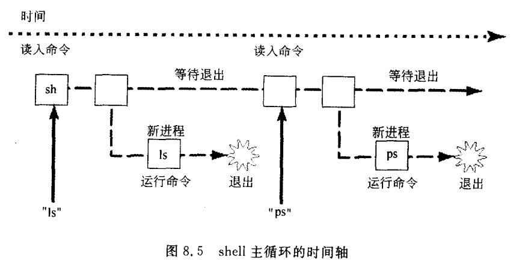

# 进程 = 运行中的程序

# 通过命令ps学习进程

## 选项
* -a 列出所有进程，包括其他终端由其他用户运行的程序
* -l print更多信息
* -f 格式化输出（UID列username代替uid等）

## 信息（列）
* S - 状态state
> R - running
> S - sleeping
* UID - 用户ID
* PID - 进程ID
* PPID - 父进程ID
* PRI - 优先级
* NI - niceness级别
* SZ - 占用内存大小
* WCHAN - 进程睡眠原因

## 系统进程

## 进程管理和文件管理

## 内存和程序

# shell： 进程控制和程序控制的一种方式

shell的三个主要功能
* 运行程序
* 管理输入输出（IO重定向）
* 可编程

# shell是如何运行程序的

四步：
1. 用户输入a.out
2. shell找到该文件并且确认可执行，创建（fork）一个新（子）进程（来运行该程序）
3. 载入程序（可执行文件） - exec
4. 程序在该新（子）进程中执行直至结束

## shell的主循环


## 问题1：一个程序如何运行另一个程序

可以通过函数 `execvp`
执行内容有以下几步：
1. 调用execvp
2. 内核从磁盘载入程序（执行文件）
3. 内核将arglist复制到进程
4. 内核调用main(argc, argv)

### 函数调用exec*
从当前进程中把当前程序的机器指令清除，然后在空的进程中载入调用时指定的程序代码，然后执行。

```
EXEC(3)                                                                                                Linux Programmer's Manual                                                                                               EXEC(3)


NAME
       execl, execlp, execle, execv, execvp, execvpe - execute a file

SYNOPSIS
       #include <unistd.h>

       extern char **environ;

       int execl(const char *path, const char *arg, ...);
       int execlp(const char *file, const char *arg, ...);
       int execle(const char *path, const char *arg,
                  ..., char * const envp[]);
       int execv(const char *path, char *const argv[]);
       int execvp(const char *file, char *const argv[]);
       int execvpe(const char *file, char *const argv[],
                   char *const envp[]);

   Feature Test Macro Requirements for glibc (see feature_test_macros(7)):

       execvpe(): _GNU_SOURCE

DESCRIPTION
       The  exec() family of functions replaces the current process image with a new process image.  The functions described in this manual page are front-ends for execve(2).  (See the manual page for execve(2) for further details
       about the replacement of the current process image.)

       The initial argument for these functions is the name of a file that is to be executed.

       The const char *arg and subsequent ellipses in the execl(), execlp(), and execle() functions can be thought of as arg0, arg1, ..., argn.  Together they describe a list of one or more pointers to null-terminated strings that
       represent  the  argument  list available to the executed program.  The first argument, by convention, should point to the filename associated with the file being executed.  The list of arguments must be terminated by a NULL
       pointer, and, since these are variadic functions, this pointer must be cast (char *) NULL.

       The execv(), execvp(), and execvpe() functions provide an array of pointers to null-terminated strings that represent the argument list available to the new program.  The first argument, by convention, should point  to  the
       filename associated with the file being executed.  The array of pointers must be terminated by a NULL pointer.

       The execle() and execvpe() functions allow the caller to specify the environment of the executed program via the argument envp.  The envp argument is an array of pointers to null-terminated strings and must be terminated by
       a NULL pointer.  The other functions take the environment for the new process image from the external variable environ in the calling process.

   Special semantics for execlp() and execvp()
       The execlp(), execvp(), and execvpe() functions duplicate the actions of the shell in searching for an executable file if the specified filename does not contain a slash (/) character.  The file is sought in the colon-sepa‐
       rated  list  of  directory  pathnames  specified  in  the  PATH  environment  variable.   If this variable isn't defined, the path list defaults to the current directory followed by the list of directories returned by conf‐
       str(_CS_PATH).  (This confstr(3) call typically returns the value "/bin:/usr/bin".)

       If the specified filename includes a slash character, then PATH is ignored, and the file at the specified pathname is executed.

       In addition, certain errors are treated specially.

       If permission is denied for a file (the attempted execve(2) failed with the error EACCES), these functions will continue searching the rest of the search path.  If no other file is found,  however,  they  will  return  with
       errno set to EACCES.

       If the header of a file isn't recognized (the attempted execve(2) failed with the error ENOEXEC), these functions will execute the shell (/bin/sh) with the path of the file as its first argument.  (If this attempt fails, no
       further searching is done.)

RETURN VALUE
       The exec() functions return only if an error has occurred.  The return value is -1, and errno is set to indicate the error.

ERRORS
       All of these functions may fail and set errno for any of the errors specified for execve(2).
```


## 问题2：如何建立新的进程
先 fork 再 exec
> glibc的fork wrapper实际上调 syscall的clone而不是syscall的fork - NTPL线程实现

参见[forkdemo*](code/08)

### fork
做下面的事情：
1. 分配新的内存块和内核数据结构
2. 复制原来的进程到新的进程
> 注意： linux的fork实现使用了COW技术。 `Under Linux, fork() is implemented using copy-on-write pages, so the only penalty that it incurs is the time and memory required to duplicate the parent's page tables, and to create a unique task structure for the child.`
3. 向运行进程集添加新的进程
4. 将控制返回给两个进程

## 问题3： 父进程如何等待子进程的退出

### syscall wait*

```
WAIT(2)                                                                                                Linux Programmer's Manual                                                                                               WAIT(2)


NAME
       wait, waitpid, waitid - wait for process to change state

SYNOPSIS
       #include <sys/types.h>
       #include <sys/wait.h>

       pid_t wait(int *status);

       pid_t waitpid(pid_t pid, int *status, int options);

       int waitid(idtype_t idtype, id_t id, siginfo_t *infop, int options);

   Feature Test Macro Requirements for glibc (see feature_test_macros(7)):

       waitid():
           _SVID_SOURCE || _XOPEN_SOURCE >= 500 || _XOPEN_SOURCE && _XOPEN_SOURCE_EXTENDED
           || /* Since glibc 2.12: */ _POSIX_C_SOURCE >= 200809L

DESCRIPTION
       All  of these system calls are used to wait for state changes in a child of the calling process, and obtain information about the child whose state has changed.  A state change is considered to be: the child terminated; the
       child was stopped by a signal; or the child was resumed by a signal.  In the case of a terminated child, performing a wait allows the system to release the resources associated with the child; if a wait  is  not  performed,
       then the terminated child remains in a "zombie" state (see NOTES below).

       If  a  child has already changed state, then these calls return immediately.  Otherwise they block until either a child changes state or a signal handler interrupts the call (assuming that system calls are not automatically
       restarted using the SA_RESTART flag of sigaction(2)).  In the remainder of this page, a child whose state has changed and which has not yet been waited upon by one of these system calls is termed waitable.

   wait() and waitpid()
       The wait() system call suspends execution of the calling process until one of its children terminates.  The call wait(&status) is equivalent to:

           waitpid(-1, &status, 0);

       The waitpid() system call suspends execution of the calling process until a child specified by pid argument has changed state.  By default, waitpid() waits only for terminated children, but this behavior is  modifiable  via
       the options argument, as described below.

       The value of pid can be:

       < -1   meaning wait for any child process whose process group ID is equal to the absolute value of pid.

       -1     meaning wait for any child process.

       0      meaning wait for any child process whose process group ID is equal to that of the calling process.

       > 0    meaning wait for the child whose process ID is equal to the value of pid.

       The value of options is an OR of zero or more of the following constants:

       WNOHANG     return immediately if no child has exited.

       WUNTRACED   also return if a child has stopped (but not traced via ptrace(2)).  Status for traced children which have stopped is provided even if this option is not specified.

       WCONTINUED (since Linux 2.6.10)
                   also return if a stopped child has been resumed by delivery of SIGCONT.

       (For Linux-only options, see below.)

       If  status  is  not NULL, wait() and waitpid() store status information in the int to which it points.  This integer can be inspected with the following macros (which take the integer itself as an argument, not a pointer to
       it, as is done in wait() and waitpid()!):

       WIFEXITED(status)
              returns true if the child terminated normally, that is, by calling exit(3) or _exit(2), or by returning from main().

       WEXITSTATUS(status)
              returns the exit status of the child.  This consists of the least significant 8 bits of the status argument that the child specified in a call to exit(3) or _exit(2) or as the  argument  for  a  return  statement  in
              main().  This macro should be employed only if WIFEXITED returned true.

       WIFSIGNALED(status)
              returns true if the child process was terminated by a signal.

       WTERMSIG(status)
              returns the number of the signal that caused the child process to terminate.  This macro should be employed only if WIFSIGNALED returned true.

       WCOREDUMP(status)
              returns  true if the child produced a core dump.  This macro should be employed only if WIFSIGNALED returned true.  This macro is not specified in POSIX.1-2001 and is not available on some UNIX implementations (e.g.,
              AIX, SunOS).  Only use this enclosed in #ifdef WCOREDUMP ... #endif.

       WIFSTOPPED(status)
              returns true if the child process was stopped by delivery of a signal; this is possible only if the call was done using WUNTRACED or when the child is being traced (see ptrace(2)).

       WSTOPSIG(status)
              returns the number of the signal which caused the child to stop.  This macro should be employed only if WIFSTOPPED returned true.

       WIFCONTINUED(status)
              (since Linux 2.6.10) returns true if the child process was resumed by delivery of SIGCONT.

   waitid()
       The waitid() system call (available since Linux 2.6.9) provides more precise control over which child state changes to wait for.

       The idtype and id arguments select the child(ren) to wait for, as follows:

       idtype == P_PID
              Wait for the child whose process ID matches id.

       idtype == P_PGID
              Wait for any child whose process group ID matches id.

       idtype == P_ALL
              Wait for any child; id is ignored.

       The child state changes to wait for are specified by ORing one or more of the following flags in options:

       WEXITED     Wait for children that have terminated.

       WSTOPPED    Wait for children that have been stopped by delivery of a signal.

       WCONTINUED  Wait for (previously stopped) children that have been resumed by delivery of SIGCONT.

       The following flags may additionally be ORed in options:

       WNOHANG     As for waitpid().

       WNOWAIT     Leave the child in a waitable state; a later wait call can be used to again retrieve the child status information.

       Upon successful return, waitid() fills in the following fields of the siginfo_t structure pointed to by infop:

       si_pid      The process ID of the child.

       si_uid      The real user ID of the child.  (This field is not set on most other implementations.)

       si_signo    Always set to SIGCHLD.

       si_status   Either the exit status of the child, as given to _exit(2) (or exit(3)), or the signal that caused the child to terminate, stop, or continue.  The si_code field can be used to  determine  how  to  interpret  this
       field.

si_code     Set  to one of: CLD_EXITED (child called _exit(2)); CLD_KILLED (child killed by signal); CLD_DUMPED (child killed by signal, and dumped core); CLD_STOPPED (child stopped by signal); CLD_TRAPPED (traced child has
       trapped); or CLD_CONTINUED (child continued by SIGCONT).

If WNOHANG was specified in options and there were no children in a waitable state, then waitid() returns 0 immediately and the state of the siginfo_t structure pointed to by infop is unspecified.  To distinguish this  case
from that where a child was in a waitable state, zero out the si_pid field before the call and check for a nonzero value in this field after the call returns.

RETURN VALUE
wait(): on success, returns the process ID of the terminated child; on error, -1 is returned.

waitpid():  on success, returns the process ID of the child whose state has changed; if WNOHANG was specified and one or more child(ren) specified by pid exist, but have not yet changed state, then 0 is returned.  On error,
-1 is returned.

waitid(): returns 0 on success or if WNOHANG was specified and no child(ren) specified by id has yet changed state; on error, -1 is returned.  Each of these calls sets errno to an appropriate value in the case of an error.

ERRORS
ECHILD (for wait()) The calling process does not have any unwaited-for children.

ECHILD (for waitpid() or waitid()) The process specified by pid (waitpid()) or idtype and id (waitid()) does not exist or is not a child of the calling process.  (This can happen for  one's  own  child  if  the  action  for
  SIGCHLD is set to SIG_IGN.  See also the Linux Notes section about threads.)

EINTR  WNOHANG was not set and an unblocked signal or a SIGCHLD was caught; see signal(7).

EINVAL The options argument was invalid.
```

## 小结


# 实现一个shell：psh2.c
...

## 问题
父进程wait子进程时，ctrl-C/SIGINT同时发给父子进程。

# 思考： 用进程编程
* execvp/exit 类似 call/return
* 全部变量和fork/exec

# exit和exec的其他细节

## 进程死亡：exit和_exit

**exit - 库函数**
1. 刷新所有的流（fd？）
2. 调用atexit和on_exit注册的函数（infinite loop？）
3. 执行当前系统定义的其他与exit相关的操作
4. 调用_exit

**_exit - 系统调用**
1. 处理所有分配给这个进程的内存
2. 关闭这个进程打开的文件（文件fd、目录fd）
3. 释放所有内核用来管理和维护这个进程的数据结构
> 还有：
* 将该进程的PPID置为init进程的PID
* 如果父进程在wait则通知父进程
* 向父进程发送SIGCHLD

**status传递**
exit -> _exit -> 存放在内核 -> 一直到父进程进行wait操作
> 死亡但是没有给exit赋值的进程： `zomboe` - defunct

**SIGCHLD信号**
默认处理方式为： `忽略` 。 - 可以设置处理函数
即使父进程没有在wait也会发给父进程。

### 库函数exit
```
XIT(3)                                                                                                Linux Programmer's Manual                                                                                               EXIT(3)


NAME
       exit - cause normal process termination

SYNOPSIS
       #include <stdlib.h>

       void exit(int status);

DESCRIPTION
       The exit() function causes normal process termination and the value of status & 0377 is returned to the parent (see wait(2)).

       All functions registered with atexit(3) and on_exit(3) are called, in the reverse order of their registration.  (It is possible for one of these functions to use atexit(3) or on_exit(3) to register an additional function to
       be executed during exit processing; the new registration is added to the front of the list of functions that remain to be called.)  If one of these functions does not return (e.g., it calls _exit(2), or kills itself with  a
       signal),  then  none  of  the  remaining  functions  is  called,  and  further exit processing (in particular, flushing of stdio(3) streams) is abandoned.  If a function has been registered multiple times using atexit(3) or
       on_exit(3), then it is called as many times as it was registered.

       All open stdio(3) streams are flushed and closed.  Files created by tmpfile(3) are removed.

       The C standard specifies two constants, EXIT_SUCCESS and EXIT_FAILURE, that may be passed to exit() to indicate successful or unsuccessful termination, respectively.

RETURN VALUE
       The exit() function does not return.

CONFORMING TO
       SVr4, 4.3BSD, POSIX.1-2001, C89, C99.

NOTES
       It is undefined what happens if one of the functions registered using atexit(3) and on_exit(3) calls either exit() or longjmp(3).  Note that a call to execve(2) removes registrations created using atexit(3) and on_exit(3).

       The use of EXIT_SUCCESS and EXIT_FAILURE is slightly more portable (to non-UNIX environments) than the use of 0 and some nonzero value like 1 or -1.  In particular, VMS uses a different convention.

       BSD has attempted to standardize exit codes; see the file <sysexits.h>.

       After exit(), the exit status must be transmitted to the parent process.  There are three cases.  If the parent has set SA_NOCLDWAIT, or has set the SIGCHLD handler to SIG_IGN, the status is discarded.  If  the  parent  was
       waiting  on  the  child  it is notified of the exit status.  In both cases the exiting process dies immediately.  If the parent has not indicated that it is not interested in the exit status, but is not waiting, the exiting
       process turns into a "zombie" process (which is nothing but a container for the single byte representing the exit status) so that the parent can learn the exit status when it later calls one of the wait(2) functions.

       If the implementation supports the SIGCHLD signal, this signal is sent to the parent.  If the parent has set SA_NOCLDWAIT, it is undefined whether a SIGCHLD signal is sent.

       If the process is a session leader and its controlling terminal is the controlling terminal of the session, then each process in the foreground process group of this controlling terminal is sent a  SIGHUP  signal,  and  the
       terminal is disassociated from this session, allowing it to be acquired by a new controlling process.

       If  the exit of the process causes a process group to become orphaned, and if any member of the newly orphaned process group is stopped, then a SIGHUP signal followed by a SIGCONT signal will be sent to each process in this
       process group.  See setpgid(2) for an explanation of orphaned process groups.

SEE ALSO
       _exit(2), setpgid(2), wait(2), atexit(3), on_exit(3), tmpfile(3)
```

### 系统调用 _exit
```
_EXIT(2)                                                                                               Linux Programmer's Manual                                                                                              _EXIT(2)


NAME
       _exit, _Exit - terminate the calling process

SYNOPSIS
       #include <unistd.h>

       void _exit(int status);

       #include <stdlib.h>

       void _Exit(int status);

   Feature Test Macro Requirements for glibc (see feature_test_macros(7)):

       _Exit():
           _XOPEN_SOURCE >= 600 || _ISOC99_SOURCE || _POSIX_C_SOURCE >= 200112L;
           or cc -std=c99

DESCRIPTION
       The  function  _exit()  terminates the calling process "immediately".  Any open file descriptors belonging to the process are closed; any children of the process are inherited by process 1, init, and the process's parent is
       sent a SIGCHLD signal.

       The value status is returned to the parent process as the process's exit status, and can be collected using one of the wait(2) family of calls.

       The function _Exit() is equivalent to _exit().

RETURN VALUE
       These functions do not return.
```

## exec家族

前面有提到过，这里小结一下。

### 库函数：execl, execlp, execle, execv, execvp, execvpe

**命名规律**
* p: path
* e: environment，表示参数里允许传入环境变量（`char * const envp[]`）
* l: 用不定长参数来传递args（`const char *arg, ...`，需要用`NULL`结尾）
* v: 用数组来传递args（`char *const argv[]`，从示例来看，也是需要一个NULL结尾的）
> NULL结尾使得可以*安全*的检测到参数的结尾

```c
#include <unistd.h>

extern char **environ;

int execl(const char *path, const char *arg, ...);
int execlp(const char *file, const char *arg, ...);
int execle(const char *path, const char *arg,
           ..., char * const envp[]);
int execv(const char *path, char *const argv[]);
int execvp(const char *file, char *const argv[]);
int execvpe(const char *file, char *const argv[],
            char *const envp[]);
```

### 系统调用 execve
```c
#include <unistd.h>

int execve(const char *filename, char *const argv[],
           char *const envp[]);
```

示例：
```c
/* execve.c */

#include <stdio.h>
#include <stdlib.h>
#include <unistd.h>

int
main(int argc, char *argv[])
{
    char *newargv[] = { NULL, "hello", "world", NULL };
    char *newenviron[] = { NULL };

    if (argc != 2) {
     fprintf(stderr, "Usage: %s <file-to-exec>\n", argv[0]);
     exit(EXIT_FAILURE);
    }

    newargv[0] = argv[1];

    execve(argv[1], newargv, newenviron);
    perror("execve");   /* execve() only returns on error */
    exit(EXIT_FAILURE);
}
```

# 小结

# TODO
* 本章习题
