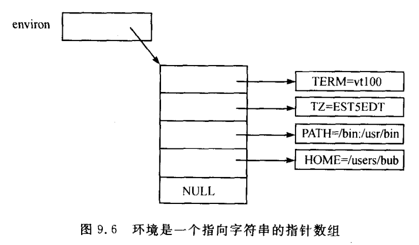

# shell编程

# 什么是以及为什么要使用shell script

# smshl-命令行解释

# shell中的流程控制
## if语句做些什么

## if是如何工作的

## 在smsh中增加if


# shell变量：局部和全部

## 使用shell变量

## 变量的存储

## 增加变量命令：builtins

## 效果

# 环境：个性化设置

## 使用环境

查看
* env
* export
* echo $var

设置
* var=value
* export var=value


## 什么是环境以及它是如何工作的


```c
extern char **environ;

int main()
{
  int i;
  for(i=0; environ[i]; i++){  // 利用了最后一个 NULL 的特点
    printf("%s\n", environ[i]);
  }
}
```

### environ的“继承”
exec会替换程序的代码和数据，但 `environ`指针指向的数组是唯一的例外： `当内核执行系统调用execve时，它将数组和字符串复制到新的程序的数据空间`

注意，仍然是“副本”，所以子进程不能修改父进程的环境。

## 在smsh中增加环境处理

## 效果

# 已实现的shell的功能


# 小结
